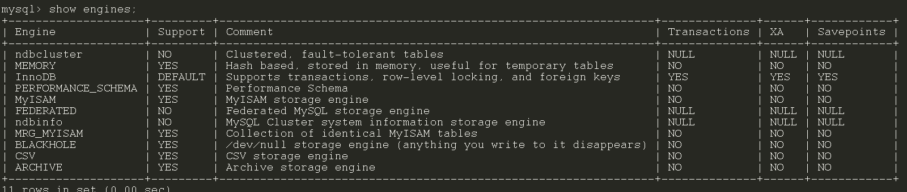

### 存储引擎

MySQL 支持多种存储引擎，你可以通过 `SHOW ENGINES` 命令来查看 MySQL 支持的所有存储引擎。

从上图我们可以查看出， MySQL 当前默认的存储引擎是 InnoDB。并且，所有的存储引擎中只有 InnoDB 是事务性存储引擎，也就是说只有 InnoDB 支持事务。

我这里使用的 MySQL 版本是 8.x，不同的 MySQL 版本之间可能会有差别。

MySQL 5.5.5 之前，MyISAM 是 MySQL 的默认存储引擎。5.5.5 版本之后，InnoDB 是 MySQL 的默认存储引擎。

你可以通过 `SELECT VERSION()` 命令查看你的 MySQL 版本。

MySQL 存储引擎采用的是 **插件式架构** ，支持多种存储引擎，我们甚至可以为不同的数据库表设置不同的存储引擎以适应不同场景的需要。**存储引擎是基于表的，而不是数据库。**

### InnoDB 与 MyISAM 的区别

- InnoDB 支持行级别的锁粒度，MyISAM 不支持，只支持表级别的锁粒度。
- MyISAM 不提供事务支持。InnoDB 提供事务支持，实现了 SQL 标准定义了四个隔离级别。
- MyISAM 不支持外键，而 InnoDB 支持。
- MyISAM 不支持 MVCC，而 InnoDB 支持。
- 虽然 MyISAM 引擎和 InnoDB 引擎都是使用 B+Tree 作为索引结构，但是两者的实现方式不太一样。
- MyISAM 不支持数据库异常崩溃后的安全恢复，而 InnoDB 支持。
- InnoDB 的性能比 MyISAM 更强大