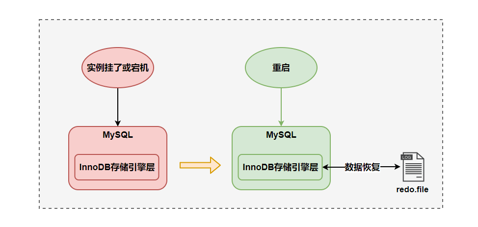
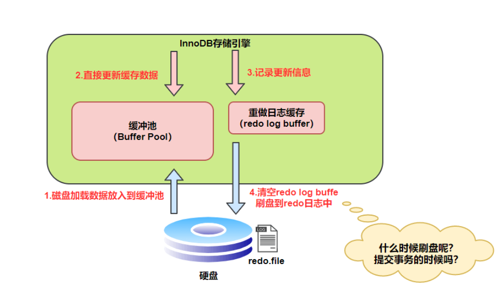

[TOC]


MySQL 日志 主要包括错误日志、查询日志、慢查询日志、事务日志、二进制日志几大类。其中，比较重要的还要属二进制日志 binlog（归档日志）和事务日志 redo log（重做日志）和 undo log（回滚日志）。


### 1. 重做日志 [Redo Log]
redo log（重做日志）是 InnoDB 存储引擎独有的，它让 MySQL 拥有了崩溃恢复能力。

比如 MySQL 实例挂了或宕机了，重启时，InnoDB 存储引擎会使用 redo log 恢复数据，保证数据的持久性与完整性。



MySQL 中数据是以页为单位，你查询一条记录，会从硬盘把一页的数据加载出来，加载出来的数据叫数据页，会放入到 `Buffer Pool` 中。

后续的查询都是先从 `Buffer Pool` 中找，没有命中再去硬盘加载，减少硬盘 IO 开销，提升性能。

更新表数据的时候，也是如此，发现 `Buffer Pool` 里存在要更新的数据，就直接在 `Buffer Pool` 里更新。

然后会把“在某个数据页上做了什么修改”记录到重做日志缓存（`redo log buffer`）里，接着刷盘到 redo log 文件里。




RedoLog的刷盘时机主要有下面几种

- 事务提交：当事务提交时，log buffer 里的 redo log 会被刷新到磁盘

- Log buffer 空间不足时：log buffer 中缓存的 redo log 已经占满了 log buffer 总容量的大约一半左右

- 事务日志缓冲区满：InnoDB 使用一个事务日志缓冲区（transaction log buffer）来暂时存储事务的重做日志条目。当缓冲区满时，会触发日志的刷新，将日志写入磁盘。

- Checkpoint（检查点）：InnoDB 定期会执行检查点操作，将内存中的脏数据（已修改但尚未写入磁盘的数据）刷新到磁盘，并且会将相应的重做日志一同刷新，以确保数据的一致性。

- 后台刷新线程：InnoDB 启动了一个后台线程，负责周期性（每隔 1 秒）地将脏页（已修改但尚未写入磁盘的数据页）刷新到磁盘，并将相关的重做日志一同刷新。

- 正常关闭服务器：MySQL 关闭的时候，redo log 都会刷入到磁盘里去。

#### 1.1 为什么需要Redolog
  >
  > 数据页大小是`16KB`，刷盘比较耗时，可能就修改了数据页里的几 `Byte` 数据，有必要把完整的数据页刷盘吗？而且数据页刷盘是随机写，因为一个数据页对应的位置可能在硬盘文件的随机位置，所以性能是很差。
  >
  > 如果是写 redo log，一行记录可能就占几十 `Byte`，只包含表空间号、数据页号、磁盘文件偏移量、更新值，再加上是顺序写，所以刷盘速度很快。
  >
  > 所以用 redo log 形式记录修改内容，性能会远远超过刷数据页的方式，这也让数据库的并发能力更强。同时持久化到文件中,在服务出现宕机的时候不会出现数据丢失
  >  

### 2. 二进制日志 [BinLog]

redo log 它是物理日志，记录内容是“在某个数据页上做了什么修改”，属于 InnoDB 存储引擎。而 binlog 是逻辑日志，记录内容是语句的原始逻辑，类似于“给 ID=2 这一行的 c 字段加 1”，属于`MySQL Server` 层。不管用什么存储引擎，只要发生了表数据更新，都会产生 binlog 日志。

那 binlog 到底是用来干嘛的？

可以说 MySQL 数据库的`数据备份、主备、主主、主从`都离不开 binlog，需要依靠 binlog 来同步数据，保证数据一致性。


binlog 会记录所有涉及更新数据的逻辑操作，并且是顺序写。binlog 日志有三种格式，可以通过`binlog_format`参数指定。

- **statement** : 记录的是SQL的原文,但是容易产生数据不一致的情况, 如 `update xxx set time = Now()`
- **row**: 记录变动内容的SQL,无法直接阅读,需要经过工具解析,不会有不一致的问题,但是记录的文件比较大
- **mixed**: MySQL自动判断SQL有无一致性的问题,如果没有就`statement`,有的话就用`row` 

binlog 的写入时机也非常简单，事务执行过程中，先把日志写到`binlog cache`，事务提交的时候，再把`binlog cache`写到 binlog 文件中。因为一个事务的 binlog 不能被拆开，无论这个事务多大，也要确保一次性写入，所以系统会给每个线程分配一个块内存作为`binlog cache`。我们可以通过`binlog_cache_size`参数控制单个线程 binlog cache 大小，如果存储内容超过了这个参数，就要暂存到磁盘（`Swap`）。

```sql
mysql> show variables like '%binlog_cache_size%';
+-----------------------+----------------------+
| Variable_name         | Value                |
+-----------------------+----------------------+
| binlog_cache_size     | 32768                |
| max_binlog_cache_size | 18446744073709547520 |
+-----------------------+----------------------+
```

### 3. Undo Log

每一个事务对数据的修改都会被记录到 undo log ，当执行事务过程中出现错误或者需要执行回滚操作的话，MySQL 可以利用 undo log 将数据恢复到事务开始之前的状态。

undo log 属于逻辑日志，记录的是 SQL 语句，比如说事务执行一条 DELETE 语句，那 undo log 就会记录一条相对应的 INSERT 语句。同时，undo log 的信息也会被记录到 redo log 中，因为 undo log 也要实现持久性保护。并且，undo-log 本身是会被删除清理的，例如 INSERT 操作，在事务提交之后就可以清除掉了；UPDATE/DELETE 操作在事务提交不会立即删除，会加入 history list，由后台线程 purge 进行清理


### 4.  MySQL日志总结
- MySQL InnoDB 引擎使用 `**redo log(重做日志)** 保证事务的**持久性**`，`使用 **undo log(回滚日志)** 来保证事务的**原子性**。`

- MySQL 数据库的**数据备份、主备、主主、主从**都离不开 binlog，需要依靠 binlog 来同步数据，保证数据一致性

