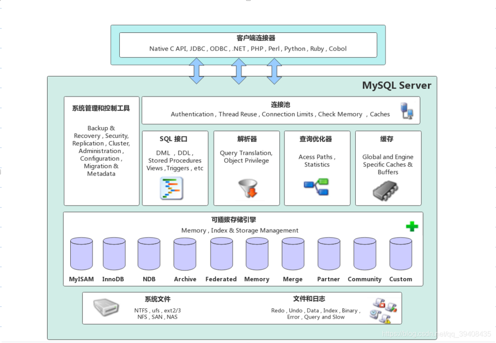

### MySQL的架构

MySQL Server架构自顶向下大致可以分网络连接层、服务层、存储引擎层和系统文件层。

#### 一、网络连接器

客户端连接器（Client Connectors）：提供与MySQL服务器建立的支持。目前几乎支持所有主流的服务端编程技术，例如常见的 Java、C、Python、.NET等，它们通过各自API技术与MySQL建立连接。

#### 二、服务层（MySQL Server）

服务层是MySQL Server的核心，主要包含系统管理和控制工具、连接池、SQL接口、解析器、查询优化器和缓存六个部分。

- 连接池（Connection Pool）: 负责存储和管理客户端与数据库的连接，一个线程负责管理一个连接。
- 系统管理和控制工具（Management     Services & Utilities）：例如备份恢复、安全管理、集群管理等。
- SQL接口（SQL     Interface）：用于接受客户端发送的各种SQL命令，并且返回用户需要查询的结果。比如DML、DDL、存储过程、视图、触发器等。
- 解析器（Parser）：负责将请求的SQL解析生成一个"解析树"。然后根据一些MySQL规则进一步检查解析树是否合法。
- 查询优化器（Optimizer）：当“解析树”通过解析器语法检查后，将交由优化器将其转化成执行计划，然后与存储引擎交互。
- 缓存（Cache&Buffer）： 缓存机制是由一系列小缓存组成的。比如表缓存，记录缓存，权限缓存，引擎缓存等。如果查询缓存有命中的查询结果，查询语句就可以直接去查询缓存中取数据。

#### 三、存储引擎层（Pluggable Storage Engines）

存储引擎负责MySQL中数据的存储与提取，与底层系统文件进行交互。

MySQL存储引擎是插件式的，服务器中的查询执行引擎通过接口与存储引擎进行通信，接口屏蔽了不同存储引擎之间的差异 。现在有很多种存储引擎，各有各的特点，最常见的是`MyISAM`和`InnoDB`。

 

#### 四、系统文件层（File System）

该层负责将数据库的数据和日志存储在文件系统之上，并完成与存储引擎的交互，是文件的物理存储层。主要包含日志文件，数据文件，配置文件，pid 文件，socket 文件等。