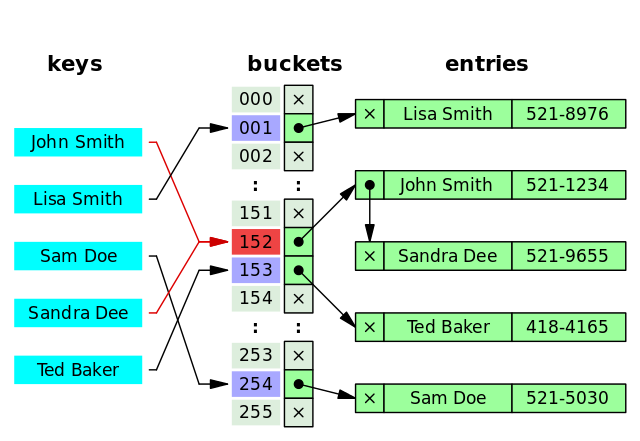

[TOC]

但凡经历过几场面试的小伙伴，应该都清楚，数据库索引这个知识点在面试中出现的频率高到离谱。
除了对于准备面试来说非常重要之外，善用索引对 SQL 的性能提升非常明显，是一个性价比较高的 SQL 优化手段。

### 1. 索引介绍

`索引是一种用于快速查询和检索数据的数据结构，其本质可以看成是一种排序好的数据结构。`

索引的作用就相当于书的目录。打个比方: 我们在查字典的时候，如果没有目录，那我们就只能一页一页的去找我们需要查的那个字，速度很慢。如果有目录了，我们只需要先去目录里查找字的位置，然后直接翻到那一页就行了。

索引底层数据结构存在很多种类型，常见的索引结构有: `B 树， B+树 和 Hash、红黑树`。在 MySQL 中，无论是 Innodb 还是 MyIsam，都使用了 B+树作为索引结构。

### 2. 索引的优缺点

优点：

- 使用索引可以大大加快数据的检索速度（大大减少检索的数据量）, 减少 IO 次数，这也是创建索引的最主要的原因。
- 通过创建唯一性索引，可以保证数据库表中每一行数据的唯一性。

缺点：
- 创建索引和维护索引需要耗费许多时间。当对表中的数据进行增删改的时候，如果数据有索引，那么索引也需要动态的修改，会降低 SQL 执行效率。
- 索引需要使用物理文件存储，也会耗费一定空间。

但是，**使用索引一定能提高查询性能吗?**

大多数情况下，索引查询都是比全表扫描要快的。但是如果数据库的数据量不大，那么使用索引也不一定能够带来很大提升。

### 3. 索引底层数据结构选型

哈希表是键值对的集合，通过键(key)即可快速取出对应的值(value)，因此哈希表可以快速检索数据（接近 O（1））。

**为何能够通过 key 快速取出 value 呢？** 原因在于 **哈希算法**（也叫散列算法）。通过哈希算法，我们可以快速找到 key 对应的 index，找到了 index 也就找到了对应的 value。

```shell
hash = hashfunc(key)
index = hash % array_size
```




为了减少 Hash 冲突的发生，一个好的哈希函数应该“均匀地”将数据分布在整个可能的哈希值集合中。

MySQL 的 InnoDB 存储引擎不直接支持常规的哈希索引，但是，InnoDB 存储引擎中存在一种特殊的“自适应哈希索引”（Adaptive Hash Index），自适应哈希索引并不是传统意义上的纯哈希索引，而是结合了 B+Tree 和哈希索引的特点，以便更好地适应实际应用中的数据访问模式和性能需求。`自适应哈希索引的每个哈希桶实际上是一个小型的 B+Tree 结构。这个 B+Tree 结构可以存储多个键值对，而不仅仅是一个键。这有助于减少哈希冲突链的长度，提高了索引的效率。`关于 Adaptive Hash Index 的详细介绍，可以查看 [MySQL 各种“Buffer”之 Adaptive Hash Indexopen in new window](https://mp.weixin.qq.com/s/ra4v1XR5pzSWc-qtGO-dBg) 这篇文章。

> 之所以没有直接使用Hash,是因为Hash对范围检索很不友好,效率低导致的


### 4. 索引的类型

- 暗照数据结构维度划分：

- BTree 索引：MySQL 里默认和最常用的索引类型。只有叶子节点存储 value，非叶子节点只有指针和 key。存储引擎 MyISAM 和 InnoDB 实现 BTree 索引都是使用 B+Tree，但二者实现方式不一样（前面已经介绍了）。
- 哈希索引：类似键值对的形式，一次即可定位。
- RTree 索引：一般不会使用，仅支持 geometry 数据类型，优势在于范围查找，效率较低，通常使用搜索引擎如 ElasticSearch 代替。
- 全文索引：对文本的内容进行分词，进行搜索。目前只有 `CHAR`、`VARCHAR` ，`TEXT` 列上可以创建全文索引。一般不会使用，效率较低，通常使用搜索引擎如 ElasticSearch 代替。

按照底层存储方式角度划分：

- 聚簇索引（聚集索引）：索引结构和数据一起存放的索引，InnoDB 中的主键索引就属于聚簇索引。
- 非聚簇索引（非聚集索引）：索引结构和数据分开存放的索引，二级索引(辅助索引)就属于非聚簇索引。MySQL 的 MyISAM 引擎，不管主键还是非主键，使用的都是非聚簇索引。

按照应用维度划分：

- 主键索引：加速查询 + 列值唯一（不可以有 NULL）+ 表中只有一个。
- 普通索引：仅加速查询。
- 唯一索引：加速查询 + 列值唯一（可以有 NULL）。
- 覆盖索引：一个索引包含（或者说覆盖）所有需要查询的字段的值。
- 联合索引：多列值组成一个索引，专门用于组合搜索，其效率大于索引合并。
- 全文索引：对文本的内容进行分词，进行搜索。目前只有 `CHAR`、`VARCHAR` ，`TEXT` 列上可以创建全文索引。一般不会使用，效率较低，通常使用搜索引擎如 ElasticSearch 代替。

MySQL 8.x 中实现的索引新特性：

- 隐藏索引：也称为不可见索引，不会被优化器使用，但是仍然需要维护，通常会软删除和灰度发布的场景中使用。主键不能设置为隐藏（包括显式设置或隐式设置）。
- 降序索引：之前的版本就支持通过 desc 来指定索引为降序，但实际上创建的仍然是常规的升序索引。直到 MySQL 8.x 版本才开始真正支持降序索引。另外，在 MySQL 8.x 版本中，不再对 GROUP BY 语句进行隐式排序。
- 函数索引：从 MySQL 8.0.13 版本开始支持在索引中使用函数或者表达式的值，也就是在索引中可以包含函数或者表达式。

### 5. 索引的细节
#### 5.1 主键索引
数据表的主键列使用的就是主键索引。一张数据表有只能有一个主键，并且主键不能为 null，不能重复。当未指定主键索引的时候,MySQL会自动创建一个6个字节的隐藏主键`row_id`(<u>需要注意的是长度和row_id竞争而导致的性能问题</u>) 

在 MySQL 的 InnoDB 的表中，当没有显示的指定表的主键时，InnoDB 会自动先检查表中是否有唯一索引且不允许存在 null 值的字段，如果有，则选择该字段为默认的主键，否则 InnoDB 将会自动创建一个 6Byte 的自增主键。

#### 5.2 二级索引
`二级索引（Secondary Index）的叶子节点存储的数据是主键的值,不存储数据信息`，也就是说，通过二级索引可以定位主键的位置，二级索引又称为辅助索引/非主键索引。唯一索引，普通索引，前缀索引等索引都属于二级索引。

- 唯一索引(Unique Key):唯一索引也是一种约束。唯一索引的属性列不能出现重复的数据，但是允许数据为 NULL，一张表允许创建多个唯一索引。 建立唯一索引的目的大部分时候都是为了该属性列的数据的唯一性，而不是为了查询效率。
- 普通索引(Index):普通索引的唯一作用就是为了快速查询数据，一张表允许创建多个普通索引，并允许数据重复和 NULL。
- 前缀索引(Prefix):前缀索引只适用于字符串类型的数据。前缀索引是对文本的前几个字符创建索引，相比普通索引建立的数据更小，因为只取前几个字符。
- 全文索引(Full Text):全文索引主要是为了检索大文本数据中的关键字的信息，是目前搜索引擎数据库使用的一种技术。Mysql5.6 之前只有 MYISAM 引擎支持全文索引，5.6 之后 InnoDB 也支持了全文索引。


> 可以理解为非聚簇索引,当使用非聚簇索引的时候的时候,因为只能找到数据的主键,而数据和主键不在一起,所以需要回表查询一次(在没有索引覆盖的情况下);

#### 5.3 聚簇索引

聚簇索引（Clustered Index）即索引结构和数据一起存放的索引，并不是一种单独的索引类型。InnoDB 中的主键索引就属于聚簇索引。

在 MySQL 中，InnoDB 引擎的表的 .ibd文件就包含了该表的索引和数据，对于 InnoDB 引擎表来说，该表的索引(B+树)的每个非叶子节点存储索引，叶子节点存储索引和索引对应的数据。

聚簇索引的优缺点

- **查询速度非常快**：聚簇索引的查询速度非常的快，因为整个 B+树本身就是一颗多叉平衡树，叶子节点也都是有序的，定位到索引的节点，就相当于定位到了数据。相比于非聚簇索引， 聚簇索引少了一次读取数据的 IO 操作。
- **对排序查找和范围查找优化**：聚簇索引对于主键的排序查找和范围查找速度非常快。

- **依赖于有序的数据**：因为 B+树是多路平衡树，如果索引的数据不是有序的，那么就需要在插入时排序，如果数据是整型还好，否则类似于字符串或 UUID 这种又长又难比较的数据，插入或查找的速度肯定比较慢。
- **更新代价大**：如果对索引列的数据被修改时，那么对应的索引也将会被修改，而且聚簇索引的叶子节点还存放着数据，修改代价肯定是较大的，所以对于主键索引来说，主键一般都是不可被修改的。

非聚簇索引(Non-Clustered Index)即索引结构和数据分开存放的索引，并不是一种单独的索引类型。二级索引(辅助索引)就属于非聚簇索引。MySQL 的 MyISAM 引擎，不管主键还是非主键，使用的都是非聚簇索引。

非聚簇索引的叶子节点并不一定存放数据的指针，因为二级索引的叶子节点就存放的是主键，根据主键再回表查数据。

- 更新代价比聚簇索引要小 。非聚簇索引的更新代价就没有聚簇索引那么大了，非聚簇索引的叶子节点是不存放数据的。

- 依赖于有序的数据:跟聚簇索引一样，非聚簇索引也依赖于有序的数据
- 可能会二次查询(回表):这应该是非聚簇索引最大的缺点了。 当查到索引对应的指针或主键后，可能还需要根据指针或主键再到数据文件或表中查询。

#### 5.4 联合索引
使用表中的多个字段创建索引，就是 联合索引，也叫 组合索引 或 复合索引。

以 score 和 name 两个字段建立联合索引：

```sql
ALTER TABLE `cus_order` ADD INDEX id_score_name(score, name);
```

最左前缀匹配原则指的是在使用联合索引时，MySQL 会根据索引中的字段顺序，从左到右依次匹配查询条件中的字段。如果查询条件与索引中的最左侧字段相匹配，那么 MySQL 就会使用索引来过滤数据，这样可以提高查询效率。

### 6. 索引下推
索引下推（Index Condition Pushdown，简称 ICP） 是 MySQL 5.6 版本中提供的一项索引优化功能，它允许存储引擎在索引遍历过程中，执行部分 WHERE字句的判断条件，直接过滤掉不满足条件的记录，从而减少回表次数，提高查询效率。

```sql
create table student(
	id bigint primary key,
	name varchar(128) not null,
	birth date not null,
    index `ix_name_birthc`(`name`,`birth`)
)comment 'Student';


select * from student where name = 'zhangsan' and month(birth) = '2024-01'
```


> 索引下除了可以减少回表查询的数据,同时也减少了和Server层交互的数据量

### 7. 索引使用建议

1. 选择合适的字段作为索引

- **不为 NULL 的字段**：索引字段的数据应该尽量不为 NULL，因为对于数据为 NULL 的字段，数据库较难优化。
- **被频繁查询的字段**：我们创建索引的字段应该是查询操作非常频繁的字段。
- **被作为条件查询的字段**：被作为 WHERE 条件查询的字段，应该被考虑建立索引。
- **频繁需要排序的字段**：索引已经排序，这样查询可以利用索引的排序，加快排序查询时间。
**被经常频繁用于连接的字段**：经常用于连接的字段可能是一些外键列，对于外键列并不一定要建立外键，只是说该列涉及到表与表的关系。对于频繁被连接查询的字段，可以考虑建立索引，提高多表连接查询的效率。


2. 限制每张表上的索引数量,过多的索引可能导致更新时候的性能问题
3. 对于频繁更新的字段谨慎建立索引
4. 从磁盘空间以及更新效率上的角度,应尽量建立联合索引而非单列索引
5. 字符串的字段尽量使用最左匹配原则索引
5. 删除长期不使用的索引
6. 避免一些索引失效的场景出现
- 联合索引未遵循最左匹配
- 在索引列上使用计算,函数以及转换等操作
- OR 条件没有全部支持索引
- like 语法使用 '%searcKey' 的形式
- 索引字段区分不明显
