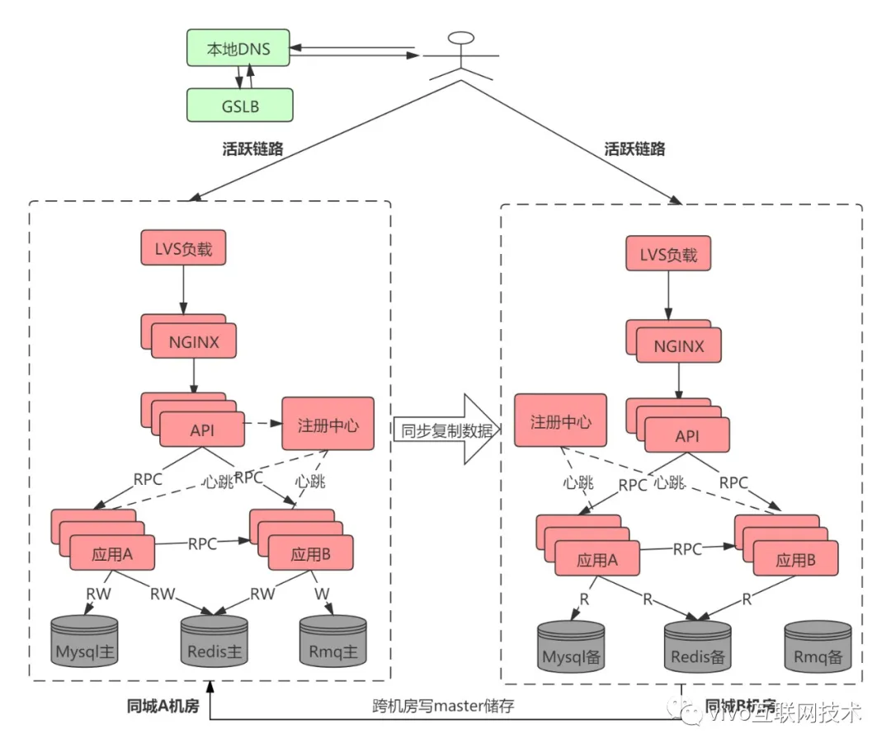
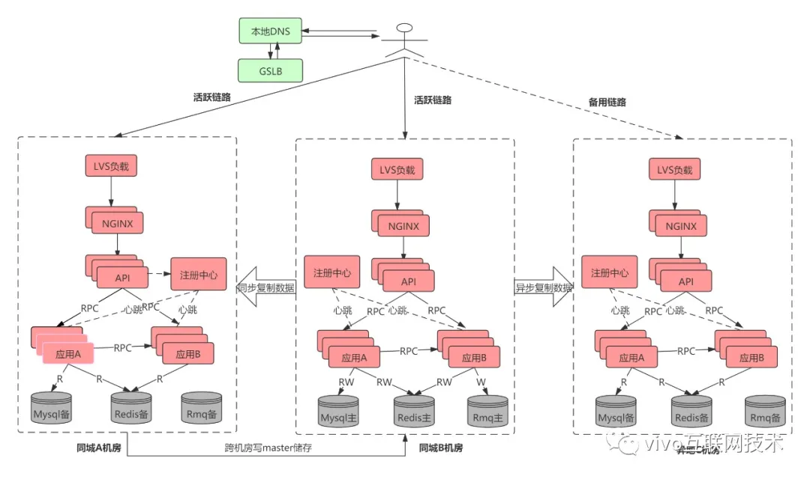
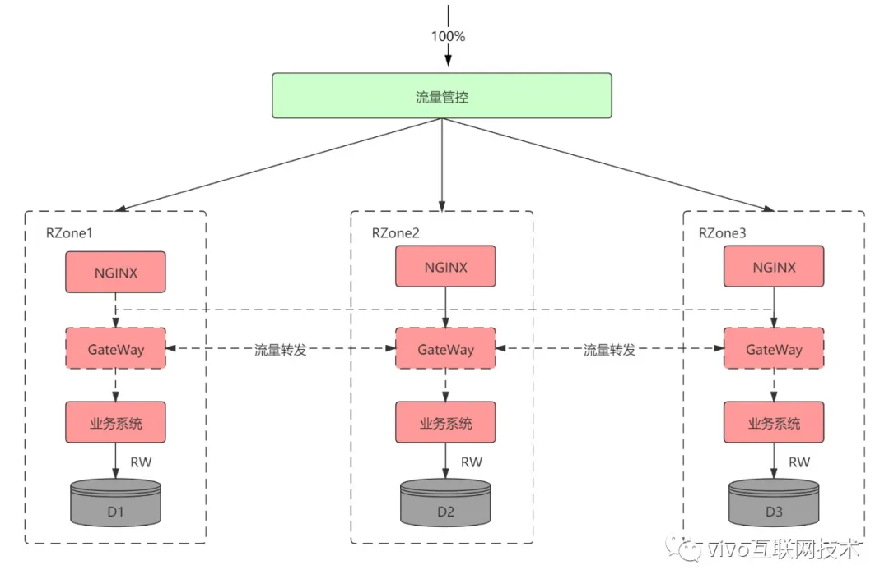

### 1. 为什么需要异地多活

随着移动互联网的深入发展，用户增长达到一定规模后，不少企业都会面高并发业务和临海量数据的挑战，传统的单机房在机器容量上存在瓶颈。在一些极端场景下，有可能所有服务器都出现故障，例如机房断电、机房火灾、地震等这些不卡抗拒因素会导致系统所有服务器都故障从而导致业务整体瘫痪，而且即使有其他地区的备份，把备份业务系统全部恢复到能够正常提供业务，花费的时间也比较长。为了满足中心业务连续性，增强抗风险能力，多活作为一种可靠的高可用部署架构，成为各大互联网公司的首要选择。

### 2. 异地多活与备份的区别

多活架构的关键点就是指不同地理位置上的系统都能够提供业务服务，`这里的“活”是指实时提供服务的意思。与“活”对应的是字是“备”，备是备份，正常情况下对外是不提供服务的，如果需要提供服务，则需要大量的人工干预和操作，花费大量的时间才能让“备”变成“活。`

单纯从描述来看多活很强大，能够保证在灾难的情况下业务都不受影响，是不是意味着不管什么业务，我们都要去实现多活架构呢？其实不是，实现多活架构都要付出一定的代价，具体表现为：

- 不同多活方案实现复杂度不一样，随着业务规模和容灾级别的提升，多活方案会给业务系统设计带来更大复杂度。
- 不管采用哪种多活方案都难以完全避免跨机房甚至是跨地区服务调用带来的耗时增加。
- 多活会带来成本会上升，毕竟要多在一个或者多个机房搭建独立的一套业务系统。

因此，多活虽然功能很强大，但也不是每个业务都要上多活。例如，企业内部的 IT 系统、管理系统、博客站点等，如果无法承受异地多活带来的复杂度和成本，是可以不做异地多活的，而对于重要的业务例如核心金融、支付、交易等有必要做多活。

### 3. 多活方案

常见的多活方案有同城双活、两地三中心、三地五中心、异地多活等多种技术方案，不同多活方案技术要求、建设成本、运维成本都不一样，下面我们会逐步介绍这几种多活方案并给出每种方案的优点和缺点。选用哪种方案要结合具体业务规模、当前基础建设能力、投入产出比等多种因素来决定。

#### 3.1 同城双活

同城双活是在同城或相近区域内建立两个机房。同城双机房距离比较近，通信线路质量较好，比较容易实现数据的同步复制 ，保证高度的数据完整性和数据零丢失。同城两个机房各承担一部分流量，一般入口流量完全随机，内部RPC调用尽量通过就近路由闭环在同机房，相当于两个机房镜像部署了两个独立集群，数据仍然是单点写到主机房数据库，然后实时同步到另外一个机房。下图展示了同城双活简单部署架构，当然一般真实部署和考虑问题要远远比下图复杂。

`服务调用基本在同机房内完成闭环，数据仍然是单点写到主机房数据储存，然后实时同步复制到同城备份机房`。当机房A出现问题时候运维人员只需要通过GSLB或者其他方案手动更改路由方式将流量路由到B机房。同城双活可有效用于防范火灾、建筑物破坏、供电故障、计算机系统及人为破坏引起的机房灾难.

#### 3.2 两地三中心

所谓两地三中心是指 同城双中心 + 异地灾备中心。异地灾备中心是指在异地的城市建立一个备份的灾备中心，用于双中心的数据备份，数据和服务平时都是冷的，当双中心所在城市或者地区出现异常而都无法对外提供服务的时候，异地灾备中心可以用备份数据进行业务的恢复。

> - 服务同城双活，数据同城灾备，同城不丢失数据情况下跨机房级别容灾。
> - 架构方案较为简单，核心是解决底层数据双活，由于双机房距离近，通信质量好，底层储存例如mysql可以采用同步复制，有效保证双机房数据一致性。
> - 灾备中心能防范同城双中心同时出现故障时候利用备份数据进行业务的恢复
> - 数据库写数据存在跨机房调用，在复杂业务以及链路下频繁跨机房调用增加响应时间，影响系统性能和用户体验。
> - 服务规模足够大(例如单体应用超过万台机器)，所有机器链接一个主数据库实例会引起连接不足问题。
> - 出问题不敢轻易将流量切往异地数据备份中心，异地的备份数据中心是冷的，平时没有流量进入，因此出问题需要较长时间对异地灾备机房进行验证。

### 4. 多活带来的问题和挑战

#### 4.1 流量路由

为了保证用户请求能正确进入自己所属单元，每一个机房都会部署流量入口网关集群。当用户请求到达进入机房内最先进入到流量网关，流量网关能感知全局的流量分片情况，计算用户所处流量单元并将流量转发到对应的单元，这样就可以将用户请求路由到对应的单元内。

#### 4.2 数据同步

- **QZone数据**：这种数据只需要保证最终一致性，对于短暂不一致无影响，但是对延时非常铭感，例如一些算法、风控、配置等数据。这类数据基本上都是每个机房部署一套QZone，然后机房之间相互同步。
- **MZone数据**：这类数据对一致性非常铭感，不能出现不一致，只能采用同城双活部署方式，业务需要能容忍异地调用延时。
- **RZone数据** ：这类数据每个Zone都有自己的主节点，如果数据不在该单元内需要路由到对应的节点去写。这类数据部署情况像下面这样

