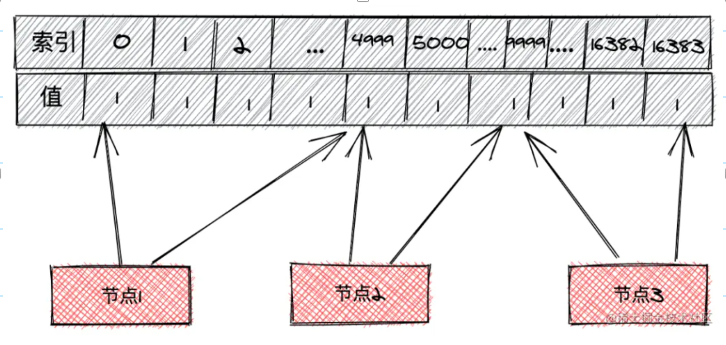
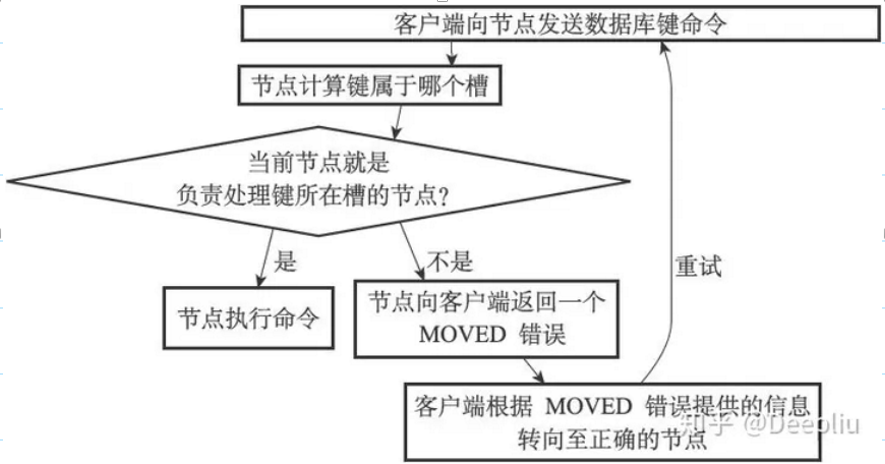
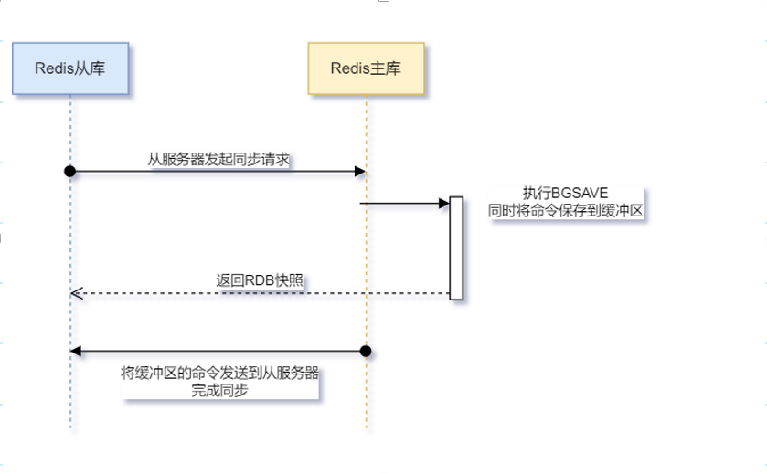
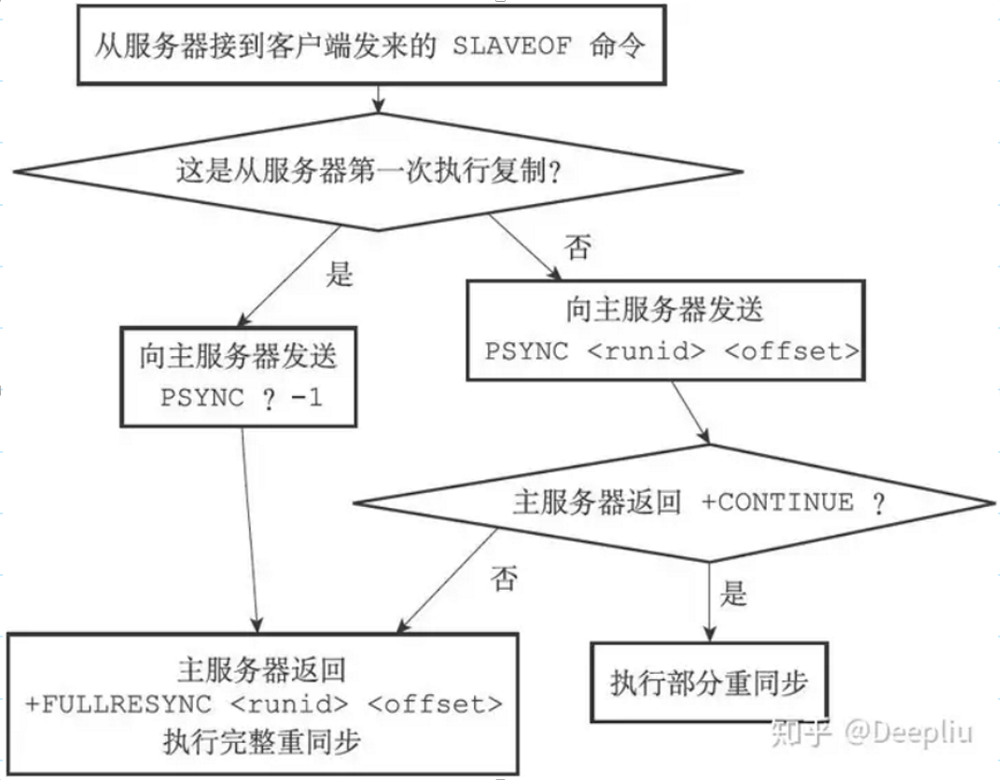

Redis集群是Redis提供的分布式数据库方案，集群通过分片（sharding）来进行数据共享，并提供复制和故障转移功能。

 

### 1、 Redis集群的工作原理

 

Redis集群通过槽指派机制来决定写命令应该被分配到那个节点。整个集群对应的槽是由16384大小的二进制数组组成，集群中每个主节点分配一部分槽，每条写命令落到二进制数组中的某个位置，该位置被分配给了哪个节点，则对应的命令就由该节点去执行。槽指派对应的二进制数组如下图所示：



从上图可以看到：节点1只负责执行0-4999的槽位，而节点2负责执行5000-9999，节点3执行9999-16383。当进行写的时候：

 ```shell
 Set key value
 ```

命令通过CRC16(key)&16383=6789（假设结果），由于节点2负责5000～9999的槽位，则该命令的结果6789最终由节点2执行。当然如果在节点2执行一条命令时，假设通过CRC计算后得到的值为567，则其应该由节点1执行，此时命令会进行转向操作，将要执行的命令流转到节点1上去执行




### 2、Redis的集群节点同步

集群中每个主节点都会定时发送信息到其他主节点进行同步，如果其他主节点在规定时间内响应了发送消息的主节点，则发送消息的主节点认为响应了消息的主节点正常，反之则认为响应消息的主节点疑似下线，则发送消息的主节点在其节点上将其标记“疑似下线(`客观下线`)”。

 

当集群中超过一半以上的节点认为某个主节点被标记为“疑似下线”，则其中某个主节点将疑似下线节点标记为下线状态(`主观下线`)，并向集群广播一条下线消息，当下线节点对应的从节点接收到该消息时，则从从节点中选举出一个节点作为主节点继续对外提供服务。


在命令传播阶段，从服务器默认每秒向主服务器发送命令：
```shell
REPLCONF ACK <replication_offset>
```

其中 `replication_offset` 是从服务器当前的复制偏移量。 发送 `REPLCONFACK` 命令对于主从服务器有三个作用：

- 检测主从服务器的网络连接状态。
- 辅助实现min-slaves选项。
- 检测命令丢失。

 

#### 2.1 Redis的旧版同步方式(全量)


Redis的同步方式分为:

- 主从同步
- 从从同步(分但Master的压力)

具体过程如下：

1. 建立连接，然后从库告诉主库请求同步，然后主库跟从库说：“收到”
2. 主库生成快照RDB发送给从库，并在缓冲区记录从现在开始执行的所有写命令。
3. 从库拿到数据后，要把数据保存到库里。这个时候就会在本地完成数据的加载，会用到RDB。
4. 主库把新来的数据AOF同步给从库。




这种方式存在性能问题，当网络状态不好的时候,从服务器经常掉线，导致经常出现重新同步，可能会影响Redis的性能


#### 2.2 Redis的新版同步方式(全量 + 增量)

为解决旧版复制功能在处理断线重复制的低效问题，从2.8版本开始，使用PSYNC命令代替SYNC命令来执行复制时的同步操作。

PSYNC命令包括两种模式：

- ❑完整重同步（fullresynchronization）：用于初次复制，发送“PSYNC?-1”命令，与SYNC命令的执行步骤基本一样，都是让主服务器创建并发送RDB文件，以及发送保存在缓冲区的写命令来进行同步；
	
- ❑部分重同步（partialresynchronization）：用于断线后重复制，发送“PSYNC＜runid＞＜offset＞”命令。当从服务器断线后重连接主服务器时，如果条件允许，主服务器可以将主从服务器连接断开期间执行的写命令发送给从服务器，从服务器执行这些写命令，就又可以与主服务器状态一致。

部分重同步功能由以下三个部分构成：

- ❑主服务器的复制偏移量（replication offset）和从服务器的复制偏移量：两者状态一致时偏移量相同，反之，偏移量不同说明不一致。单位是字节。如果从服务器的偏移量不在复制积压缓冲区（说明时间比较久或者为错误的Offset），则执行完整重同步。

- ❑主服务器的复制积压缓冲区（replication backlog）：固定长度先进先出（FIFO）的队列，默认大小为1MB。缓冲区最小大小的估算公式 $S(x) = second * writeSizePerSecond$，其中second是从服务器的平均断线时间，write_size_per_second是主服务器平均每秒产生的写命令数据量（协议格式的写命令的长度总和）。为了安全起见，可以将复制积压缓冲区的大小设为2倍估算的最小大小。
	
- ❑服务器的运行ID（runID）：每个服务器，不论主还是从，都会有个运行ID，服务器启动时自动生成，由40个随机的十六进制字符组成，例如`53b9b28df8042fdc9ab5e3fcbbbabff1d5dce2b3`。

PSYNC执行完整重同步和部分重同步时的流程图：


