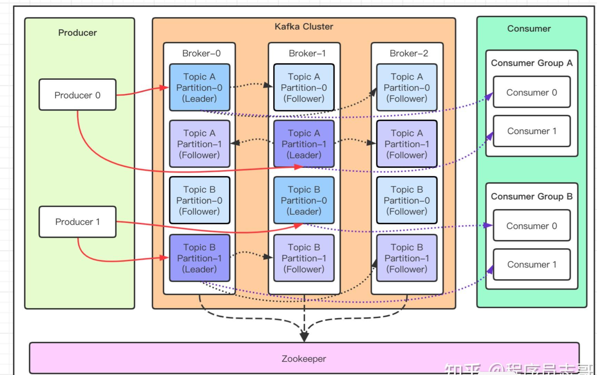
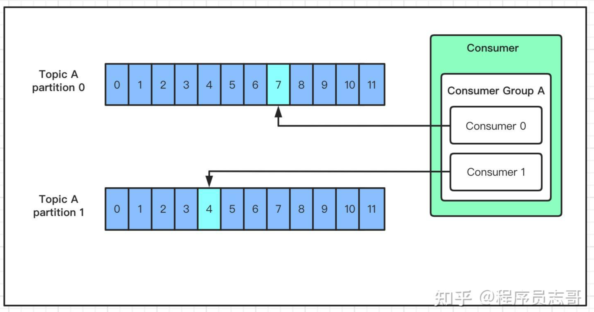

## Kafka的生产消费原理

### 1、架构设计

- Producer：Producer即生产者，消息的产生者，是消息的入口
- Broker： Broker是 kafka 一个实例，每个服务器上有一个或多个     kafka 的实例
- Topic：消息的主题，可以理解为消息队列，kafka的数据就保存在topic。在每个     broker 上都可以创建多个 topic 。
- Partition：Topic的分区，每个     topic 可以有多个分区，分区的作用是做负载，提高 kafka 的吞吐量。同一个     topic 在不同的分区的数据是不重复的，partition 的表现形式就是一个一个的文件夹！
- Replication：每一个分区都有多个副本，副本的作用是做备胎，主分区（Leader）会将数据同步到从分区（Follower）。当主分区（Leader）故障的时候会选择一个备胎（Follower）上位，成为     Leader。在kafka中默认副本的最大数量是10个，且副本的数量不能大于Broker的数量，follower和leader绝对是在不同的机器，同一机器对同一个分区也只可能存放一个副本
- Message：每一条发送的消息主体。
- Consumer：消费者，即消息的消费方，是消息的出口。
- Consumer     Group：我们可以将多个消费组组成一个消费者组，在 kafka 的设计中同一个分区的数据只能被消费者组中的某一个消费者消费。同一个消费者组的消费者可以消费同一个topic的不同分区的数据，这也是为了提高kafka的吞吐量！
- Zookeeper：kafka     集群依赖 zookeeper 来保存集群的的元信息，来保证系统的可用性。

## 2、发送过程原理

那 kafka 是如何将数据写入到对应的分区呢？kafka中有以下几个原则：

- 1、数据在写入的时候可以指定需要写入的分区，如果有指定，则写入对应的分区
- 2、如果没有指定分区，但是设置了数据的key，则会根据key的值hash出一个分区
- 3、如果既没指定分区，又没有设置key，则会轮询选出一个分区

在确定了发送的分区之后，kafka 每次发送数据都是向`Leader`发送数据，并顺序写入到磁盘，然后Leader会将数据同步到各个`Follower`，即使Leader挂了，也不会影响服务的正常运行。

## 3、消费过程

与生产者一样，消费者主动的去kafka集群拉取消息时，也是从`Leader`分区去拉取数据。

考虑到多个消费者的场景，kafka 在设计的时候，可以由多个消费者组成一个消费组，同一个消费组者的消费者可以消费同一个 topic 下不同分区的数据，同一个分区只会被一个消费组内的某个消费者所消费，防止出现重复消费的问题！

但是不同的组，可以消费同一个分区的数据！

你可以这样理解，一个消费组就是一个客户端，一个客户端可以由很多个消费者组成，以便加快消息的消费能力。

