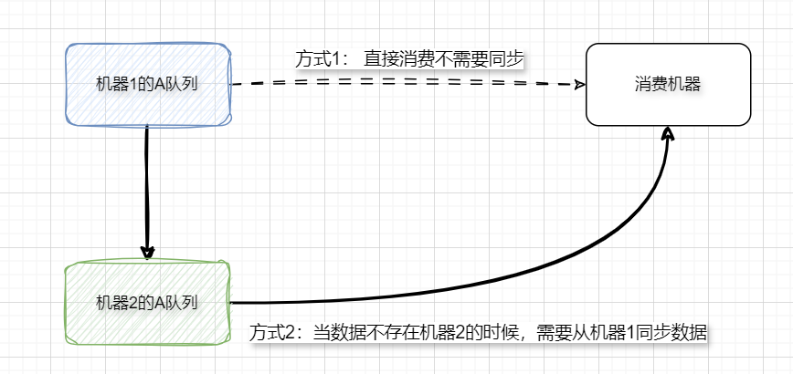
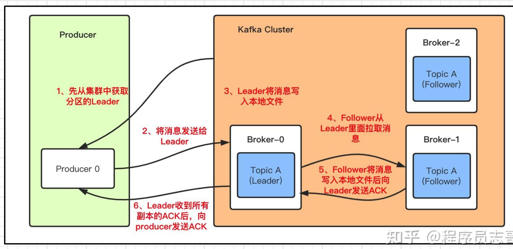

由于笔者只使用和实践过RabbitMQ和Kafka，RocketMQ和ActiveMQ了解的不深，所以分析一下RabbitMQ和Kafka的高可用。

### （一）RabbitMQ

RabbitMQ有三种模式：单机模式，普通集群模式，镜像集群模式

**（1）单机模式**

单机模式平常使用在开发或者本地测试场景，一般就是测试是不是能够正确地处理消息，生产上基本没人去用单机模式，风险很大。

**（2）普通集群模式：仅共享Queue的元数据** 

普通集群模式就是启动多个RabbitMQ实例。在你创建的queue，只会放在一个rabbtimq实例上，但是每个实例都同步queue的元数据。在消费的时候完了，如果连接到了另外一个实例，那么那个实例会从queue所在实例上拉取数据过来。

这种方式确实很麻烦，也不怎么好，没做到所谓的分布式，就是个普通集群。因为这导致你要么消费者每次随机连接一个实例然后拉取数据，要么固定连接那个queue所在实例消费数据，前者有数据拉取的开销，后者导致单实例性能瓶颈。

而且如果那个放queue的实例宕机了，会导致接下来其他实例就无法从那个实例拉取，如果你开启了消息持久化，让RabbitMQ落地存储消息的话，消息不一定会丢，得等这个实例恢复了，然后才可以继续从这个queue拉取数据。

这方案主要是提高吞吐量的，就是说让集群中多个节点来服务某个queue的读写操作。

**（3）镜像集群模式： 共享元数据和消息数据**

镜像集群模式是所谓的RabbitMQ的高可用模式，跟普通集群模式不一样的是，你创建的queue，无论元数据还是queue里的消息都会存在于多个实例上，然后每次你写消息到queue的时候，都会自动把消息到多个实例的queue里进行消息同步。

优点在于你任何一个实例宕机了，没事儿，别的实例都可以用。缺点在于`性能开销太大和扩展性很低，同步所有实例，这会导致网络带宽和压力很重，而且扩展性很低`，每增加一个实例都会去包含已有的queue的所有数据，并没有办法线性扩展queue。

开启镜像集群模式可以去RabbitMQ的管理控制台去增加一个策略，指定要求数据同步到所有节点的，也可以要求就同步到指定数量的节点，然后你再次创建queue的时候，应用这个策略，就会自动将数据同步到其他的节点上去了。

### （二）Kafka

Kafka天生就是一个分布式的消息队列，它可以由多个broker组成，每个broker是一个节点；你创建一个topic，这个topic可以划分为多个partition，每个partition可以存在于不同的broker上，每个partition就放一部分数据。

kafka 0.8以后，提供了HA机制，就是replica副本机制。kafka会均匀地将一个partition的所有replica分布在不同的机器上，来提高容错性。每个partition的数据都会同步到吉他机器上，形成自己的多个replica副本。然后所有replica会选举一个leader出来，那么生产和消费都去leader，其他replica就是follower，leader会同步数据给follower。当leader挂了会自动去找replica，然后会再选举一个leader出来，这样就具有高可用性了。

写数据的时候，生产者就写leader，然后leader将数据落地写本地磁盘，接着其他follower自己主动从leader来pull数据。一旦所有follower同步好数据了，就会发送ack给leader，leader收到所有follower的ack之后，就会返回写成功的消息给生产者。（当然，这只是其中一种模式，还可以适当调整这个行为）

消费的时候，只会从leader去读，但是只有一个消息已经被所有follower都同步成功返回ack的时候，这个消息才会被消费者读到。