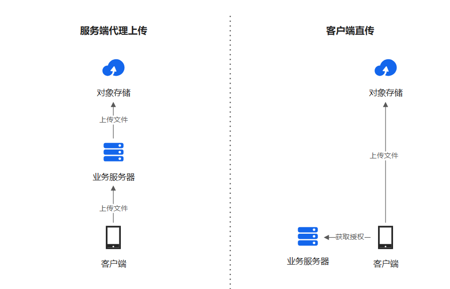
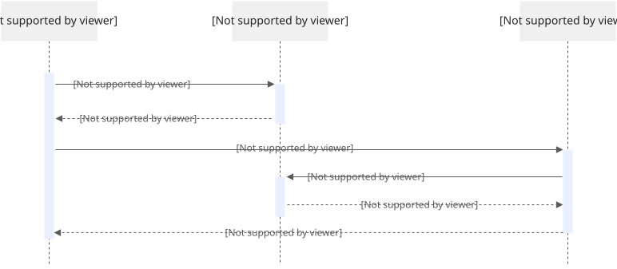
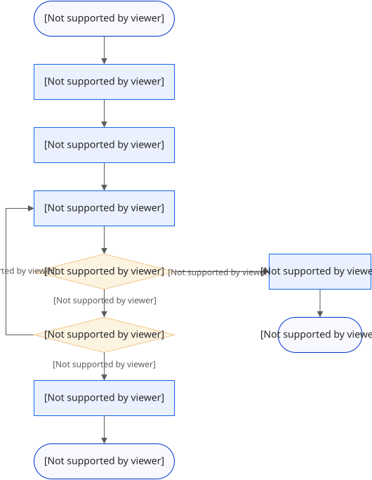

[TOC]

## I. OSS文件最佳实践

### 1. 传统方式

在典型的服务端和客户端架构下，常见的文件上传方式是服务端代理上传：客户端将文件上传到业务服务器，然后业务服务器将文件上传到OSS。在这个过程中，一份数据需要在网络上传输两次，会造成网络资源的浪费，增加服务端的资源开销,且上传速度受到业务服务器的限制。

为了解决这一问题，您可以在客户端直连OSS来完成文件上传，无需经过业务服务器中转。

### 2. Web端直传

服务端签名直传是指在服务端生成签名，将签名返回给客户端，然后客户端使用签名上传文件到OSS。由于服务端签名直传无需将访问密钥暴露在前端页面，相比客户端签名直传具有更高的安全性。本文介绍如何进行服务端签名直传。

当用户要上传一个文件到OSS，而且希望将上传的结果返回给应用服务器时，需要设置一个回调函数，将请求告知应用服务器。用户上传完文件后，不会直接得到返回结果，而是先通知应用服务器，再把结果转达给用户。

### 3. 大文件分片上传

在上传大文件（超过5 GB）到OSS的过程中，如果出现网络中断、程序异常退出等问题导致文件上传失败，您需要使用分片上传的方式上传大文件。分片上传通过将待上传的大文件分成多个较小的碎片（Part），充分利用网络带宽和服务器资源并发上传多个Part，加快上传完成时间，并在Part上传完成之后调用CompleteMultipartUpload接口将这些Part组合成一个完整的Object。

