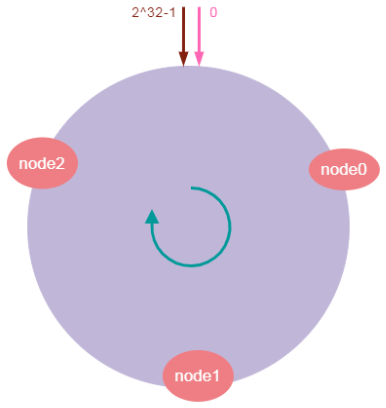
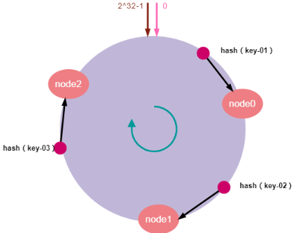
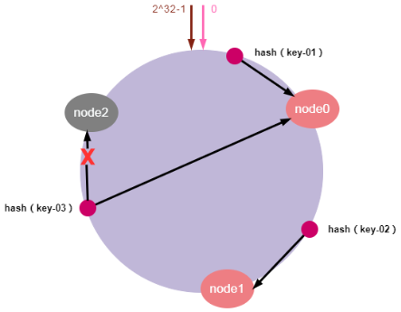
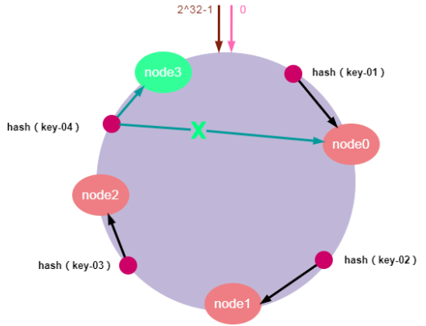
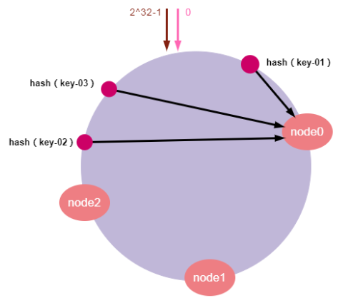
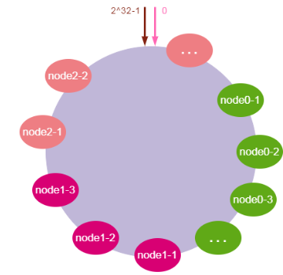

### 1. 使用场景

一致性哈希(Consistent Hash)算法是1997年提出，是一种特殊的哈希算法，目的是解决分布式系统的数据分区问题：当分布式集群移除或者添加一个服务器时，必须尽可能小地改变已存在的服务请求与处理请求服务器之间的映射关系。

我们知道，传统的按服务器节点数量取模在集群扩容和收缩时存在一定的局限性。而一致性哈希算法正好解决了简单哈希算法在分布式集群中存在的动态伸缩的问题。降低节点上下线的过程中带来的数据迁移成本，同时节点数量的变化与分片原则对于应用系统来说是无感的，使上层应用更专注于领域内逻辑的编写，使得整个系统架构能够动态伸缩，更加灵活方便。

一致性哈希算法是分布式系统中的重要算法，使用场景也非常广泛。主要是是负载均衡、缓存数据分区等场景。

一致性哈希应该是实现负载均衡的首选算法，它的实现比较灵活，既可以在客户端实现，也可以在中间件上实现，比如日常使用较多的缓存中间件memcached 使用的路由算法用的就是一致性哈希算法。

此外，其它的应用场景还有很多：

- RPC框架Dubbo用来选择服务提供者
- 分布式关系数据库分库分表：数据与节点的映射关系

### 2. 哈希环
#### 2.1 哈希环的分布

- 一致性哈希算法将整个哈希值空间映射成一个虚拟的圆环。整个哈希空间的取值范围为$0 ~ 2^32 -1$，按顺时针方向开始从$0~2^32-1$排列，最后的节点$2^32-1$在0开始位置重合，形成一个虚拟的圆环。
- 将服务器节点映射到哈希环上对应的位置。我们可以对服务器IP地址进行哈希计算，哈希计算后的结果对2^32取模，结果一定是一个0到2^32-1之间的整数。最后将这个整数映射在哈希环上，整数的值就代表了一个服务器节点的在哈希环上的位置。即：hash（服务器ip）% 2^32。下面我们依次将node0、node1、node2三个缓存服务器映射到哈希环上，如下图所示：

- 当服务器接收到数据请求时，首先需要计算请求Key的哈希值；然后将计算的哈希值映射到哈希环上的具体位置；接下来，从这个位置沿着哈希环顺时针查找，遇到的第一个节点就是key对应的节点；最后，将请求发送到具体的服务器节点执行数据操作。

#### 2.2 服务器缩容

服务器缩容就是减少集群中服务器节点的数量或是集群中某个节点故障。假设，集群中的某个节点故障，原本映射到该节点的请求，会找到哈希环中的下一个节点，数据也同样被重新分配至下一个节点，其它节点的数据和请求不受任何影响。这样就确保节点发生故障时，集群能保持正常稳定。如下图所示：

如上图所示：节点node2发生故障时，数据key-01和key-02不会受到影响，只有key-03的请求被重定位到node0。在一致性哈希算法中，如果某个节点宕机不可用了，那么受影响的数据仅仅是会寻址到此节点和前一节点之间的数据。其他哈希环上的数据不会受到影响。

#### 2.3 服务器扩容

服务器扩容就是集群中需要增加一个新的数据节点，假设，由于需要缓存的数据量太大，必须对集群进行扩容增加一个新的数据节点。此时，只需要计算新节点的哈希值并将新的节点加入到哈希环中，然后将哈希环中从上一个节点到新节点的数据映射到新的数据节点即可。其他节点数据不受影响，具体如下图所示：

如上图所示，加入新的node3节点后，key-01、key-02,key-03不受影响，只有key-04的寻址被重定位到新节点node3，受影响的数据仅仅是会寻址到新节点和前一节点之间的数据。

通过一致性哈希算法，集群扩容或缩容时，只需要重新定位哈希环空间内的一小部分数据。其他数据保持不变。当节点数越多的时候，使用哈希算法时，需要迁移的数据就越多，使用一致哈希时，需要迁移的数据就越少。所以，一致哈希算法具有较好的容错性和可扩展性。

#### 2.4 数据倾斜问题

由于哈希计算的随机性，导致一致性哈希算法存在一个致命问题：数据倾斜，，也就是说大多数访问请求都会集中少量几个节点的情况。特别是节点太少情况下，容易因为节点分布不均匀造成数据访问的冷热不均。这就失去了集群和负载均衡的意义。如下图所示：

致性哈希算法引入了虚拟节点机制，即对每一个物理服务节点映射多个虚拟节点，将这些虚拟节点计算哈希值并映射到哈希环上，当请求找到某个虚拟节点后，将被重新映射到具体的物理节点。虚拟节点越多，哈希环上的节点就越多，数据分布就越均匀，从而避免了数据倾斜的问题。

- 参考文章 : [图解一致性哈希算法，看这一篇就够了！ -阿里云开发者社区 (aliyun.com)](https://developer.aliyun.com/article/1082388)