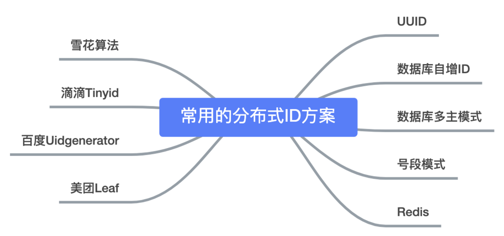
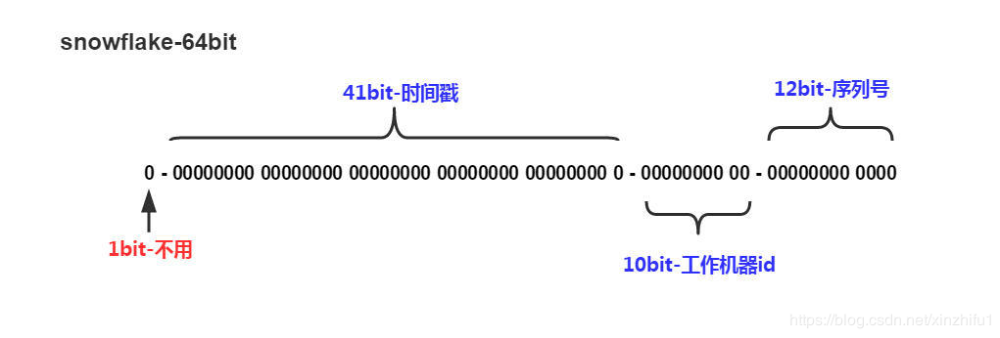

[TOC]

在我们业务数据量不大的时候，单库单表完全可以支撑现有业务，数据再大一点搞个MySQL主从同步读写分离也能对付。

但随着数据日渐增长，主从同步也扛不住了，就需要对数据库进行分库分表，但分库分表后需要有一个唯一ID来标识一条数据，数据库的自增ID显然不能满足需求；特别一点的如订单、优惠券也都需要有`唯一ID`做标识。此时一个能够生成`全局唯一ID`的系统是非常必要的。那么这个`全局唯一ID`就叫`分布式ID`。

那么分布式ID需要满足那些条件？

- 全局唯一：必须保证ID是全局性唯一的，基本要求
- 高性能：高可用低延时，ID生成响应要块，否则反倒会成为业务瓶颈
- 高可用：100%的可用性是骗人的，但是也要无限接近于100%的可用性
- 好接入：要秉着拿来即用的设计原则，在系统设计和实现上要尽可能的简单
- 趋势递增：最好趋势递增，这个要求就得看具体业务场景了，一般不严格要求



### 1 ID生成实践方案

#### 1.1 基于UUID

在Java的世界里，想要得到一个具有唯一性的ID，首先被想到可能就是`UUID`，毕竟它有着全球唯一的特性。

```javascript
public static void main(String[] args) { 
       String uuid = UUID.randomUUID().toString().replaceAll("-","");
       System.out.println(uuid);
 }
```
UUID没有丝毫的业务意义，看不出和实体相关的有用信息；而对于数据库来说用作业务`主键ID`，它不仅是太长还是字符串，存储性能差查询也很耗时，所以不推荐用作`分布式ID`。

#### 1.2 基于数据库自增ID
基于数据库的auto_increment自增ID完全可以充当分布式ID，具体实现：需要一个单独的MySQL实例用来生成ID，建表结构如下：

```sql
CREATE DATABASE `SEQ_ID`;
CREATE TABLE SEQID.SEQUENCE_ID (
    id bigint(20) unsigned NOT NULL auto_increment, 
    value char(10) NOT NULL default '',
    PRIMARY KEY (id),
) ENGINE=MyISAM;
insert into SEQUENCE_ID(value)  VALUES ('values');
```

当我们需要一个ID的时候，向表中插入一条记录返回主键ID，但这种方式有一个比较致命的缺点，访问量激增时MySQL本身就是系统的瓶颈，用它来实现分布式服务风险比较大，不推荐！

> 使用双主多从的方式可以提升数据库ID生成的性能,只需要讲生成ID的步长和起始值设置为不同即可

#### 1.3 基于数据库的号段模式

号段模式是当下分布式ID生成器的主流实现方式之一，号段模式可以理解为从数据库批量的获取自增ID，每次从数据库取出一个号段范围，例如 (1,1000] 代表1000个ID，具体的业务服务将本号段，生成1~1000的自增ID并加载到内存。表结构如下：

```sql
CREATE TABLE id_generator (
  id int(10) NOT NULL,
  max_id bigint(20) NOT NULL COMMENT '当前最大id',
  step int(20) NOT NULL COMMENT '号段的步长',
  biz_type    int(20) NOT NULL COMMENT '业务类型',
  version int(20) NOT NULL COMMENT '版本号: 用于乐观锁',
  PRIMARY KEY (`id`)
) 
```
等这批号段ID用完，再次向数据库申请新号段，对max_id和version字段做一次update操作，`update max_id= max_id + step,version = version + 1 where version = ?`，update成功则说明新号段获取成功，新的号段范围是`(max_id ,max_id +step]`。

```sql
update id_generator set max_id = #{max_id+step}, version = version + 1 where version = # {version} and biz_type = XXX
```

由于多业务端可能同时操作，所以采用版本号`version`乐观锁方式更新，这种`分布式ID`生成方式不强依赖于数据库，不会频繁的访问数据库，对数据库的压力小很多。

Redis也同样可以实现，原理就是利用redis的 `incr`命令实现ID的原子性自增,不过需要注意Redis数据持久性,关于Redis的持久化可参考[Redis的持久化](../中间件/Redis/Redis的持久化.md)。

```shell
127.0.0.1:6379> set seq_id 1     // 初始化自增ID为1
OK
127.0.0.1:6379> incr seq_id      // 增加1，并返回递增后的数值
(integer) 2
```

#### 1.4 基于雪花算法（Snowflake）模式

雪花算法（Snowflake）是twitter公司内部分布式项目采用的ID生成算法，开源后广受国内大厂的好评，在该算法影响下各大公司相继开发出各具特色的分布式生成器。



`Snowflake`生成的是Long类型的ID，一个Long类型占8个字节，每个字节占8比特，也就是说一个Long类型占64个比特。

Snowflake ID组成结构：`正数位`（占1比特）+ `时间戳`（占41比特）+ `机器ID`（占5比特）+ `数据中心`（占5比特）+ `自增值`（占12比特），总共64比特组成的一个Long类型。

### 2.开源的ID生成方案
- 百度(uid-generator)
- 美团（Leaf）
- 滴滴（Tinyid）