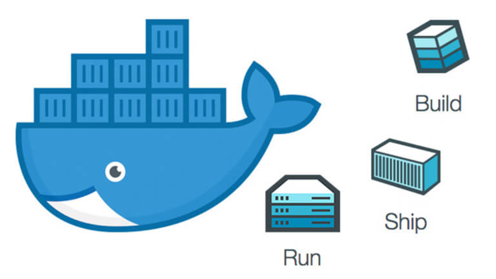

## 为什么要使用Docker(容器)?

- 一致的运行环境、隔离性
- 更快速的启动时间 (相比于虚拟机)
- 弹性伸缩，快速扩展
- 迁移方便
- 持续交付和部署

容器是一个应用层抽象，用于将代码和依赖资源打包在一起。 多个容器可以在同一台机器上运行，共享操作系统内核，但各自作为独立的进程在用户空间中运行 。与虚拟机相比， 容器占用的空间较少（容器镜像大小通常只有几十兆），瞬间就能完成启动 。

`虚拟机 (VM) 是一个物理硬件层抽象，用于将一台服务器变成多台服务器`。 管理程序允许多个 VM 在一台机器上运行。每个 VM 都包含一整套操作系统、一个或多个应用、必要的二进制文件和库资源，因此 占用大量空间 。而且 VM 启动也十分缓慢 。

通过 Docker 官网，我们知道了这么多 Docker 的优势，但是大家也没有必要完全否定虚拟机技术，因为两者有不同的使用场景。虚拟机更擅长于彻底隔离整个运行环境。例如，云服务提供商通常采用虚拟机技术隔离不同的用户。而 Docker 通常用于隔离不同的应用 ，例如前端，后端以及数据库。

### 基础概念

Docker 中有非常重要的三个基本概念，理解了这三个概念，就理解了 Docker 的整个生命周期。

- 镜像（Image）
- 容器（Container）
- 仓库（Repository）

#### 1. 镜像(Image):一个特殊的文件系统

操作系统分为内核和用户空间。对于 Linux 而言，内核启动后，会挂载 root 文件系统为其提供用户空间支持。而 Docker 镜像（Image），就相当于是一个 root 文件系统。

Docker 镜像是一个特殊的文件系统，除了提供容器运行时所需的程序、库、资源、配置等文件外，还包含了一些为运行时准备的一些配置参数（如匿名卷、环境变量、用户等）。 镜像不包含任何动态数据，其内容在构建之后也不会被改变。

Docker 设计时，就充分利用 `Union FS` 的技术，将其设计为分层存储的架构 。镜像实际是由多层文件系统联合组成。

镜像构建时，会一层层构建，前一层是后一层的基础。每一层构建完就不会再发生改变，后一层上的任何改变只发生在自己这一层。 比如，删除前一层文件的操作，实际不是真的删除前一层的文件，而是仅在当前层标记为该文件已删除。在最终容器运行的时候，虽然不会看到这个文件，但是实际上该文件会一直跟随镜像。因此，在构建镜像的时候，需要额外小心，每一层尽量只包含该层需要添加的东西，任何额外的东西应该在该层构建结束前清理掉。

分层存储的特征还使得镜像的复用、定制变的更为容易。甚至可以用之前构建好的镜像作为基础层，然后进一步添加新的层，以定制自己所需的内容，构建新的镜像。

#### 2、 容器(Container):镜像运行时的实体

镜像（Image）和容器（Container）的关系，就像是面向对象程序设计中的 类 和 实例 一样，镜像是静态的定义，容器是镜像运行时的实体。容器可以被创建、启动、停止、删除、暂停等 。

容器的实质是进程，但与直接在宿主执行的进程不同，容器进程运行于属于自己的独立的 命名空间。前面讲过镜像使用的是分层存储，容器也是如此。

容器存储层的生存周期和容器一样，容器消亡时，容器存储层也随之消亡。因此，任何保存于容器存储层的信息都会随容器删除而丢失。

按照 Docker 最佳实践的要求，容器不应该向其存储层内写入任何数据 ，容器存储层要保持无状态化。所有的文件写入操作，都应该使用数据卷（Volume）、或者绑定宿主目录，在这些位置的读写会跳过容器存储层，直接对宿主(或网络存储)发生读写，其性能和稳定性更高。数据卷的生存周期独立于容器，容器消亡，数据卷不会消亡。因此， 使用数据卷后，容器可以随意删除、重新 run ，数据却不会丢失。

#### 3 仓库(Repository):集中存放镜像文件的地方

镜像构建完成后，可以很容易的在当前宿主上运行，但是， 如果需要在其它服务器上使用这个镜像，我们就需要一个集中的存储、分发镜像的服务，`Docker Registry` 就是这样的服务。

一个 Docker Registry 中可以包含多个仓库（Repository）；每个仓库可以包含多个标签（Tag）；每个标签对应一个镜像。所以说：镜像仓库是 Docker 用来集中存放镜像文件的地方类似于我们之前常用的代码仓库。

通常，一个仓库会包含同一个软件不同版本的镜像，而标签就常用于对应该软件的各个版本 。我们可以通过`<仓库名>:<标签>`的格式来指定具体是这个软件哪个版本的镜像。如果不给出标签，将以 latest 作为默认标签.。

这里补充一下 Docker Registry 公开服务和私有 Docker Registry 的概念：

Docker Registry 公开服务 是开放给用户使用、允许用户管理镜像的 Registry 服务。一般这类公开服务允许用户免费上传、下载公开的镜像，并可能提供收费服务供用户管理私有镜像。

最常使用的 Registry 公开服务是官方的 Docker Hub ，这也是默认的 Registry，并拥有大量的高质量的官方镜像，网址为：

> https://hub.docker.com/open in new window](https://hub.docker.com/) 。

### Docker 底层实现原理

首先，Docker 容器虚拟化技术为基础的软件，那么什么是虚拟化技术呢？简单点来说，虚拟化技术可以这样定义：

虚拟化技术是一种资源管理技术，是将计算机的各实体资源，予以抽象、转换后呈现出来并可供分割、组合为一个或多个电脑配置环境。由此，打破实体结构间的不可切割的障碍，使用户可以比原本的配置更好的方式来应用这些电脑硬件资源。这些资源的新虚拟部分是不受现有资源的架设方式，地域或物理配置所限制。一般所指的虚拟化资源包括计算能力和数据存储。

Docker 技术是基于 LXC（Linux container- Linux 容器）虚拟容器技术的。

LXC，其名称来自 Linux 软件容器（Linux Containers）的缩写，一种操作系统层虚拟化（Operating system–level virtualization）技术，为 Linux 内核容器功能的一个用户空间接口。它将应用软件系统打包成一个软件容器（Container），内含应用软件本身的代码，以及所需要的操作系统核心和库。通过统一的名字空间和共用 API 来分配不同软件容器的可用硬件资源，创造出应用程序的独立沙箱运行环境，使得 Linux 用户可以容易的创建和管理系统或应用容器。

LXC 技术主要是借助 Linux 内核中提供的 CGroup 功能和 namespace 来实现的，通过 LXC 可以为软件提供一个独立的操作系统运行环境。

namespace 是 Linux 内核用来隔离内核资源的方式。 通过 namespace 可以让一些进程只能看到与自己相关的一部分资源，而另外一些进程也只能看到与它们自己相关的资源，这两拨进程根本就感觉不到对方的存在。具体的实现方式是把一个或多个进程的相关资源指定在同一个 namespace 中。Linux namespaces 是对全局系统资源的一种封装隔离，使得处于不同 namespace 的进程拥有独立的全局系统资源，改变一个 namespace 中的系统资源只会影响当前 namespace 里的进程，对其他 namespace 中的进程没有影响。

CGroup 是 Control Groups 的缩写，是 Linux 内核提供的一种可以限制、记录、隔离进程组 (process groups) 所使用的物理资源 (如 cpu memory i/o 等等) 的机制。。

两者都是将进程进行分组，但是两者的作用还是有本质区别。namespace 是为了隔离进程组之间的资源，而 cgroup 是为了对一组进程进行统一的资源监控和限制。
