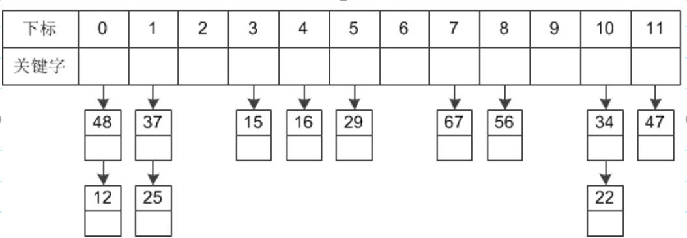
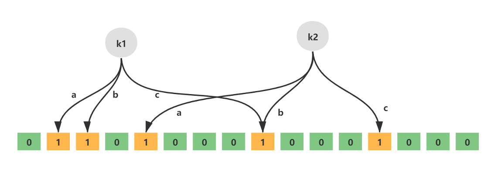

### 1、哈希表的定义

哈希表是一种高效的数据结构，常用于存储键值对并支持快速的插入、查找和删除操作。散列函数是哈希表的关键组成部分，用于将键映射到哈希表的索引位置。本篇博客将介绍哈希表和散列函数的基本概念，并通过实例代码演示它们的应用。

哈希表是一种数据结构，它将键值对存储在一个数组中，并通过散列函数将键映射到数组的索引位置。这样可以快速地插入、查找和删除键值对，使得哈希表成为一种高效的数据结构。哈希表的查找操作的平均时间复杂度为 O(1)，在理想情况下可以达到常数时间。

哈希表的主要优点是`快速的查找操作`，但它也有一些局限性。首先，哈希表的键必须是可哈希的，即可以通过散列函数计算得到唯一的哈希值。其次，哈希表的内存消耗较大，因为需要维护一个数组来存储数据。 最后，哈希表的查找操作在最坏情况下可能变得很慢，如果哈希函数导致冲突，多个键被映射到同一个索引位置，就需要处理冲突。 极端情况下，哈希表可能退化为数组或链表（看冲突发生的时候具体的实现方式）

 

 

### 2、散列函数的概念以及散列方式

散列函数是哈希表的关键组成部分，它将键映射到哈希表的索引位置。散列函数必须满足以下特性：

- 一致性：对于相同的键，散列函数应该始终返回相同的哈希值。这样可以确保相同的键在哈希表中总是存储在相同的位置，实现快速的查找操作。
- 均匀性：散列函数应该将键均匀地映射到哈希表的不同索引位置，减少冲突的发生。这样可以确保哈希表中的数据分布均匀，避免出现过多的冲突。 
- 高效性：散列函数应该能够在常数时间内计算出哈希值，以保持快速的插入、查找和删除操作。

负载因子： 该指数指出了散列函数是否均匀分布  在Java中，负载因子默认值为 0.75，$负载因子 = {散列表中元素个数}\div{散列表长度}$

散列方式分为： 静态散列和动态散列。或者散列函数分为静态和动态，静态使用有限可枚举的集合，而动态则适用于变化的集合中

### 3、冲突的解决方式

在散列函数的映射过程中，不同的键可能会产生相同的哈希值，这就是冲突。当出现冲突时，我们需要解决冲突，确保每个键能够正确地映射到哈希表的索引位置。

- 链地址法：链地址法是一种简单且常用的解决冲突的方法。它使用一个链表来存储哈希值相同的键值对。当发生冲突时，新的键值对会被添加到链表中，这样可以保证所有的键值对都能被正确地存储在哈希表中。在Java中著名的HashMap就是使用该方法解决冲突的问题。

+ 开放地址法：开放地址法是另一种解决冲突的方法。它在发生冲突时不使用链表，而是在哈希表中寻找下一个可用的空槽来存储键值对。有多种开放地址法的实现方式，如线性探测、二次探测和双重散列等。

### 4、散列的应用场景

1. Java HashMap的实现

2. 布隆过滤器
   布隆过滤器（Bloom Filter）是1970年由布隆提出的。它实际上是一个很长的二进制向量和一系列随机映射函数。布隆过滤器可以用于检索一个元素是否在一个集合中。它的优点是空间效率和查询时间都比一般的算法要好的多，缺点是有一定的误识别率和删除困难。

  - 布隆过滤器的优点
       1. 时间复杂度低，增加和查询元素的时间复杂为O(N)，（N为哈希函数的个数，通常情况比较小）
    			§ 保密性强，布隆过滤器不存储元素本身
          2. 存储空间小，如果允许存在一定的误判，布隆过滤器是非常节省空间的（相比其他数据结构如Set集合）有点一定的误判率，但是可以通过调整参数来降低、 无法获取元素本身、很难删除元素
  -  布隆过滤器的使用场景
		布隆过滤器可以告诉我们 “某样东西一定不存在或者可能存在”，也就是说布隆过滤器说这个数不存在则一定不存，布隆过滤器说这个数存在可能不存在（误判，后续会讲），利用这个判断是否存在的特点可以做很多有趣的事情。
		1. 解决Redis缓存穿透问题（面试重点）
	 	2. 邮件过滤，使用布隆过滤器来做邮件黑名单过滤
	 	3. 对爬虫网址进行过滤，爬过的不再爬
	 	4. 解决新闻推荐过的不再推荐(类似抖音刷过的往下滑动不再刷到)
	 	5. HBase\RocksDB\LevelDB等数据库内置布隆过滤器，用于判断数据是否存在，可以减少数据库的IO请求
