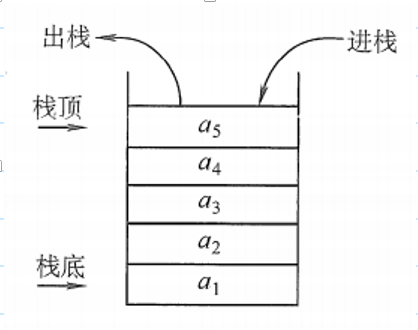
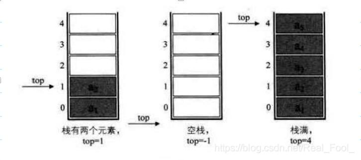
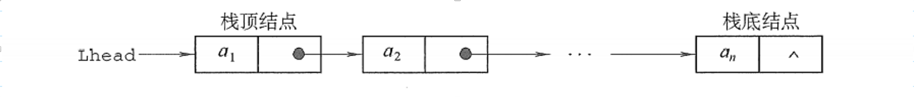
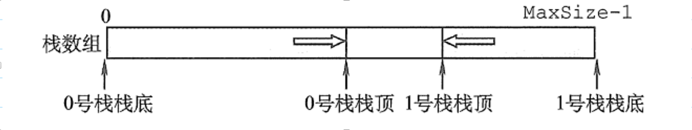

### 1、栈的定义

栈（Stack）：是只允许在一端进行插入或删除的线性表。首先栈是一种线性表，但限定这种线性表只能在某一端进行插入和删除操作。

- 栈顶（Top）：线性表允许进行插入删除的那一端。
- 栈底（Bottom）：固定的，不允许进行插入和删除的另一端。
- 空栈：不含任何元素的空表。

#### 1.1、栈的常见基本操作

- InitStack(&S)：初始化一个空栈S。
- StackEmpty(S)：判断一个栈是否为空，若栈为空则返回true，否则返回false。
- Push(&S, x)：进栈（栈的插入操作），若栈S未满，则将x加入使之成为新栈顶。
- Pop(&S, &x)：出栈（栈的删除操作），若栈S非空，则弹出栈顶元素，并用x返回。
- GetTop(S, &x)：读栈顶元素，若栈S非空，则用x返回栈顶元素。
- DestroyStack(&S)：栈销毁，并释放S占用的存储空间（“&”表示引用调用）。

#### 1.2、 栈的存储结构

`线性存储： 依赖数组实现(静态数组 & 动态数组)`

采用顺序存储的栈称为顺序栈，它利用一组地址连续的存储单元存放自栈底到栈顶的数据元素，同时附设一个指针（top）指示当前栈顶元素的位置。

若存储栈的长度为StackSize，则栈顶位置top必须小于StackSize。当栈存在一个元素时，top等于0，因此通常把空栈的判断条件定位top等于-1。

根据具体实现的要求可实现固定空间的栈以及动态空间的栈

特点:

1. 各种操作都是常数的时间开销
2. 当空间出现不足需要倍增的时候，开销较大
3. 实现简单

`链式存储 ：依赖实现`

采用链式存储的栈称为链栈，链栈的优点是便于多个栈共享存储空间和提高其效率，且不存在栈满上溢的情况。通常采用单链表实现，并规定所有操作都是在单链表的表头进行的。这里规定链栈没有头节点，Lhead指向栈顶元素。

- 基于链表的实现增加或缩减栈的大小都很简单

- 每个操作都需要使用额外的空间和时间来处于指针的位置

 ### 1.3、栈的常见问题

1. 使用栈来判定符号是否匹配

   遍历符号，当与栈顶符号不匹配时候入栈；匹配的时候将栈顶元素出栈，遍历完成后检查栈是否为空，为空则说明匹配

   

2. 使用一个数组实现2个栈

 

3. 使用2个栈实现一个队列

- 创建栈S1，S2
- 当入栈时候，压入S1
- 当出栈的时候，如S2不为空，则直接出栈，若S2为空，则将S1依次出栈，入S2栈，然后再S2出栈
- 若S1为空且S2也为空，那么直接报错

4. 逆置队列

- 创建栈S，依次将队列元素入栈
- 对栈S内的所有元素出栈，压入队列中，完成逆置操作，时间复杂度![img]

