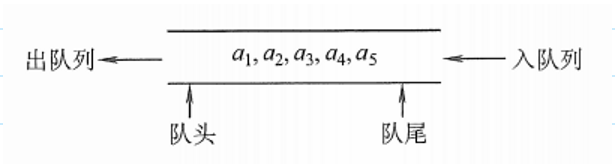
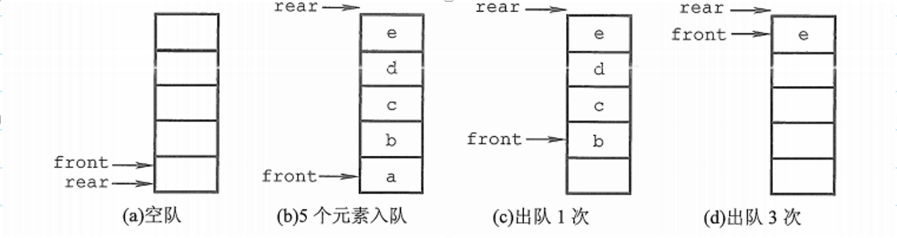
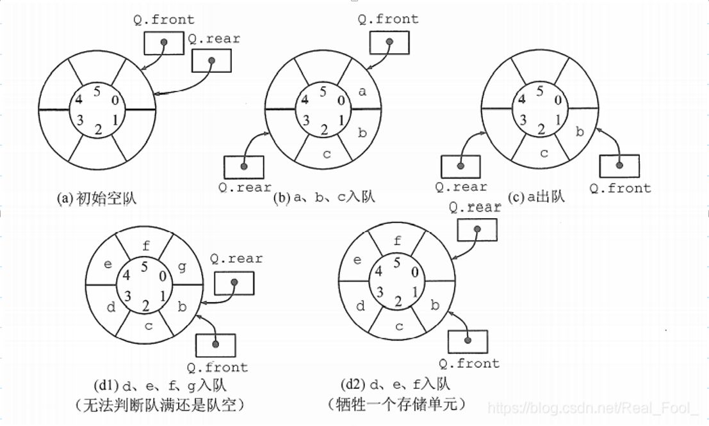
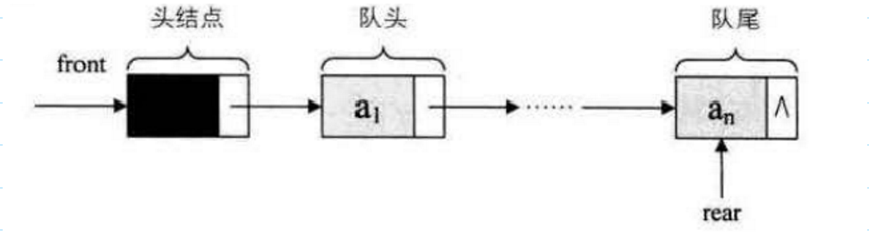
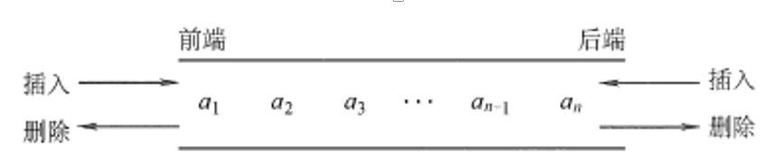

### 1、队列的定义

队列（queue）是只允许在一端进行插入操作，而在另一端进行删除操作的线性表。

队列是一种先进先出（First In First Out）的线性表，简称FIFO。允许插入的一端称为队尾，允许删除的一端称为队头。

- 队头（Front）：允许删除的一端，又称队首。
- 队尾（Rear）：允许插入的一端。
- 空队列：不包含任何元素的空表。

 

### 2、队列的常见基本操作

- InitQueue(&Q)：初始化队列，构造一个空队列Q。
- QueueEmpty(Q)：判队列空，若队列Q为空返回true，否则返回false。
- EnQueue(&Q,     x)：入队，若队列Q未满，将x加入，使之成为新的队尾。
- DeQueue(&Q,     &x)：出队，若队列Q非空，删除队头元素，并用x返回。
- GetHead(Q,     &x)：读队头元素，若队列Q非空，则将队头元素赋值给x。

### 3、队列的存储结构

- 队列的顺序实现是指分配一块连续的存储单元存放队列中的元素，并附设两个指针：队头指针     front指向队头元素，队尾指针 rear 指向队尾元素的下一个位置。
- 如图d，队列出现“上溢出”，然而却又不是真正的溢出，所以是一种“假溢出”。

- 为了解决基于数组实现的队列的假溢出问题，这里使用循环队列实现
- 

- 队列的链式存储结构表示为链队列，它实际上是一个同时带有队头指针和队尾指针的单链表，只不过它只能尾进头出而已。

### 4、双端队列
双端队列是指允许两端都可以进行入队和出队操作的队列，如下图所示。其元素的逻辑结构仍是线性结构。将队列的两端分别称为前端和后端，两端都可以入队和出队。
		

在双端队列进队时，前端进的元素排列在队列中后端进的元素的前面，后端进的元素排列在队列中前端进的元素的后面。在双端队列出队时，无论是前端还是后端出队，先出的元素排列在后出的元素的前面。