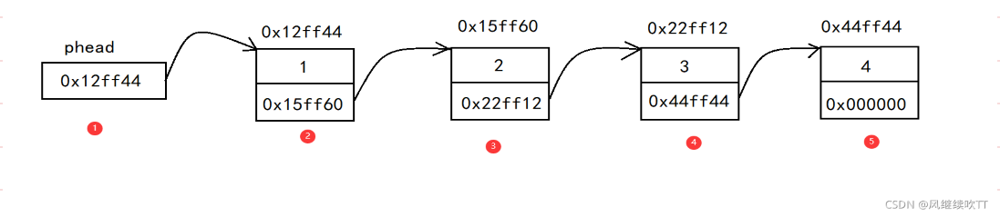
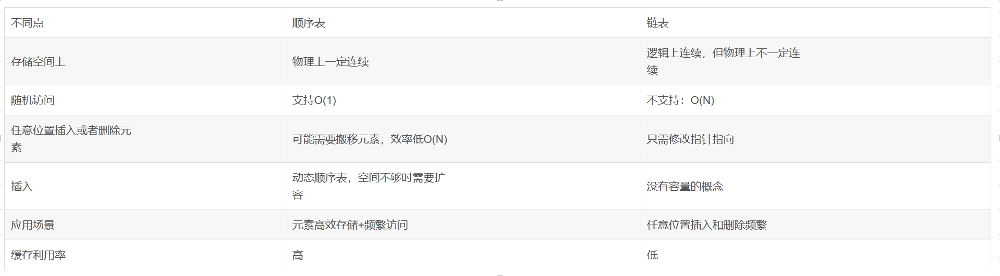
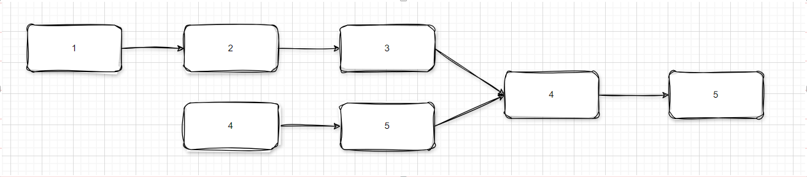

### 1、定义

链表是物理存储单元上非连续的、非顺序的存储结构，数据元素的逻辑顺序是通过链表的指针地址实现，有一系列结点（地址）组成，结点可动态的生成。

```c
struct Node {
    // 节点值
    int value;
    
    // 指向下一个节点
    Node* next;
    
    // 指向前一个节点（如果是双向链表的话）
    Node* prefix;
    
}
```

结点包括两个部分：

1. 存储数据元素的数据域（内存空间）
2. 存储指向下一个结点地址的指针域。
3. 链式结构在逻辑上是连续的，但在物理上不一定连续。



相对于线性表顺序结构，操作复杂。 链表分为 （1）单链表 （2）双链表 （3）单向循环链表 （4）双向循环链表



### 2、链表常见问题

1. 使用链表实现栈

   ```java
   package org.example.stack;
   
   import java.util.LinkedList;
   import java.util.Optional;
   
   public class MyStackImplementLink<E> implements Stack<E>{
   
       private final LinkedList<E> data;
   
   
       public MyStackImplementLink(){
           this.data = new LinkedList<>();
       }
   
       public MyStackImplementLink(LinkedList<E> data) {
           this.data = data;
       }
   
       @Override
       public boolean empty() {
           return this.data.isEmpty();
       }
   
       @Override
       public Optional<E> peek() {
           return Optional.ofNullable(this.data.getFirst());
       }
   
       @Override
       public void push(E e) {
           this.data.addFirst(e);
       }
   
       @Override
       public E pop() {
           return this.data.removeFirst();
       }
   }
   
   ```

   

2. 访问链表的倒数第N个元素

  - 先遍历一遍链表，确定链表中节点的个数l。然后再遍历一遍链表，从前往后第（l-n+1）个节点就是倒数第n个节点

  - 设置两个指针，第一个指针从头结点向前走到第n-1个节点时，第二个指针开始从头结点出发。当第一个指针走到尾结点时，第二个指针的位置即为倒数第n个节点

```java
package org.example.link;

import java.util.ArrayList;
import java.util.Arrays;

public class NElement {

    public static void main(String[] args) {
        Node<Integer> node = Node.build(Arrays.asList(1, 2, 3, 4, 5, 6, 7, 8, 9, 10, 11, 12, 13, 14, 15, 16, 17, 18, 19));
        int location = 10;
        Node<Integer> sp = node;
        Node<Integer> fp = node;
        for (int i = 0; i < location; i++) {
            fp = fp.getNext();
        }
        while (fp != null) {
            fp = fp.getNext();
            sp = sp.getNext();
        }
        System.out.println(sp.getE());


    }
}

```


3. 判断链表是否存在环

	- 快慢指针： 从链表的起点处，防止两个指针，sp & fp,   sp步长为1，fp步长为2，当出现相等的时候表示出现了环；当任何一个指针出现了NULL的时候，表示不是环; 

4. 判断两个链表的合并点




  - 讲两个链表放入栈中，依次从栈中取出数据，直到取出的数据不相等，上一次取出的数据就是合并点

  - 算两个链表的长度差 = d，让长链表先走D步, 然后两个链表同时移动，直到值相

    ```java
    package org.example.link;
    
    import java.util.*;
    
    // Press Shift twice to open the Search Everywhere dialog and type `show whitespaces`,
    // then press Enter. You can now see whitespace characters in your code.
    public class SameNode {
        public static void main(String[] args) {
            Node<Integer> node1 = Node.build(Arrays.asList(1, 2, 3, 4, 5, 6, 7, 8, 9, 0));
            Node<Integer> node2 = Node.build(Arrays.asList(0,0,6, 7, 8, 9, 0));
    
            Stack<Integer> s1 = new Stack<>();
            while (node1 != null) {
                s1.push(node1.getE());
                node1 = node1.getNext();
            }
    
    
            Stack<Integer> s2 = new Stack<>();
            while (node2 != null) {
                s2.push(node2.getE());
                node2 = node2.getNext();
            }
    
    
            List<Integer> samePart = new ArrayList<>();
            while (true) {
                if (s1.isEmpty() || s2.isEmpty()) {
                    break;
                }
                Integer p1 = s1.pop();
                Integer p2 = s2.pop();
                if (!Objects.equals(p1, p2)) {
                    break;
                }
                samePart.add(p1);
            }
            System.out.println(samePart);
        }
    }
    ```

    
