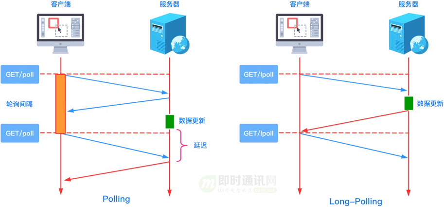
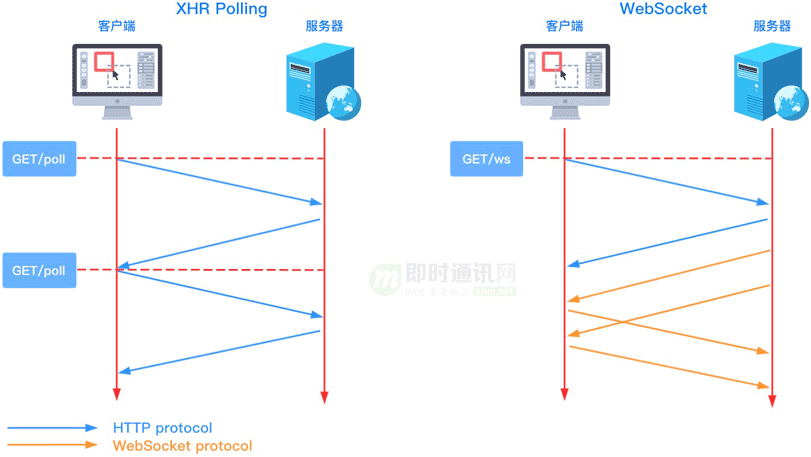

[TOC]


### 1. 轮询机制

定时的发起HTTP请求检查是否存在数据,浪费资源占用珍贵的线程资源.

### 2. 长链接推送
轮询机制的优化版,当请求达到的时候有数据立即返回,无数据的时候夯住请求,当数据到达或者Timeout的时候则返回,因此夯住的时候是占用CPU资源的时候所以相对于直接轮询效果好很多.




### 3. WebSocket

WebSocket 是一种网络传输协议，可在单个 TCP 连接上进行全双工通信，位于 OSI 模型的应用层。WebSocket 协议在 2011 年由 IETF 标准化为 [RFC 6455](https://cloud.tencent.com/developer/tools/blog-entry?target=https%3A%2F%2Ftools.ietf.org%2Fhtml%2Frfc6455&source=article&objectId=1887095)，后由 [RFC 7936](https://cloud.tencent.com/developer/tools/blog-entry?target=https%3A%2F%2Ftools.ietf.org%2Fhtml%2Frfc7936&source=article&objectId=1887095) 补充规范。

WebSocket 使得客户端和服务器之间的数据交换变得更加简单，允许服务端主动向客户端推送数据。在 WebSocket API 中，浏览器和服务器只需要完成一次握手，两者之间就可以创建持久性的连接，并进行双向数据传输。

介绍完轮询和 WebSocket 的相关内容之后，接下来用一张图看一下 XHR Polling（短轮询） 与 WebSocket 之间的区别。





- 较少的控制开销：在连接创建后，服务器和客户端之间交换数据时，用于协议控制的数据包头部相对较小；
- 更强的实时性：由于协议是全双工的，所以服务器可以随时主动给客户端下发数据。相对于 HTTP 请求需要等待客户端发起请求服务端才能响应，延迟明显更少；
- 保持连接状态：与 HTTP 不同的是，WebSocket 需要先创建连接，这就使得其成为一种有状态的协议，之后通信时可以省略部分状态信息；
- 更好的二进制支持：WebSocket 定义了二进制帧，相对 HTTP，可以更轻松地处理二进制内容；
- 可以支持扩展：WebSocket 定义了扩展，用户可以扩展协议、实现部分自定义的子协议。

#### 3.1 服务端升级协议

- 客户端请求信息

```sql
GET ws://echo.websocket.org/ HTTP/1.1
Connection: Upgrade  -- 标识客户端想升级协议
Upgrade: websocket -- 想升级到WebSocket协议
Sec-WebSocket-Version: 13 -- 升级的协议版本
Sec-WebSocket-Key: Zx8rNEkBE4xnwifpuh8DHQ== -- 随机字符串,用于签名校验
Sec-WebSocket-Extensions: permessage-deflate; client_max_window_bits -- 支持的WS拓展
```

- 服务端相应

```sql
HTTP/1.1 101 Web Socket Protocol Handshake -- 标识确认升级
Connection: Upgrade -- 标识这个是升级请求
Upgrade: websocket  --  
Sec-WebSocket-Accept: 52Rg3vW4JQ1yWpkvFlsTsiezlqw= -- 签名
```

  

#### 3.2 客户端使用 WebScoket

```js
const socket = new WebSocket("ws://localhost:8080");

// 回调数据
socket.onopen = (event) => console.log('connect success!')
socket.onmessage = (event) => console.log('receiver message!');
socket.onerror = (event) => console.log('socket error');

//  发送数据
function sendBySocket(message) {
    if (socket.readyState !== WebSocket.OPEN) {
        console.error("The socket not ready!");
        return;
    }
    socket.send(message);

}

```


### 4. SSE (Server-Sent Events)

服务器向浏览器推送信息，除了 WebSocket，还有一种方法：Server-Sent Events（以下简称 SSE）。

严格地说，HTTP 协议无法做到服务器主动推送信息。但是，有一种变通方法，就是`服务器向客户端声明，接下来要发送的是流信息（streaming）。也就是说，发送的不是一次性的数据包，而是一个数据流，会连续不断地发送过来`。这时，客户端不会关闭连接，会一直等着服务器发过来的新的数据流，视频播放就是这样的例子。本质上，这种通信就是以流信息的方式，完成一次用时很长的下载。

SSE 就是利用这种机制，使用流信息向浏览器推送信息。它基于 HTTP 协议，目前除了 IE/Edge，其他浏览器都支持。

- SSE 使用 HTTP 协议，现有的服务器软件都支持。WebSocket 是一个独立协议。
- SSE 属于轻量级，使用简单；WebSocket 协议相对复杂。
- SSE 默认支持断线重连，WebSocket 需要自己实现。
- SSE 一般只用来传送文本，二进制数据需要编码后传送，WebSocket 默认支持传送二进制数据。
- SSE 支持自定义发送的消息类型。

#### 4.1 服务端发送SSE消息

SSE消息基于HTTP协议,因此我们需要调整HTTP请求的数据,一个标准的SSE请求如下

```html
Content-Type: text/event-stream
Cache-Control: no-cache
Connection: keep-alive


: this is a test stream\n\n  -- 标识注释

data: some text\n\n -- 数据格式
data: another message\n
data: with two lines \n\n
```

#### 4.2  客户端使用SSE

```js
var sse = new EventSource("https://localhost:8080/sse", {withCredentials: true});

// SSE 建立链接 OR sse.addEventListener('open',function(event){})
sse.onopen = function (event) {

}

// SSE 接受到消息
sse.onmessage = function (event) {
    console.log(event.data)
}

// SSE 出现错误
sse.onerror = function (event) {
    console.error(event)
}

// 自定义SSE事件
sse.addEventListener('customerEvent',event => {})

// 关闭SSE
sse.close()


```


