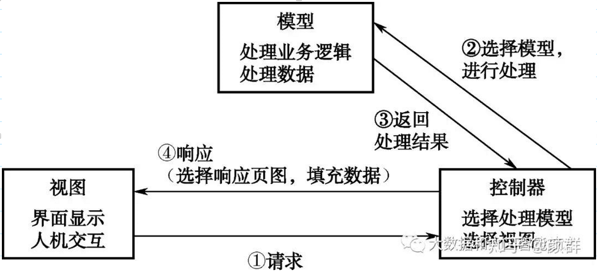

### 1、MVC分层的意义

当我们实现一个应用程序时（不使用O/R Mapping），我们可能会写特别多数据访问层的代码，从数据库保存、删除、读取对象信息，而这些代码都是重复的。而使用ORM则会大大减少重复性代码，对象关系映射（Object Relational Mapping，简称ORM），主要实现程序对象到关系数据库数据的映射。

- 优点：关注前后端分离
- 缺点：模型层分层太粗，融合了数据处理、业务处理等所有的功能。核心的复杂业务逻辑都放到模型层，导致模型层很乱
- 适应场景：后端业务逻辑简单的服务，比如接口直接提供对数据库增删改查

### 2、MVC 分层概述

MVC模式是软件工程中常见的一种软件架构模式，该模式把软件系统（项目）分为三个基本部分：

- 模型（Model）
- 视图（View）
- 控制器（Controller）。

 

使用MVC模式有很多优势，例如:简化后期对项目的修改、扩展等维护操作；使项目的某一部分变得可以重复利用；使项目的结构更加直观。

 

具体来讲，MVC模式可以将项目划分为模型（M）、视图（V）和控制器（C）三个部分，并赋予各个部分不同的功能，方便开发人员进行分组。

（1）视图（View）：负责界面的显示，以及与用户的交互功能，例如表单、网页等。

（2）控制器（Controller）：可以理解为一个分发器，用来决定对于视图发来的请求，需要用哪一个模型来处理，以及处理完后需要跳回到哪一个视图。即用来连接视图和模型。

（3）模型（Model）：模型持有所有的数据、状态和程序逻辑。模型接受视图数据的请求，并返回最终的处理结果。

 

### 3、分层的具体设计和实现

> *需要注意的是，下面的描述主要说的主流方案的设计，并非规范和约束。*

 

#### 1．数据访问层（DAL： Data Access Layout）

数据访问层也称为持久层，位于三层中的最下层，用于对数据进行处理。该层中的方法一般都是“原子性”的，即每个方法都不可再分。

比如，可以在DAL层中实现数据的增删改查操作，而增、删、改、查四个操作是非常基本的功能，都是不能再拆分的。

在程序中，DAL一般写在dao包中，包里面的类名也是以“Dao”结尾，如StudentDao.java、DepartmentDao.java、NewsDao.java等；换句话说，在程序中，DAL是由dao包中的多个“类名Dao.java”组成。每个“类名Dao.java”类，就包含着对该“类名”的所有对象的数据操作，如StudentDao.java中包含对Student对象的增、删、改、查等数据操作，DepartmentDao.java中包含对Department对象的增、删、改、查等数据操作。

 

#### 2．业务逻辑层（BLL： Bussiness Logic Layout）

 

位于三层中的中间层（DAL与USL中间），起到了数据交换中承上启下的作用，用于对业务逻辑的封装。BLL的设计对于一个支持可扩展的架构尤为关键，因为它扮演了两个不同的角色。对于DAL而言，它是调用者；对于USL而言，它是被调用者。依赖与被依赖的关系都纠结在BLL上。

 

使用上，就是对DAL中的方法进行“组装”。比如，该层也可以实现对Student对象的增删改查，但与DAL不同的是，BLL中的增、删、改、查不再是 “原子性”的功能，而是包含了一定的业务逻辑应该提示错误信息。即BLL中的“删”，应该是“带逻辑的删”（即先“查”后“删”），也就是对DAL中的“查”和“删”两个方法进行了“组装”。

 

在程序中，BLL一般写在service包（或biz包）中，包里面的类名也是以“Service（或Biz）”结尾，如StudentService.java、DepartmentService.java、NewsService等。换句话说，在程序中，BLL是由service包中的多个“类名Service.java”组成。每个“类名Service.java”类，就包含着对该“类名”的对象的业务操作，如StudentService.java中包含对Student对象的“带逻辑的删”、“带逻辑的增”等业务逻辑操作，DepartmentService.java中包含对所有Department对象的“带逻辑的删”、“带逻辑的增”等业务逻辑操作。

 

#### 3．表示层（USL： User Show Layout）

 

位于三层中的最上层，用于显示数据和接收用户输入的数据，为用户提供一种交互式操作的界面。USL又分为“USL前台代码”和“USL后台代码”，其中“USL前台代码”是指用户能直接访问到的界面，一般是程序的外观（如html文件、JSP文件等），类似于MVC模式中的“视图”；“USL后台代码”是指用来调用业务逻辑层的JAVA代码（如Servlet），类似于MVC模式中的“控制器”。表示层前台代码一般放在WebContent目录下，而表示层后台代码目前放在servlet包下。

> *目前的前后端分离方案中，后端仅仅提供**API**接口，**HTML**代码以及业务交互逻辑均由前端工程化实现*