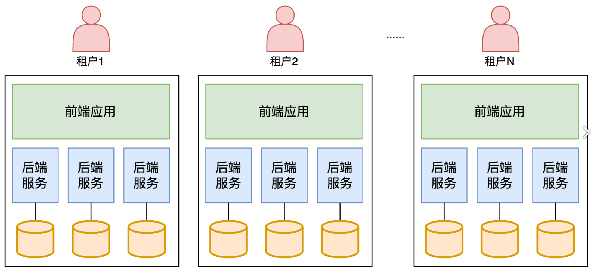
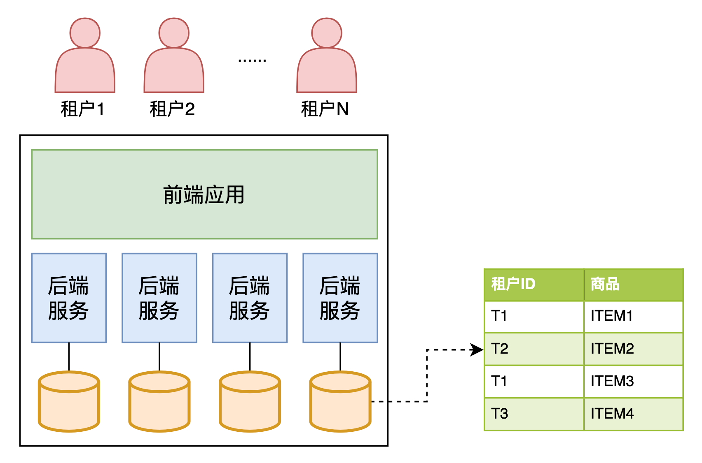

[TOC]

### 1.什么是多租户？[#](https://www.cnblogs.com/dj2016/p/16917125.html#什么是多租户？)

多租户是SaaS领域的特有产物，在SaaS服务中，租户是指使用SaaS系统的客户，租户不同于用户，例如，B端SaaS产品，用户可能是某个组织下的员工，但整个企业组织是SaaS系统的租户。多租户技术是一种软件架构技术，可以实现多个租户共享系统实例，并且租户间能够实现数据与行为的隔离。

- 租户：一般指一个企业客户或个人客户，租户之间数据与行为是隔离的。
- 用户：在某个租户内的具体使用者，可以通过使用账户名、密码等登录信息，登录到SaaS系统使用软件服务。
- 组织：如果租户是一个企业客户，通常会拥有自己的组织架构。
- 员工：是指组织内部具体的某位员工。
- 解决方案：为了解决客户的某类型业务问题，SaaS服务商将产品与服务组合在一起，为商家提供整体的打包方案。
- 产品能力：指的是SaaS服务商对客户售卖的产品应用，特指能够帮助客户实现端到端场景解决方案闭环的能力。
- 资源域：用来运行1个或多个产品应用的一套云资源环境。
- 云资源：SaaS产品一般都部署在各种云平台上，例如阿里云、腾讯云、华为云等。对这些云平台提供的计算、存储、网络、容器等资源，抽象为云资源。

### 2.多租户数据隔离模式

#### 2.1 竖井隔离模式

有些SaaS服务商会选择竖井隔离模式，即每个租户都运行在隔离的一套资源中。有人会说，这不就是传统软件模式吗，为什么会是SaaS模式呢？但如果这些竖井式的资源，拥有标准化的租户身份识别、入驻流程、计费体系、部署流程、运营流程，那边它依然是SaaS模式，只不过每个客户都有一套端到端的基础设施。

- 优势如下: 

  - 满足强隔离需求：一些客户为了系统和数据的安全性，可能提出非常严格的隔离需求，期望软件产品能够部署在一套完全独立的环境中，不和其他租户的应用实例、数据放在一起。

  - 计费逻辑简单：SaaS服务商需要针对租户使用资源进行计费，对于复杂的业务场景，计算、存储、网络资源间的关系同样也会非常复杂，计费模型是很有挑战的，但在竖井模式下，计费模型相对来说是比较简单的。

  - 降低故障影响面：因为每个客户的系统都部署在自己的环境中，如果其中一个环境出现故障，并不会影响其他客户使用软件服务。

- 劣势如下

  - 规模化问题：由于租户的SaaS环境是独立的，所以每入驻一个租户，就需要创建和运营一套SaaS环境，如果只是少量的租户，还可能可以管理，但如果是成千上万的租户，管理和运营这些环境将会是非常大的挑战。

  - 成本问题：每个租户都有独立的环境，花费在单个客户上的成本将非常高，会大幅削弱SaaS软件服务的盈利能力。

  - 敏捷迭代问题：SaaS模式的一个优势是能够快速响应市场需求，迭代产品功能。`但竖井隔离策略会阻碍这种敏捷迭代能力，因为更新、管理、支撑这些租户的SaaS环境，会变得非常复杂和低效。`

  - 系统管理与监控：在同一套环境中，对部署的基础设施进行管理与监控，是较为简单的。但每个租户都有独立的环境，在这种非中心化的模式下，对每个租户的基础设施进行管理与监控，同样也是非常复杂、困难的。

#### 2.2 共享模式

相信很多SaaS服务商会优先选择共享模式，即多租户共享一套基础设施资源，这样能让SaaS软件服务更加高效、敏捷、低成本。

- 优势如下
	- 高效管理：在共享策略下，能够集中化地管理、运营所有租户，管理效率非常高。同时，对基础设施配置管理、监控，也将更加容易。相比竖井策略，产品的迭代更新会更快。
	- 成本低：SaaS服务商的成本结构中，很大一块是基础设施的成本。在共享模型下，服务商可以根据租户们的实际资源负载情况，动态伸缩系统，这样基础设施的利用率将非常高。

- 劣势

  - 租户相互影响：由于所有租户共享一套资源，当其中一个租户大量占用机器资源，其他租户的使用体验很可能受到影响，在这种场景下，需要在技术架构上设计一些限制措施（限流、降级、服务器隔离等），让影响面可控。

  - 租户计费困难：在竖井模型下，非常容易统计租户的资源消耗。然而，在共享模型下，由于所有租户共享一套资源，需要投入更多的精力统计单个租户的合理费用。

