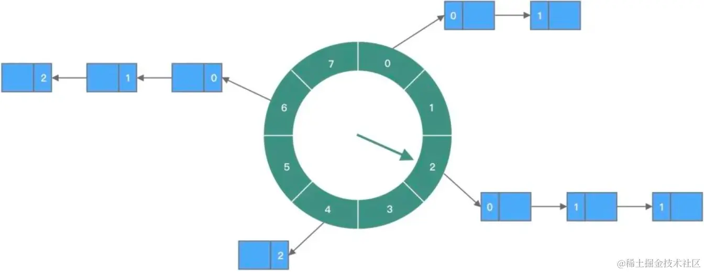

[TOC]

我们经常遇到这种业务场景，如：外卖订单超30分钟未支付，则自动取 消订单；用户注册成功15分钟后，发短信消息通知用户等等。这就是延时任务处理场 景。

### 1. 被动关闭

在解决这类问题的时候，有一种比较简单的方式，那就是通过业务上的被动方式来进行关单操作。

简单点说，就是订单创建好了之后。我们系统上不做主动关单，什么时候用户来访问这个订单了，再去判断时间是不是超过了过期时间，如果过了时间那就进行关单操作，然后再提示用户。

- 优点在于实现简单,无需要额外的处理资源
- 缺点在于,长时间不关闭造成脏数据,而且在读的时候写数据造成架构的混乱

所以，**这种方案只适合于自己学习的时候用，任何商业网站中都不建议使用这种方案来实现订单关闭的功能。**

### 2. 定时任务

定时任务关闭订单，这是很容易想到的一种方案。

具体实现细节就是我们通过一些调度平台来实现定时执行任务，任务就是去扫描所有到期的订单，然后执行关单动作。

这个方案的优点也是比较简单，实现起来很容易，基于Timer、ScheduledThreadPoolExecutor、或者像xxl-job这类调度框架都能实现，但是有以下几个问题：

**1、时间不精准。**  一般定时任务基于固定的频率、按照时间定时执行的，那么就可能会发生很多订单已经到了超时时间，但是定时任务的调度时间还没到，那么就会导致这些订单的实际关闭时间要比应该关闭的时间晚一些。

**2、无法处理大订单量。**  定时任务的方式是会把本来比较分散的关闭时间集中到任务调度的那一段时间，如果订单量比较大的话，那么就可能导致任务执行时间很长，整个任务的时间越长，订单被扫描到时间可能就很晚，那么就会导致关闭时间更晚。

**3、对数据库造成压力。**  定时任务集中扫表，这会使得数据库IO在短时间内被大量占用和消耗，如果没有做好隔离，并且业务量比较大的话，就可能会影响到线上的正常业务。

**4、分库分表问题。**  订单系统，一旦订单量大就可能会考虑分库分表，在分库分表中进行全表扫描，这是一个极不推荐的方案。

所以，`定时任务的方案，适合于对时间精确度要求不高、并且业务量不是很大的场景中。如果对时间精度要求比较高，并且业务量很大的话，这种方案不适用`

### 3. Java的延时队列

有这样一种方案，他不需要借助任何外部的资源，直接基于应用自身就能实现，那就是基于JDK自带的DelayQueue来实现

> DelayQueue是一个无界的BlockingQueue，用于放置实现了Delayed接口的对象，其中的对象只能在其到期时才能从队列中取走。

基于延迟队列，是可以实现订单的延迟关闭的，首先，在用户创建订单的时候，把订单加入到DelayQueue中，然后，还需要一个常驻任务不断的从队列中取出那些到了超时时间的订单，然后在把他们进行关单，之后再从队列中删除掉。

这个方案需要有一个线程，不断的从队列中取出需要关单的订单。一般在这个线程中需要加一个while(true)循环，这样才能确保任务不断的执行并且能够及时的取出超时订单。

+ 优点在于方案简单,开发成本低
+ 缺点也很明显,基于内存不能持久化,大数据情况下占用内存高,对集群调度不友好

所以，**`基于JDK的DelayQueue方案只适合在单机场景、并且数据量不大的场景中使用，如果涉及到分布式场景，那还是不建议使用。`**

### 4. 时间轮

时间轮可以理解为一种环形结构，像钟表一样被分为多个 slot。每个 slot 代表一个时间段，每个 slot 中可以存放多个任务，使用的是链表结构保存该时间段到期的所有任务。时间轮通过一个时针随着时间一个个 slot 转动，并执行 slot 中的所有到期任务。

基于Netty的HashedWheelTimer可以帮助我们快速的实现一个时间轮，这种方式和DelayQueue类似，缺点都是基于内存、集群扩展麻烦、内存有限制等等。

但是他相比DelayQueue的话，效率更高一些，任务触发的延迟更低。代码实现上面也更加精简。延时队,列插入任务和删除操作的复杂度$O(nlog(n))$,二时间轮的复杂度仅为$O(1)$

所以，`基于Netty的时间轮方案比基于JDK的DelayQueue效率更高，实现起来更简单，但是同样的，只适合在单机场景、并且数据量不大的场景中使用，如果涉及到分布式场景，那还是不建议使用。`

### 5. Kafka 时间轮

Kafka内部有很多延时性的操作，如延时生产，延时拉取，延时数据删除等，这些延时功能由内部的延时操作管理器来做专门的处理，其底层是采用时间轮实现的。

而且，为了解决有一些时间跨度大的延时任务，Kafka 还引入了层级时间轮，能更好控制时间粒度，可以应对更加复杂的定时任务处理场景；

Kafka 中的时间轮的实现是 TimingWheel 类，位于 kafka.utils.timer 包中。基于Kafka的时间轮同样可以得到O(1)时间复杂度，性能上还是不错的。

**基于Kafka的时间轮的实现方式，在实现方式上有点复杂，需要依赖kafka，但是他的稳定性和性能都要更高一些，而且适合用在分布式场景**中。

### 6. 延时消息与死信队列

延迟消息，当消息写入到Broker后，不会立刻被消费者消费，需要等待指定的时长后才可被消费处理的消息，称为延时消息。

有了延迟消息，我们就可以在订单创建好之后，发送一个延迟消息，比如20分钟取消订单，那就发一个延迟20分钟的延迟消息，然后在20分钟之后，消息就会被消费者消费，消费者在接收到消息之后，去关单就行了。

但是，RocketMQ的延迟消息并不是支持任意时长的延迟的，它只支持：几个固定的时长。有了RocketMQ延迟消息之后，我们处理上就简单很多，只需要发消息，和接收消息就行了，系统之间完全解耦了。但是因为延迟消息的时长受到了限制，所以并不是很灵活。

如果我们的业务上，关单时长刚好和RocketMQ延迟消息支持的时长匹配的话，那么是可以基于RocketMQ延迟消息来实现的。否则，这种方式并不是最佳的。

基于 RabbitMQ的死信队列,也可以实现类似于与延时消息的效果,当RabbitMQ中的一条正常的消息，因为过了存活时间（TTL过期）、队列长度超限、被消费者拒绝等原因无法被消费时，就会变成Dead Message，即死信。

当一个消息变成死信之后，他就能被重新发送到死信队列中（其实是交换机-exchange）。
那么基于这样的机制，就可以实现延迟消息了。那就是我们给一个消息设定TTL，然但是并不消费这个消息，等他过期，过期后就会进入到死信队列，然后我们再监听死信队列的消息消费就行了。

方式存在一个问题，那就是可能造成队头阻塞，因为队列是先进先出的，而且每次只会判断队头的消息是否过期，那么，如果队头的消息时间很长，一直都不过期，那么就会阻塞整个队列，这时候即使排在他后面的消息过期了，那么也会被一直阻塞。

> 目前仅RocketMQ对延时消息支持较为友好,其他MQ等没有明确支持延迟消息,或者使用RabbitMQ官方发布的 rabbitmq_delayed_message_exchange 插件. 

### 7. Redis 过期监听 & Zset
多用过Redis的人都知道，Redis有一个过期监听的功能，

这个方案不建议大家使用，Redis并不保证Key在过期的时候就能被立即删除，更不保证这个消息能被立即发出。所以，消息延迟是必然存在的，随着数据量越大延迟越长，延迟个几分钟都是常事儿。

而且，在Redis 5.0之前，这个消息是通过PUB/SUB模式发出的，他不会做持久化，至于你有没有接到，有没有消费成功.

另外,我们可以借助Redis中的有序集合——zset来实现这个功能。zset是一个有序集合，每一个元素(member)都关联了一个 score，可以通过 score 排序来取集合中的值。

我们将订单超时时间的时间戳（下单时间+超时时长）与订单号分别设置为 score 和 member。这样redis会对zset按照score延时时间进行排序。然后我们再开启redis扫描任务，获取”当前时间 > score”的延时任务，扫描到之后取出订单号，然后查询到订单进行关单操作即可。

使用redis zset来实现订单关闭的功能的优点是可以借助redis的持久化、高可用机制。避免数据丢失。但是这个方案也有缺点，那就是在高并发场景中，有可能有多个消费者同时获取到同一个订单号，一般采用加分布式锁解决，但是这样做也会降低吞吐型。

但是，在大多数业务场景下，如果幂等性做得好的，多个消费者取到同一个订单号也无妨。

> 或者使用基于Redisson封装好了 RDelayedQueue 其就是基于 Redis 的Zset实现的延时队列,基于Redisson的实现方式，是可以解决基于zset方案中的并发重复问题的，而且还能实现方式也比较简单，稳定性、性能都比较高。

### 8. 总结
- 实现复杂度上  $Redission > RabbitMQ插件 > RabbitMQ死信队列 > RocketMQ延迟消息 ≈ Redis的zset > Redis过期监听 ≈ kafka时间轮 > 定时任务 > Netty的时间轮 > JDK自带的DelayQueue > 被动关闭$
- 方案完整性 $Redission ≈ RabbitMQ插件 > kafka时间轮 > Redis的zset ≈ RocketMQ延迟消息 ≈ RabbitMQ死信队列 > Redis过期监听 > 定时任务 > Netty的时间轮 > JDK自带的DelayQueue > 被动关闭$
- 使用场景
  - 自己玩玩: 被动关闭
  - 单体应用,数据量不大:   Netty的时间轮、JDK自带的DelayQueue、定时任务
  - 分布式应用,数据量不大: Redis过期监听、RabbitMQ死信队列、Redis的zset、定时任务
  - 分布式应用,高并发:  Redission、RabbitMQ插件、kafka时间轮、RocketMQ延迟消息

总体考虑的话，考虑到成本，方案完整性、以及方案的复杂度，还有用到的第三方框架的流行度来说，**个人比较建议优先考虑  Redission+Redis、RabbitMQ插件、Redis的zset、RocketMQ延迟消息等方案。**
