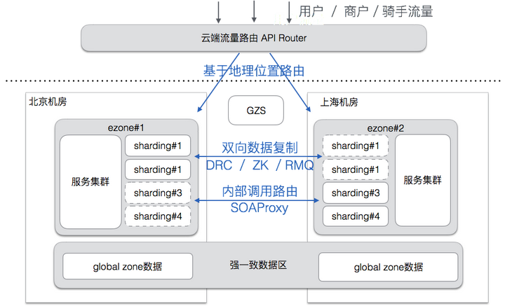
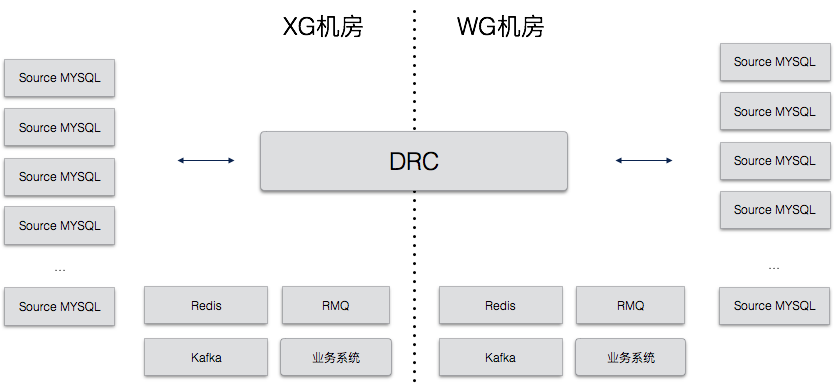
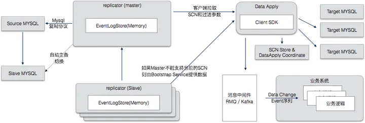

### 1. 流量路由

API-Router根据业务分集群部署在云上，参考饿了么异地多活的整体架构，API-Router的物理架构如下，

1. API-Router从配置中获取维护的每个域名的ezone到数据中心地址的映射关系；
2. API-Router将订阅GZS的关于shard到机房ezone的路由表；
3. API-Router在内存中，将请求头中的sharding key（地理位置、商户ID、订单ID），根据一套sharding规则，计算出shard；最常见的一种规则算法是，根据用户的经纬度，通过地里围栏算法，计算出相应的多边形，而这个多边形提前被分配了一个shard；
4. 根据前3步，API-Router就拥有了sharding key-->shard-->ezone-->数据中心的映射表，最后将请求转发到对应的数据中心上；

流量转移的实现： 当后端机房故障时，API-Router会根据GZS主动推送的shard到ezone映射关系变更的消息，实现流量到ezone的切换，从而保证了服务的高可用；

API-Router采用了基于Netty的全后端异步非阻塞模型，以此来尽可能减少请求在这一层上的网络损耗，Epoll的特性使其支持更高的连接数，同时采取一些保护后端服务的措施来保证整个服务链路的稳定运行。

API-ROuter的作用主要用

1. 正确路由到不同的ezone
2. 削峰填谷
3. 流量过滤
4. 其他: 反爬虫/埋点等/多协议支持

### 2. DRC 实时数据复制

饿了么的 Data Replicate Center（DRC）项目用于数据双向复制和数据订阅，使用场景如下图：

- 跨机房的 Mysql 数据复制完全通过 DRC 来完成
- 还有很多业务团队通过 DRC 来实现数据订阅

目前饿了么100%的跨机房数据复制，90%的数据订阅都通过DRC完成，每天有大量的数据流经DRC。复制延迟保持在1s以下，从来没有发生过数据丢失和错乱的情况。

DRC的设计目标包括：

1. 实时双向数据复制，延时 < 1s ，并能够解决双向修改时的数据冲突
2. 数据变更订阅，能够在DB数据发生变化时通知到相关订阅方
3. 高度可靠和保持顺序，不能丢失数据，也不能因为错乱执行顺序导致数据错误

我们最终达到了这3个目标，下面围绕着如何设计以满足以上目标介绍一下。

DRC采用了多组件的集群化设计，整体结构如下图：

**Replicator：** replicator 负责变更事件的抽取，SCN的生成，以及维护了一个Event Buffer 来存储取到的 event，结构如下图：

- replicator 有一个 master 多个 slave，只有 master 会连接 DB，其他的 slave 只连接 master replicator。
- SCN在各个Replicator中是一致的，当 master 失效后会选举出新的 master（zk），并从该 master 的当前位置开始复制，这样就避免了非常复杂的在多个 replicator 间保持一致的问题。
- Replicator 中不保存客户端状态，Client SDK Pull 数据的时候需要指定开始 SCN 位置，所以可以随时切换到任何一个Replicator拉取数据。
- 如果客户端提交的SCN超过当前Replicator的最老数据，Replicator 会回源到源头的数据库拉取。