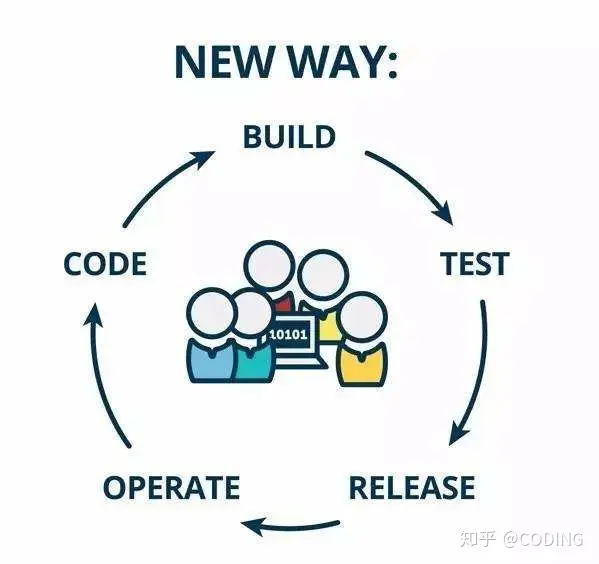
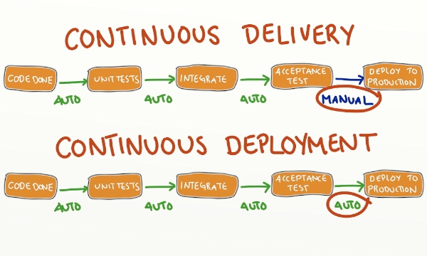

[TOC]

### 1. 什么是持续集成?

持续集成是一种软件开发过程，开发人员在整个开发周期中，更频繁地集成自己编写的新代码，每天至少一次将新代码添加到代码库中。 对构建的每次迭代都进行自动化测试，以尽早发现集成问题（越早发现，越容易修复），持续集成也有助于避免最终合并代码以进行发布时出现问题。 总体而言，持续集成有助于简化构建过程，从而生成更高质量的软件和可预测性更高的交付时间表。

- 更有效地尽早检测错误和衡量指标，帮助及早处理错误 - 有时在检入后几分钟内即可完成
- 持续证明开发进度，获得更有用的反馈
- 改进团队协作；团队中的每个人都可以更改代码，集成系统并快速确定与软件其他部分的冲突
- 改进系统集成，减少软件开发生命周期结束时的意外情况
- 减少了要合并和测试的并行变更
- 减少了系统测试期间的错误数
- 持续更新系统以供测试

**持续集成的目的，就是让产品可以快速迭代，同时还能保持高质量。**它的核心措施是，代码集成到主干之前，必须通过自动化测试。只要有一个测试用例失败，就不能集成。

与持续集成相关的，还有两个概念，分别是持续交付(Continuous Delivery)和持续部署(Continuous Deployment)。

#### 1.1 持续交付

**持续交付（Continuous delivery）指的是，频繁地将软件的新版本，交付给质量团队或者用户，以供评审。**如果评审通过，代码就进入生产阶段。

持续交付可以看作持续集成的下一步。它强调的是，不管怎么更新，软件是随时随地可以交付的。

#### 1.2 持续部署

**持续部署（continuous deployment）是持续交付的下一步，指的是代码通过评审以后，自动部署到生产环境。**

持续部署的目标是，代码在任何时刻都是可部署的，可以进入生产阶段。

持续部署的前提是能自动化完成测试、构建、部署等步骤。它与持续交付的区别，可以参考下图。

### 2. 持续集成的过程

#### 2.1 提交

流程的第一步，是开发者向代码仓库提交代码。所有后面的步骤都始于本地代码的一次提交（commit）。

#### 2.2 测试（第一轮）

代码仓库对commit操作配置了钩子（hook），只要提交代码或者合并进主干，就会跑自动化测试。

测试有好几种。

> - 单元测试：针对函数或模块的测试
> - 集成测试：针对整体产品的某个功能的测试，又称功能测试
> - 端对端测试：从用户界面直达数据库的全链路测试

第一轮至少要跑单元测试。

#### 2.3 构建

通过第一轮测试，代码就可以合并进主干，就算可以交付了。

交付后，就先进行构建（build），再进入第二轮测试。所谓构建，指的是将源码转换为可以运行的实际代码，比如安装依赖，配置各种资源（样式表、JS脚本、图片）等等。

常用的构建工具如下。

> - [Jenkins](http://jenkins-ci.org/)
> - [Travis](https://travis-ci.com/)
> - [Codeship](https://www.codeship.io/)
> - [Strider](http://stridercd.com/)

Jenkins和Strider是开源软件，Travis和Codeship对于开源项目可以免费使用。它们都会将构建和测试，在一次运行中执行完成。

#### 2.4 测试（第二轮）

构建完成，就要进行第二轮测试。如果第一轮已经涵盖了所有测试内容，第二轮可以省略，当然，这时构建步骤也要移到第一轮测试前面。

第二轮是全面测试，单元测试和集成测试都会跑，有条件的话，也要做端对端测试。所有测试以自动化为主，少数无法自动化的测试用例，就要人工跑。

需要强调的是，新版本的每一个更新点都必须测试到。如果测试的覆盖率不高，进入后面的部署阶段后，很可能会出现严重的问题。

#### 2.5 部署

通过了第二轮测试，当前代码就是一个可以直接部署的版本（artifact）。将这个版本的所有文件打包（ `tar filename.tar *` ）存档，发到生产服务器。

生产服务器将打包文件，解包成本地的一个目录，再将运行路径的符号链接（symlink）指向这个目录，然后重新启动应用。这方面的部署工具有[Ansible](http://www.ansible.com/)，[Chef](https://www.chef.io/chef/)，[Puppet](https://puppetlabs.com/)等。

#### 2.6 回滚

一旦当前版本发生问题，就要回滚到上一个版本的构建结果。最简单的做法就是修改一下符号链接，指向上一个版本的目录。

### 3. 持续集成实践

主流的持续集成工具有 `Jenkins` & `gitlab-runner`

