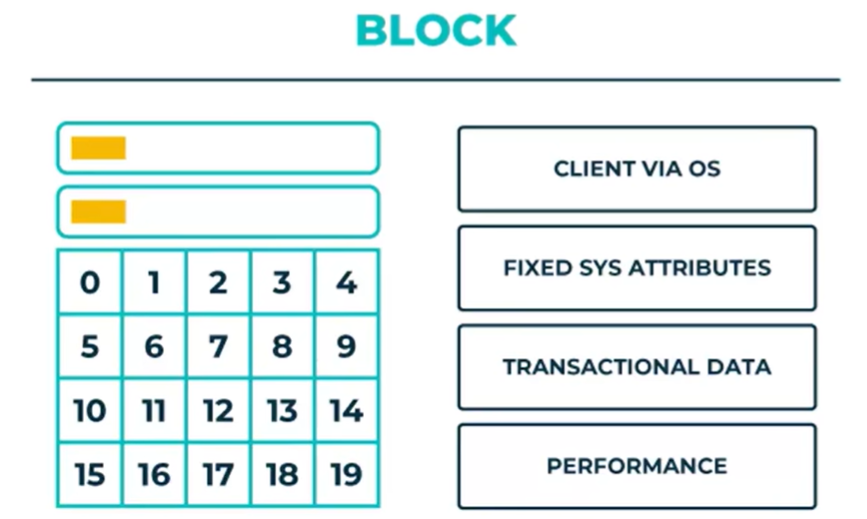
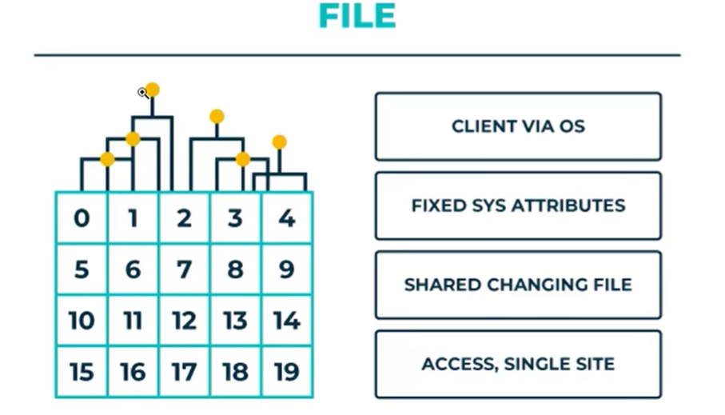
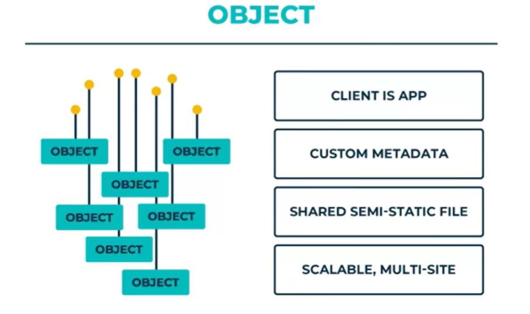

[TOC]

### 块存储

块存储是一种以固定大小的数据块未基本单位的存储方式, 通常用于底层硬件与操作系统的交互.快存储提供的是原始的未经格式化的,类似于物理磁盘. 操作系统可以讲这些块视为连续的地址空加班,并通过块设备驱动程序对块实现读写操作,快存储的主要特点是低延迟,高性能适用于执行随机IO的应用,如数据库和虚拟机的存储.

### 文件存储

采用树状的目录结构来管理和组织数据,也就是我们常见的文件和文件夹形式.这种存储方式提供了文件系统层次,屏蔽了磁盘的异构性, 文件系统支持多种文件协议,如NFS,SMB写,适用于网络附加存储,NAS以及云存储等.

### 对象存储

对象存储是一种基于对象的存储架构,每个对象都是一个包含数据(文件流)和相关元数据(文件名,创建日志,格式,访问控制等)信息的自包含实体.

对象存储不遵循文件系统的树层次架构.通过通过唯一的全局标识来访问数据.由于这种天然分布式的设计,对象存储非常适合大规模的非结构化的文件存储.具有很高的拓展性和持久性.

Amazon S3,Microsfot Azure Blog Storage ,Aliyun Cloud Object Storage Setvice 以及 Google Storage 等云服务上提供对象存储服务.

> 必须使用特定的客户端去访问,而不支持类似文件系统的方式去访问

### 总结

- 块存储呈现给使用者的是一块硬盘，使用者决定是否用某种文件系统格式化，可以直接写裸盘，也可以用某文件系统格式化成若干分区。服务提供者感知不到文件系统的概念。

- 文件存储呈现给使用者的是一个共享目录，服务提供者决定用什么文件系统。建立与操作系统上对快存储的封装.

- 对象存储呈现给使用者的是一个KV，只不过这里的V是文件。
