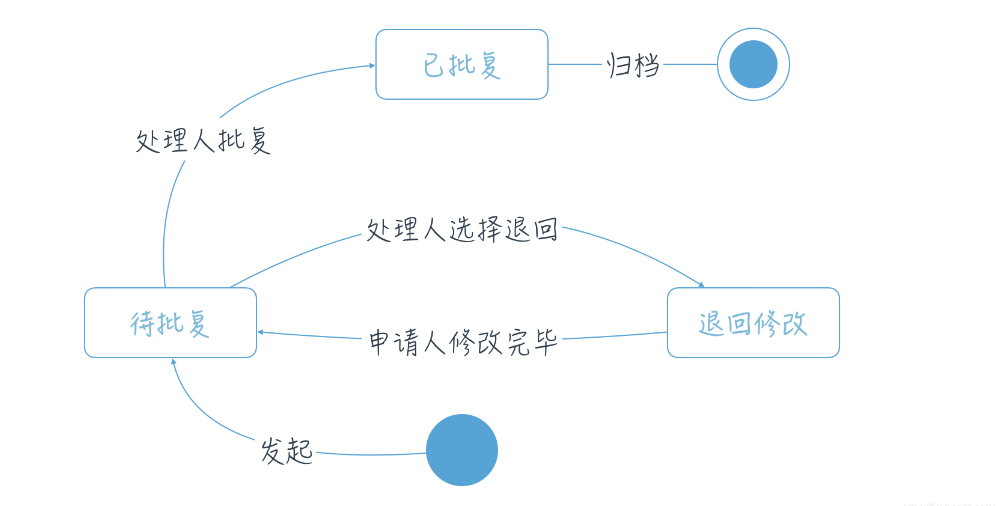

[TOC]

> 状态机是有限状态自动机(Finite-state machine, FSM)的简称，是现实事物运行规则抽象而成的一个数学模型。

先来解释什么是“状态”（ State ）。现实事物是有不同状态的，例如一个自动门，就有 open 和 closed 两种状态。我们通常所说的状态机是有限状态机，也就是被描述的事物的状态的数量是有限个，例如自动门的状态就是两个 open 和 closed 。

状态机，也就是 State Machine ，不是指一台实际机器，而是指一个数学模型。说白了，一般就是指一张状态转换图。例如，根据自动门的运行规则，我们可以抽象出下面这么一个图。

### 1. 状态机的概念

下面来给出状态机的四大概念。

- State ，状态。一个状态机至少要包含两个状态。例如上面自动门的例子，有 open 和 closed 两个状态。
- Event ，事件。事件就是执行某个操作的触发条件或者口令。对于自动门，“按下开门按钮”就是一个事件。

- Action ，动作。事件发生以后要执行动作。例如事件是“按开门按钮”，动作是“开门”。编程的时候，一个 Action 一般就对应一个函数。

- Transition ，变换。也就是从一个状态变化为另一个状态。例如“开门过程”就是一个变换。


### 2. 状态机图

做需求时，需要了解以下六种元素：起始、终止、现态、次态（目标状态）、动作、条件，我们就可以完成一个状态机图了




### 3. 状态机实战

- 订单类

  ```java
  @Data
  public class Order {
  
      private Long id;
  
      private OrderState state;
  }
  
  public enum OrderState {
      WAIT_PAYMENT,
      WAIT_DELIVER,
      WAIT_RECEIVE,
      FINISH;
  }
  
  public enum OrderAction {
      PAYED,
      DELIVERY,
      RECEIVED;
  }
  ```

- 定义状态机

  ```java
  
  @EnableStateMachine
  public class OrderConfiguration extends StateMachineConfigurerAdapter<OrderState, OrderAction> {
  
  
      @Override
      public void configure(StateMachineStateConfigurer<OrderState, OrderAction> states) throws Exception {
          states.withStates().initial(OrderState.WAIT_PAYMENT).end(OrderState.FINISH).states(EnumSet.allOf(OrderState.class));
      }
  
      @Override
      public void configure(StateMachineTransitionConfigurer<OrderState, OrderAction> transitions) throws Exception {
          transitions
                  .withExternal()
                  .source(OrderState.WAIT_PAYMENT).target(OrderState.WAIT_DELIVER).event(OrderAction.PAYED)
                  .and()
                  .withExternal()
                  .source(OrderState.WAIT_DELIVER).target(OrderState.WAIT_RECEIVE).event(OrderAction.DELIVERY)
                  .and()
                  .withExternal()
                  .source(OrderState.WAIT_RECEIVE).target(OrderState.FINISH).event(OrderAction.RECEIVED);
      }
  }
  ```

- 定义状态监听器

  ```java
  @Transactional
  @WithStateMachine
  public class OrderStatusListener {
  
      @Resource
      private StateMachine<OrderState,OrderAction> stateMachine;
  
      @OnTransition(source = "WAIT_PAYMENT",target = "WAIT_DELIVER")
      public boolean pay(Message message){
          Order order = (Order) message.getHeaders().get("order");
          order.setState(OrderState.WAIT_DELIVER);
          System.out.println("状态信息变动");
          return true;
      }
  
  
      public void sendPayMessage(){
          Message<OrderAction> order = MessageBuilder.withPayload(OrderAction.PAYED)
                  .setHeader("order", new Order()).build();
      }
  
      private synchronized boolean sendEvent(Message<OrderAction> message) {
          boolean result = false;
          try {
              stateMachine.start();
              result = stateMachine.sendEvent(message);
          } catch (Exception e) {
              e.printStackTrace();
          } finally {
              if (Objects.nonNull(message)) {
                  Order order = (Order) message.getHeaders().get("order");
                  if (Objects.nonNull(order) && Objects.equals(order.getOrderStatus(), OrderStatusEnum.FINISH)) {
                      stateMachine.stop();
                  }
              }
          }
          return result;
      }
  }
  ```

  ### 4. 总结

  针对状态机的特点，还有其他思路实现一个状态机吗？下面是一些常规思路！

  1. 消息队列方式

     订单状态的流转可以通过 MQ 发布一个事件，消费者根据业务条件把订单状态进行流转，可以根据不同的事件发送到不同的 Topic。

  2. 定时任务驱动

     每隔一段时间启动一下 job，根据特定的状态从数据库中拿对应的订单记录，然后判断订单是否有条件到达下一个状态。

  3. 规则引擎方式

     业务团队可以在规则引擎里编写一系列的状态及其对应的转换规则，由规则引擎根据已经加载的规则对输入数据进行解析，根据解析的结果执行相应的动作，完成状态流转。