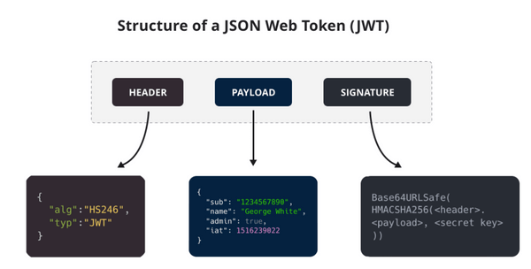

[TOC]

这是一个绝大多数人都会混淆的问题。首先先从读音上来认识这两个名词，很多人都会把它俩的读音搞混，所以我建议你先先去查一查这两个单词到底该怎么读，他们的具体含义是什么。

说简单点就是：

- **认证 (Authentication)：** 你是谁。
- **授权 (Authorization)：** 你有权限干什么。

稍微正式点（啰嗦点）的说法就是：

- **Authentication（认证）** 是验证您的身份的凭据（例如用户名/用户 ID 和密码），通过这个凭据，系统得以知道你就是你，也就是说系统存在你这个用户。所以，Authentication 被称为身份/用户验证。
- **Authorization（授权）** 发生在 **Authentication（认证）** 之后。授权嘛，光看意思大家应该就明白，它主要掌管我们访问系统的权限。比如有些特定资源只能具有特定权限的人才能访问比如 admin，有些对系统资源操作比如删除、添加、更新只能特定人才具有。

### 1. RBAC 模型 与 ABAC 模型

#### 1.1 基于角色的权限访问控制

系统权限控制最常采用的访问控制模型就是 **RBAC 模型** 。

**什么是 RBAC 呢？** RBAC 即基于角色的权限访问控制（Role-Based Access Control）。这是一种通过角色关联权限，角色同时又关联用户的授权的方式。

简单地说：一个用户可以拥有若干角色，每一个角色又可以被分配若干权限，这样就构造成“用户-角色-权限” 的授权模型。在这种模型中，用户与角色、角色与权限之间构成了多对多的关系

设计到的表结构如下

1. 用户表
2. 用户角色表
3. 角色表
4. 角色权限表
5. 权限表

#### 1.2 基于属性的访问控制

**基于属性的访问控制（Attribute-Based Access Control，简称 ABAC）** 是一种比 `RBAC模型` 更加灵活的授权模型，它的原理是通过各种属性来动态判断一个操作是否可以被允许。这个模型在云系统中使用的比较多，比如 AWS，阿里云等。

考虑下面这些场景的权限控制：

1. 授权某个人具体某本书的编辑权限
2. 当一个文档的所属部门跟用户的部门相同时，用户可以访问这个文档
3. 当用户是一个文档的拥有者并且文档的状态是草稿，用户可以编辑这个文档
4. 早上九点前禁止 A 部门的人访问 B 系统
5. 在除了上海以外的地方禁止以管理员身份访问 A 系统
6. 用户对 2022-06-07 之前创建的订单有操作权限

可以发现上述的场景通过 `RBAC模型` 很难去实现，因为 `RBAC模型` 仅仅描述了用户可以做什么操作，但是操作的条件，以及操作的数据，`RBAC模型` 本身是没有这些限制的。但这恰恰是 `ABAC模型` 的长处，`ABAC模型` 的思想是基于用户、访问的数据的属性、以及各种环境因素去动态计算用户是否有权限进行操作。

在 `ABAC模型` 中，一个操作是否被允许是基于对象、资源、操作和环境信息共同动态计算决定的。

- **对象**：对象是当前请求访问资源的用户。用户的属性包括 ID，个人资源，角色，部门和组织成员身份等
- **资源**：资源是当前用户要访问的资产或对象，例如文件，数据，服务器，甚至 API
- **操作**：操作是用户试图对资源进行的操作。常见的操作包括“读取”，“写入”，“编辑”，“复制”和“删除”
- **环境**：环境是每个访问请求的上下文。环境属性包含访问的时间和位置，对象的设备，通信协议和加密强度等

在 `ABAC模型` 的决策语句的执行过程中，决策引擎会根据定义好的决策语句，结合对象、资源、操作、环境等因素动态计算出决策结果。每当发生访问请求时，`ABAC模型` 决策系统都会分析属性值是否与已建立的策略匹配。如果有匹配的策略，访问请求就会被通过。

### 2. 无状态HTTP请求下的认证方式

- Cookie/Session
- Token

### 3. JWT: Json Web Token

JWT （JSON Web Token） 是目前最流行的跨域认证解决方案，是一种基于 Token 的认证授权机制。 从 JWT 的全称可以看出，JWT 本身也是 Token，一种规范化之后的 JSON 结构的 Token。

JWT 自身包含了身份验证所需要的所有信息，因此，我们的服务器不需要存储 Session 信息。这显然增加了系统的可用性和伸缩性，大大减轻了服务端的压力。

可以看出，**JWT 更符合设计 RESTful API 时的「Stateless（无状态）」原则** 。

并且， 使用 JWT 认证可以有效避免 CSRF 攻击，因为 JWT 一般是存在在 localStorage 中，使用 JWT 进行身份验证的过程中是不会涉及到 Cookie 的。

我在 [JWT 优缺点分析](https://javaguide.cn/system-design/security/advantages-and-disadvantages-of-jwt.html)这篇文章中有详细介绍到使用 JWT 做身份认证的优势和劣势。

下面是 [RFC 7519open in new window](https://tools.ietf.org/html/rfc7519) 对 JWT 做的较为正式的定义。

> JSON Web Token (JWT) is a compact, URL-safe means of representing claims to be transferred between two parties. The claims in a JWT are encoded as a JSON object that is used as the payload of a JSON Web Signature (JWS) structure or as the plaintext of a JSON Web Encryption (JWE) structure, enabling the claims to be digitally signed or integrity protected with a Message Authentication Code (MAC) and/or encrypted. ——[JSON Web Token (JWT)open in new window](https://tools.ietf.org/html/rfc7519)

JWT 本质上就是一组字串，通过（`.`）切分成三个为 Base64 编码的部分：

- **Header** : 描述 JWT 的元数据，定义了生成签名的算法以及 `Token` 的类型。
- **Payload** : 用来存放实际需要传递的数据
- **Signature（签名）**：服务器通过 Payload、Header 和一个密钥(Secret)使用 Header 里面指定的签名算法（默认是 HMAC SHA256）生成。

1. 使用安全系数高的加密算法。
2. 使用成熟的开源库，没必要造轮子。
3. JWT 存放在 localStorage 中而不是 Cookie 中，避免 CSRF 风险。
4. 一定不要将隐私信息存放在 Payload 当中。
5. 密钥一定保管好，一定不要泄露出去。JWT 安全的核心在于签名，签名安全的核心在密钥。
6. Payload 要加入 `exp` （JWT 的过期时间），永久有效的 JWT 不合理。并且，JWT 的过期时间不易过长。可以考虑Token续签的场景

### 4. SSO:  Single Sign On

SSO 英文全称 Single Sign On，单点登录。SSO 是在多个应用系统中，用户只需要登录一次就可以访问所有相互信任的应用系统。

1. **用户角度** :用户能够做到一次登录多次使用，无需记录多套用户名和密码，省心。
2. **系统管理员角度** : 管理员只需维护好一个统一的账号中心就可以了，方便。
3. **新系统开发角度:** 新系统开发时只需直接对接统一的账号中心即可，简化开发流程，省时。

### 5. OAuth 2.0

OAuth 是一个行业的标准授权协议，主要用来授权第三方应用获取有限的权限。而 OAuth 2.0 是对 OAuth 1.0 的完全重新设计，OAuth 2.0 更快，更容易实现，OAuth 1.0 已经被废弃。详情请见：[rfc6749open in new window](https://tools.ietf.org/html/rfc6749)。

实际上它就是一种授权机制，它的最终目的是为第三方应用颁发一个有时效性的令牌 Token，使得第三方应用能够通过该令牌获取相关的资源。

OAuth 2.0 比较常用的场景就是第三方登录，当你的网站接入了第三方登录的时候一般就是使用的 OAuth 2.0 协议。

另外，现在 OAuth 2.0 也常见于支付场景（微信支付、支付宝支付）和开发平台（微信开放平台、阿里开放平台等等）。