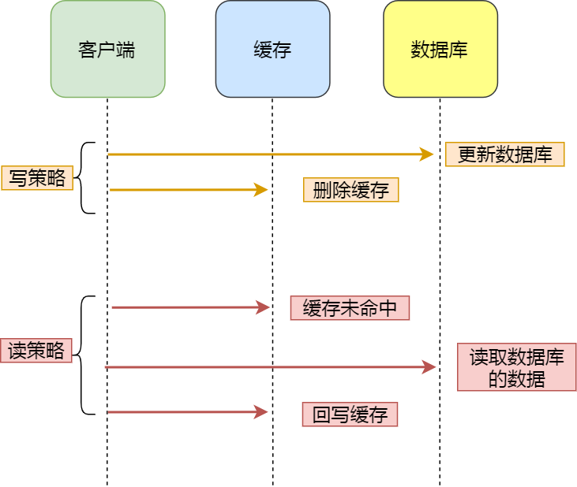
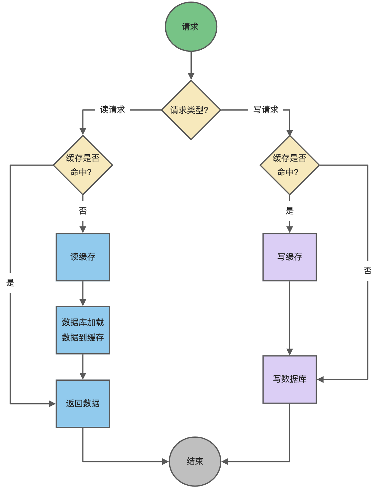

### 1. 缓存的更新策略

#### 1.1 Cache Aside（旁路缓存）策略

Cache Aside（旁路缓存）策略是最常用的，应用程序直接与「数据库、缓存」交互，并负责对缓存的维护，该策略又可以细分为「读策略」和「写策略」。

**策略的步骤：**

- 先更新数据库中的数据，再删除缓存中的数据。

**读策略的步骤：**

- 如果读取的数据命中了缓存，则直接返回数据；
- 如果读取的数据没有命中缓存，则从数据库中读取数据，然后将数据写入到缓存，并且返回给用户。

注意，写策略的步骤的顺序顺序不能倒过来，即**不能先删除缓存再更新数据库**，原因是在「读+写」并发的时候，会出现缓存和数据库的数据不一致性的问题。

#### 1.2 **Read/Write Through（读穿 / 写穿）策略**

Read/Write Through（读穿 / 写穿）策略原则是应用程序只和缓存交互，不再和数据库交互，而是由缓存和数据库交互，相当于更新数据库的操作由缓存自己代理了。

- **Read Through 策略**

先查询缓存中数据是否存在，如果存在则直接返回，如果不存在，则由缓存组件负责从数据库查询数据，并将结果写入到缓存组件，最后缓存组件将数据返回给应用。

- **Write Through 策略**

当有数据更新的时候，先查询要写入的数据在缓存中是否已经存在：

- 如果缓存中数据已经存在，则更新缓存中的数据，并且由缓存组件同步更新到数据库中，然后缓存组件告知应用程序更新完成。
- 如果缓存中数据不存在，直接更新数据库，然后返回；

下面是 Read Through/Write Through 策略的示意图：

#### 1.3 数据写回

Write Back（写回）策略在更新数据的时候，只更新缓存，同时将缓存数据设置为脏的，然后立马返回，并不会更新数据库。对于数据库的更新，会通过批量异步更新的方式进行。

实际上，Write Back（写回）策略也不能应用到我们常用的数据库和缓存的场景中，因为 Redis 并没有异步更新数据库的功能。

Write Back 是计算机体系结构中的设计，比如 CPU 的缓存、操作系统中文件系统的缓存都采用了 Write Back（写回）策略。

**Write Back 策略特别适合写多的场景**，因为发生写操作的时候， 只需要更新缓存，就立马返回了。比如，写文件的时候，实际上是写入到文件系统的缓存就返回了，并不会写磁盘。

**但是带来的问题是，数据不是强一致性的，而且会有数据丢失的风险**，因为缓存一般使用内存，而内存是非持久化的，所以一旦缓存机器掉电，就会造成原本缓存中的脏数据丢失。所以你会发现系统在掉电之后，之前写入的文件会有部分丢失，就是因为 Page Cache 还没有来得及刷盘造成的。

> MySQL中RedoLog中的数据就是这种模式,通过讲数据保存存在RedoLog中,再适合的时间点刷到Database中

### 2. 缓存雪崩与缓存穿透

#### 2.1 缓存雪崩

当某一个时刻出现大规模的缓存失效的情况，那么就会导致大量的请求直接打在数据库上面，导致数据库压力巨大，如果在高并发的情况下，可能瞬间就会导致数据库宕机。这时候如果运维马上又重启数据库，马上又会有新的流量把数据库打死。这就是缓存雪崩。

解决方案为

1. 在原有的失效时间上加上一个随机值，比如1-5分钟随机。这样就避免了因为采用相同的过期时间导致的缓存雪崩。
2. 服务限流
3. 提升MySQL的性能,读写分离与分库分表
4. 使用Redis集群,增强Redis高科用性

#### 2.2 缓存击穿

其实跟缓存雪崩有点类似，缓存雪崩是大规模的key失效，而缓存击穿是一个热点的Key，有大并发集中对其进行访问，突然间这个Key失效了，导致大并发全部打在数据库上，导致数据库压力剧增。这种现象就叫做缓存击穿。

1. 对于热点KEY,不设置自动过期时间,代码更新热点KEY的缓存
2. 获取数据库的时候采用分布式锁,只有获取到锁的线程才能去查询数据库,原理类似于单例模式下的DCL
3. 增强MySQL的读能力

#### 2.3 缓存穿透

我们使用Redis大部分情况都是通过Key查询对应的值，假如发送的请求传进来的key是不存在的，那么就查不到缓存，查不到缓存就会去数据库查询。假如有大量这样的请求，这些请求像“穿透”了缓存一样直接打在数据库上，这种现象就叫做缓存穿透。

解决方案

1. 将不存在的KEY的查询结果也放在缓存中,下次查询的时候就会命中null缓存,但是避免不了大量的无效KEY的情况
2. 使用布隆过滤器,当判断KEY不存存在的时候,直接返回.