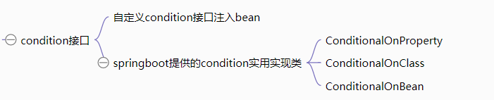

[TOC]


### 1. 什么是自动装配?

我们现在提到自动装配的时候，一般会和 Spring Boot 联系在一起。但是，实际上 Spring Framework 早就实现了这个功能。Spring Boot 只是在其基础上，通过 SPI 的方式，做了进一步优化。

SpringBoot 定义了一套接口规范，这套规范规定：SpringBoot 在启动时会扫描外部引用 jar 包中的`META-INF/spring.factories`文件，将文件中配置的类型信息加载到 Spring 容器（此处涉及到 JVM 类加载机制与 Spring 的容器知识），并执行类中定义的各种操作。对于外部 jar 来说，只需要按照 SpringBoot 定义的标准，就能将自己的功能装置进 SpringBoot。

> 自 Spring Boot 3.0 开始，自动配置包的路径从`META-INF/spring.factories` 修改为 `META-INF/spring/org.springframework.boot.autoconfigure.AutoConfiguration.imports`。


### 2. SprinBoot 的自动装配是如何实现的

SpringBoot的核心注解 `SpringBootApplication`的定义如下

```java
@Target({ElementType.TYPE})
@Retention(RetentionPolicy.RUNTIME)
@Documented
@Inherited
@SpringBootConfiguration
@ComponentScan
@EnableAutoConfiguration
public @interface SpringBootApplication {

}

@Target({ElementType.TYPE})
@Retention(RetentionPolicy.RUNTIME)
@Documented
@Configuration //实际上它也是一个配置类
public @interface SpringBootConfiguration {
}
```


大概可以把 `@SpringBootApplication`看作是 `@Configuration`、`@EnableAutoConfiguration`、`@ComponentScan` 注解的集合。根据 SpringBoot 官网，这三个注解的作用分别是：

- `@EnableAutoConfiguration`：启用 SpringBoot 的自动配置机制
- `@Configuration`：允许在上下文中注册额外的 bean 或导入其他配置类
- `@ComponentScan`：扫描被`@Component` (`@Service`,`@Controller`)注解的 bean，注解默认会扫描启动类所在的包下所有的类 ，可以自定义不扫描某些 bean。如下图所示，容器中将排除`TypeExcludeFilter`和`AutoConfigurationExcludeFilter`。


### 3. Conditional 条件注入

有兴趣的童鞋可以详细了解下 Spring Boot 提供的条件注解



- `@ConditionalOnBean`：当容器里有指定 Bean 的条件下
- `@ConditionalOnMissingBean`：当容器里没有指定 Bean 的情况下
- `@ConditionalOnSingleCandidate`：当指定 Bean 在容器中只有一个，或者虽然有多个但是指定首选 Bean
- `@ConditionalOnClass`：当类路径下有指定类的条件下
- `@ConditionalOnMissingClass`：当类路径下没有指定类的条件下
- `@ConditionalOnProperty`：指定的属性是否有指定的值
- `@ConditionalOnResource`：类路径是否有指定的值
- `@ConditionalOnExpression`：基于 SpEL 表达式作为判断条件
- `@ConditionalOnJava`：基于 Java 版本作为判断条件
- `@ConditionalOnJndi`：在 JNDI 存在的条件下差在指定的位置
- `@ConditionalOnNotWebApplication`：当前项目不是 Web 项目的条件下
- `@ConditionalOnWebApplication`：当前项目是 Web 项 目的条件下