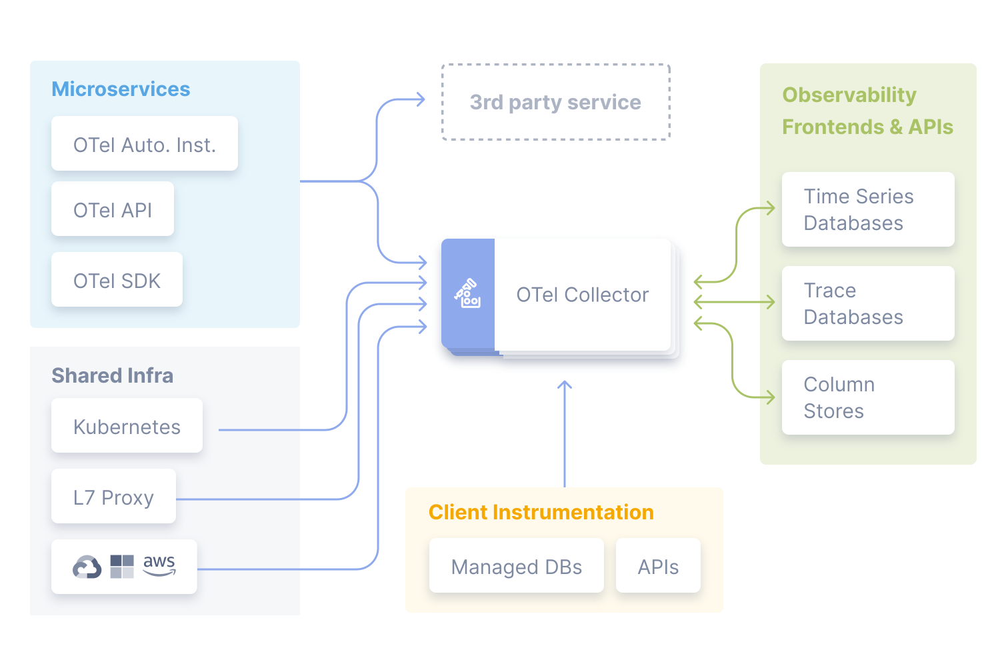

OpenTelemetry是一个观测性框架和工具包，旨在创建和管理遥测数据，如追踪、指标和日志。OpenTelemetry是厂商和工具无关的，意味着它可以与各种观测性后端一起使用，包括像Jaeger和Prometheus这样的开源工具，以及商业解决方案。OpenTelemetry是一个Cloud Native Computing Foundation（CNCF）项目。

### 可观测的三大指标

- Log: 日志记录

- Trace: 链路跟踪

- Metria: 数据指标

  

### 参考链接

1. [什么是OpenTelemetry？ | OpenTelemetry 中文文档 (opendocs.io)](https://opentelemetry.opendocs.io/docs/what-is-opentelemetry/)
2. [Docker 部署 | OpenTelemetry 中文文档 (opendocs.io)](https://opentelemetry.opendocs.io/docs/demo/docker-deployment/)
