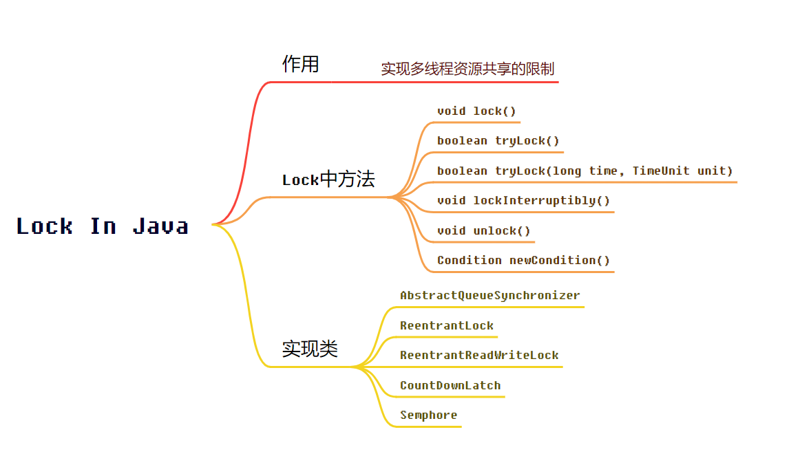

### 1、Lock锁 与 Synchronized的关系

   `锁是用来控制多个线程访问共享资源的方式，一般来说，一个锁能够防止多个线程同时访问共享资源，解决数据的一致性问题。`在Lock接口出现之前，Java程序是靠synchronized关键字实现锁功能的，而Java SE 5之后，并发包中新增了Lock接口（以及相关实现类）用来实现锁功能，

`它提供了与synchronized关键字类似的同步功能，只是在使用时需要显式地获取和释放锁。虽然它缺少了隐式获取释放锁的便捷性，但是却拥有了锁获取与释放的可操作性、可中断的获取锁以及超时获取锁等多种synchronized关键字所不具备的同步特性`

使用synchronized关键字将会隐式地获取锁，当synchronized的方法或代码块执行完成再释放。这种方式简化了同步的管理，可是扩展性没有显示的锁获取和释放来的好。在比较复杂的同步控制中，可操作性不如显式锁来的灵活. 例如，针对一个场景，手把手进行锁获取和释放，先获得锁A，然后再获取锁B，当锁B获得后，释放锁A同时获取锁C，当锁C获得后，再释放B同时获取锁D，以此类推。这种场景下，synchronized关键字就不那么容易实现了，而使用Lock却容易许多。

### 2、抽象队列同步器- AbstractQueueSynchronizer

AQS是一个用来构建锁和同步器的框架，使用AQS能简单且高效地构造出应用广泛的大量的同步器，比如我们提到的ReentrantLock，Semaphore，其他的诸如ReentrantReadWriteLock，SynchronousQueue，FutureTask等等皆是基于AQS的。当然，我们自己也能利用AQS非常轻松容易地构造出符合我们自己需求的同步器。

