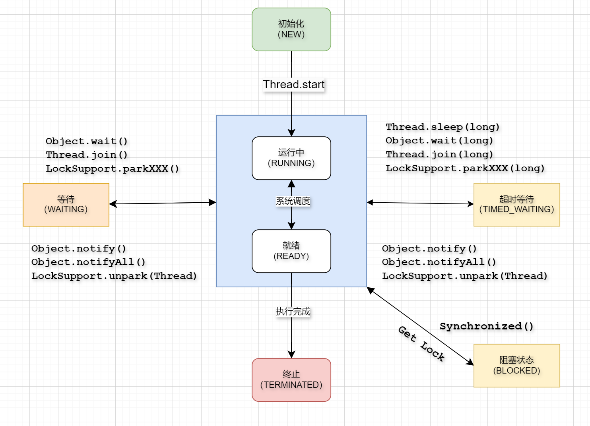
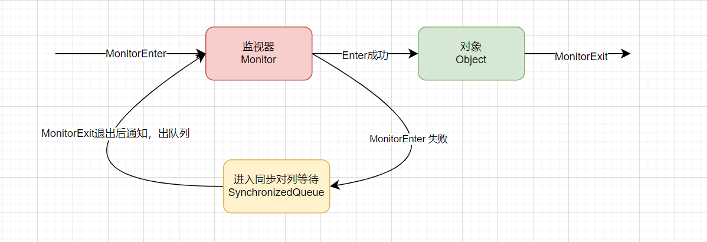

### 多线程的定义和创建

Java 给多线程编程提供了内置的支持。 一条线程指的是进程中一个单一顺序的控制流，一个进程中可以并发多个线程，每条线程并行执行不同的任务。

多线程是多任务的一种特别的形式，但多线程使用了更小的资源开销。

这里定义和线程相关的另一个术语  进程：进程是操作系统运行程序的最小单元，一个进程包括由操作系统分配的内存空间，包含一个或多个线程。一个线程不能独立的存在，它必须是进程的一部分。一个进程一直运行，直到所有的非守护线程都结束运行后才能结束，线程共享进程的资源。

多线程能满足程序员编写高效率的程序来达到充分利用 CPU 的目的。


在Java中创建线程可以分为2中方式:

1. 实现 Runnable 接口
2. 继承 Thread抽象类

```java
class MyRunnableImpl implements Runnable{
    @Override
    public void run(){
        
    }
}
new Thread(new MyRunableImpl).start()


// --- Thread -- 

class MyThreadImpl extends Thread{
    @Override
    public void run(){
        
    }
}
new MyThreadImpl().start()
```


在Java中可以通过 JMX 查询到所有的线程信息

```java
    public static void main(String[] args) {
        ThreadMXBean threadMXBean = ManagementFactory.getThreadMXBean();
        ThreadInfo[] threadInfos = threadMXBean.dumpAllThreads(false, false);
        for (ThreadInfo t : threadInfos) {
            System.out.printf("name = %s, pid = %s,state =%s\n",t.getThreadName(),t.getThreadId(),threadInfo.t());
        }
    }
```


### 2、线程的生命周期

线程是一个动态执行的过程，它也有一个从产生到死亡的过程。

下图显示了一个线程完整的生命周期。





### 3、线程的参数

1. 线程优先级 `setpriority(int)` 
2. 守护线程 `setDemon(false)`

### 4、线程的通信方式

volatile(``$adj.$不稳定的，容易改变的`)是Java提供的一种轻量级的同步机制。Java 语言包含两种内在的同步机制：同步块（或方法）和 volatile 变量，相比于synchronized（synchronized通常称为重量级锁），volatile更轻量级，因为它不会引起线程上下文的切换和调度。但是volatile 变量的同步性较差（有时它更简单并且开销更低），而且其使用也更容易出错。

 *volatile可以保证线程可见性且提供了一定的有序性，但是无法保证原子性*。在JVM底层volatile是采用“内存屏障”来实现的。观察加入volatile关键字和没有加入volatile关键字时所生成的汇编代码发现，加入volatile关键字时，会多出一个lock前缀指令，lock前缀指令实际上相当于一个内存屏障（也成内存栅栏），内存屏障会提供3个功能：

（1）它确保指令重排序时不会把其后面的指令排到内存屏障之前的位置，也不会把前面的指令排到内存屏障的后面；即在执行到内存屏障这句指令时，在它前面的操作已经全部完成；
		（2）它会强制将对缓存的修改操作立即写入主存；
		（3）如果是写操作，它会导致其他CPU中对应的缓存行无效。

---


同样的，synchronized修饰的代码块或者方法能保证持有同一个监视器的线程，只能有一个线程执行，未持有监视器的线程必须等待，由此保证的可见性。

1. 修饰一个代码块，被修饰的代码块称为同步语句块，其作用的范围是大括号{}括起来的代码，监视器的对象是所在类的Class对象； 

  2. 修饰一个方法，被修饰的方法称为同步方法，其作用的范围是整个方法，监视器的对象是这个实例； 

  3. 修改一个静态的方法，其作用的范围是整个静态方法，监视器的对象是Class对象； 

`synchronized底层原理是基于JVM的指令和对象的监视器（monitor）来实现的`。synchronized可以修饰方法或者代码块，用来保证线程的同步和安全。

当一个线程要执行一个被synchronized修饰的方法或代码块时，它需要先获取该方法或代码块所属对象的监视器。如果获取成功，那么该线程就可以执行同步代码，并且监视器的计数器加一。如果获取失败，那么该线程就会阻塞，直到监视器被释放。

当一个线程执行完同步代码后，它会释放监视器，并且监视器的计数器减一。如果计数器为零，那么说明没有线程持有该监视器，其他线程就可以竞争获取该监视器。

`synchronized修饰方法时，在字节码层面会有一个ACC_SYNCHRONIZED标志，用来表示该方法是同步的。synchronized修饰代码块时，在字节码层面会有monitorenter和monitorexit两个指令，分别用来进入和退出监视器`。

synchronized 的底层实现原理可以概括为以下几点：

+ synchronized 通过监视器锁来实现线程同步。
+ 每个 Java 对象都有一个监视器锁。
+ 线程在获取了对象的监视器锁后，可以执行被修饰的代码。
+ 线程在释放了对象的监视器锁后，其他线程可以尝试获取监视器锁。



> 关于Synchronized中的锁机制，可以参考 [Java中的锁](./Java中的锁.md)

### 5、多线程的 Wait & Notify 模型

等待/通知机制，是指一个线程A调用了对象O的wait()方法进入等待状态，而另一个线程B调用了对象O的notify()/notifyAll()方法，线程A收到通知后退出等待队列，进入可运行状态，进而执行后续操作。上诉两个线程通过对象O来完成交互，而对象上的wait()方法和notify()/notifyAll()方法的关系就如同开关信号一样，用来完成等待方和通知方之间的交互工作。

```java
public class WaitNotifyExample {
    static Object lock = new Object();
    static boolean condition = false;
 
    public static void main(String[] args) {
        Thread producer = new Thread(new Runnable() {
            @Override
            public void run() {
                synchronized (lock) {
                    System.out.println("Producer: Waiting for condition to become true.");
                    while (!condition) {
                        try {
                            // 不符合条件进入等待，释放线程锁 直到B线程 notify 
                            lock.wait(); 
                        } catch (InterruptedException e) {
                            e.printStackTrace();
                        }
                    }
                    System.out.println("Producer: Condition is true.");
                }
            }
        });
 
        Thread consumer = new Thread(new Runnable() {
            @Override
            public void run() {
                synchronized (lock) {
                    System.out.println("Consumer: Setting condition to true.");
                    condition = true;
                    lock.notifyAll();
                }
            }
        });
 
        producer.start();
        consumer.start();
    }
}
```


### 6、ThreaLocal的使用和内存泄漏

`ThreadLocal叫做线程变量，意思是ThreadLocal中填充的变量属于当前线程，该变量对其他线程而言是隔离的，也就是说该变量是当前线程独有的变量。`ThreadLocal为变量在每个线程中都创建了一个副本，那么每个线程可以访问自己内部的副本变量。

总结来说，Threadlocal 只是一个KEY，真正的Entry(Key,Value) 保存在 Thread的`ThreadLocalMap threadLocals` 对象中。

值得注意的是在 ThreadLocalMap中KEY是通过 WeakReference 引用 ThreadLocal对象的，很多人说弱引用会导致 value无法被回收，因为存在 `Thread -> ThreadLocal -> ThreadLocalMap -> Entry -> Value`链路的强引用，这其实是开发者不正确使用ThreadLocal导致的，确把问题归结到设计上去了，属于本末倒置。

正确使用ThreadLocal的方式如下： 

- 每次使用完ThreadLocal都调用它的remove()方法清除数据
- 将ThreadLocal变量定义成private static，这样就一直存在ThreadLocal的强引用，也就能保证任何时候都能通过ThreadLocal的弱引用访问到Entry的value值，进而清除掉 。

### 附录

#### 1. 基于Wait & Notify实现的简单线程池

```java
package com.taos.demo;

import com.taos.demo.base.Job;
import com.taos.demo.base.ThreadPool;

import java.util.ArrayList;
import java.util.Arrays;
import java.util.LinkedList;
import java.util.List;
import java.util.concurrent.atomic.AtomicInteger;

public class ThreadPoolExample implements ThreadPool {

    private final static int DEFAULT_THREAD_WORK_COUNT = 10;

    private final List<Thread> WORKER = new ArrayList<>();

    private final LinkedList<Job> jobs = new LinkedList<>();

    private final AtomicInteger workCount = new AtomicInteger(0);


    public ThreadPoolExample() {
        this.initWorker(DEFAULT_THREAD_WORK_COUNT);
    }

    public void initWorker(int size) {
        for (int i = 0; i < size; i++) {
            Thread thread = new Thread(new Worker(), "线程：" + workCount.incrementAndGet());
            WORKER.add(thread);
            thread.start();
        }
    }


    @Override
    public void execute(Job... jobList) {
        synchronized (this.jobs){
            jobs.addAll(Arrays.asList(jobList));
            jobs.notifyAll();
        }
    }

    @Override
    public List<Job> findJobs() {
        return this.jobs;
    }

    class Worker implements Runnable {

        private boolean running = true;

        @Override
        public void run() {
            Job job = null;
            while (running) {
                while (jobs.isEmpty()) {
                    try {
                        jobs.wait();
                    } catch (InterruptedException e) {
                        throw new RuntimeException(e);
                    }
                    job = jobs.removeFirst();
                }
                if (job != null) {
                    job.run();
                }

            }
        }

        public void shutdown() {
            this.running = false;
        }
    }

}

```
