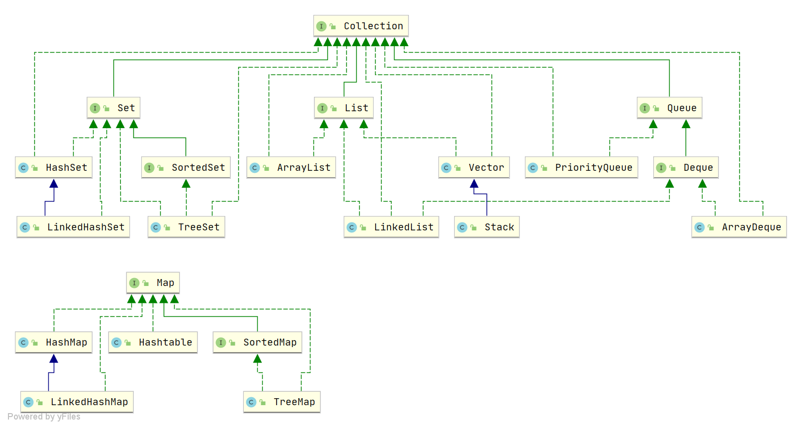

[TOC]

### 1、集合概述

Java中集合主要的继承以及实现关系图如下： 



我们主要使用的是`ArrayList`,`LinkedList`,`HashMap`以及`HashSet`的实现原理

### 2、集合相关理论
#### 2.1 快速失败

fail-fast 机制是java集合(Collection)中的一种错误机制。当多个线程对同一个集合的内容进行操作时，就可能会产生fail-fast事件。

其实fail-fast机制并不是Java集合特有的机制，它是一个通用的系统设计思想。

从上面的解释中可以了解到：fail-fast是一种错误检测机制，一旦检测到可能发生错误，就立马抛出异常，程序不继续往下执行。

```java
public class Demo{
    public  UserDomain queryUserById(String userId){
        if(userId==null||"".equals(userId)){
            throw new RuntimeException("error params...");
        }
        //do something
    }
}
```

上面的列子就是一个快速失败的列子，而且是我们开发中经常会用到的错误检测的方式。这样做能及早发现问题，不让明显错误的代码继续往下运行，而且自己抛出的异常更更容易定位问题。

```java
public class Demo{
    public static void main(String[] args) {
        List<String> userNames = new ArrayList<>();
        // xxxx

        // 错误的删除方式: 增强for循环底层仍然是迭代器
        for (String userName : userNames) {
            if (userName.equals("Hollis")) {
                userNames.remove(userName); // 只修改了 modCount未修改 exceptedModCound 导致的异常
            }
        }

        // 正确的删除方式
        Iterator<String> iterator = userNames.iterator();
        while (iterator.hasNext()){
            String next = iterator.next();
            if (Objects.equals(next,"Hollis")){
                iterator.remove();
            }
        }
    }
}

```


#### 2.2 写时复制机制

**写时复制**（**Copy-on-write**，简称**COW**）是一种计算机[程序设计](https://link.zhihu.com/?target=https%3A//zh.wikipedia.org/wiki/%E7%A8%8B%E5%BC%8F%E8%A8%AD%E8%A8%88)领域的优化策略。其核心思想是，如果有多个调用者（callers）同时请求相同资源（如内存或磁盘上的数据存储），他们会共同获取相同的指针指向相同的资源，直到某个调用者试图修改资源的内容时，系统才会真正复制一份专用副本（private copy）给该调用者，而其他调用者所见到的最初的资源仍然保持不变。这过程对其他的调用者都是[透明](https://link.zhihu.com/?target=https%3A//zh.wikipedia.org/wiki/%E9%80%8F%E6%98%8E)的。此作法主要的优点是如果调用者没有修改该资源，就不会有副本（private copy）被创建，因此多个调用者只是读取操作时可以共享同一份资源


### 3、安全并发容器集合
JDK 提供的这些容器大部分在 java.util.concurrent 包中。
- ConcurrentHashMap : 线程安全的 HashMap
- CopyOnWriteArrayList : 线程安全的 List，在读多写少的场合性能非常好，远远好于 Vector。
- ConcurrentLinkedQueue : 高效的并发队列，使用链表实现。可以看做一个线程安全的 LinkedList，这是一个非阻塞队列。
- BlockingQueue : 这是一个接口，JDK 内部通过链表、数组等方式实现了这个接口。表示阻塞队列，非常适合用于作为数据共享的通道。
- ConcurrentSkipListMap : 跳表的实现。这是一个 Map，使用跳表的数据结构进行快速查找。

### 3.1 ConcurrentHashMap
我们知道 HashMap 不是线程安全的，在并发场景下如果要保证一种可行的方式是使用 Collections.synchronizedMap() 方法来包装我们的 HashMap。
但这是通过使用一个全局的锁来同步不同线程间的并发访问，因此会带来不可忽视的性能问题。所以就有了 HashMap 的线程安全版本—— ConcurrentHashMap 的诞生。

在 JDK1.7 的时候，ConcurrentHashMap 对整个桶数组进行了分割分段(Segment，分段锁)，每一把锁只锁容器其中一部分数据（下面有示意图），多线程访问容器里不同数据段的数据，就不会存在锁竞争，提高并发访问率。到了 JDK1.8 的时候，ConcurrentHashMap 已经摒弃了 Segment 的概念，而是直接用 Node 数组+链表+红黑树的数据结构来实现，并发控制使用 synchronized 和 CAS 来操作。（JDK1.6 以后 synchronized 锁做了很多优化） 整个看起来就像是优化过且线程安全的 HashMap，虽然在 JDK1.8 中还能看到 Segment 的数据结构，但是已经简化了属性，只是为了兼容旧版本。


