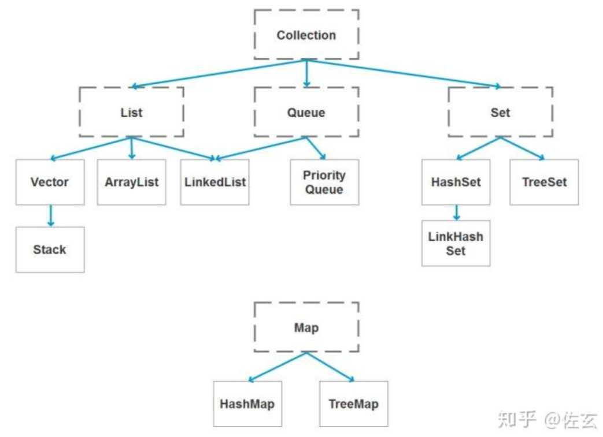

### 1、集合概述

Java中集合主要的继承以及实现关系图如下： 

我们主要使用的是`ArrayList`,`LinkedList`,`HashMap`以及`HashSet`的实现原理

### 2、ArrayList的实现方式

基于Array实现的非线程安全的集合，内部存在 `transient Object[] elementData; ` 存储元素，默认数组大小为16，当超过16的时候会进行扩容。每次add之前会通过`ensureCapacityInternal` 确保空间足够，当空间不够的时候 size会拓展到原来的2倍。

### 3、HashMap的实现方式

HashMap概述： HashMap是基于哈希表的Map接口的非同步实现。此实现提供所有可选的映射操作，并允许使用`null值`和`null键`。此类不保证映射的顺序，特别是它不保证该顺序恒久不变。

HashMap的数据结构： 在java编程语言中，最基本的结构就是两种，一个是数组，另外一个是模拟指针（引用），所有的数据结构都可以用这两个基本结构来构造的，HashMap也不例外。HashMap实际上是一个“链表散列”的数据结构，即数组和链表的结合体。

- HashSet底层由HashMap实现
- HashSet的值存放于HashMap的key上
- HashMap的value统一为PRESENT

