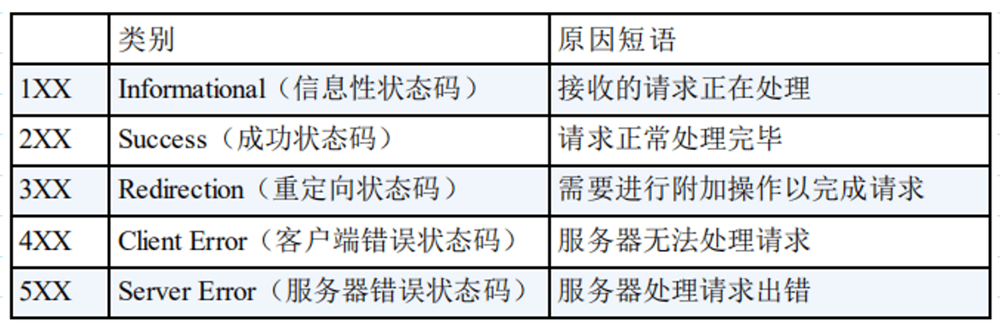
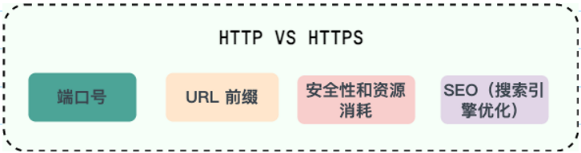
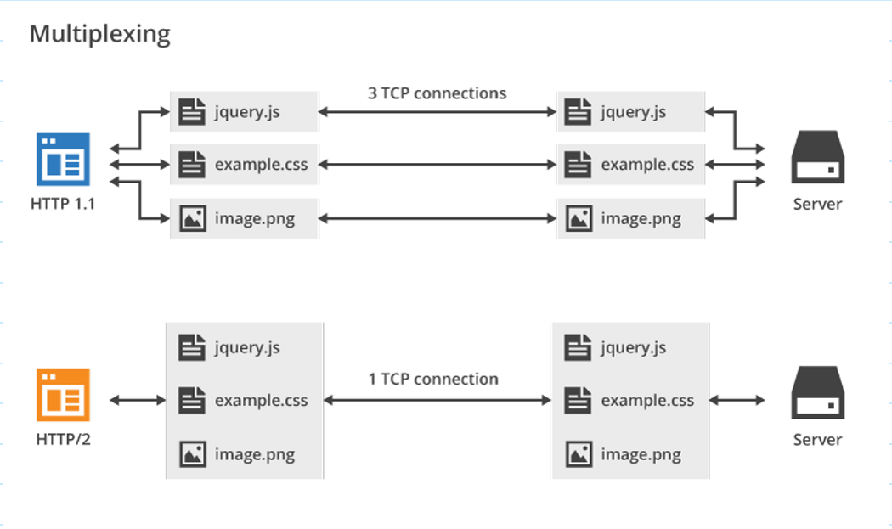
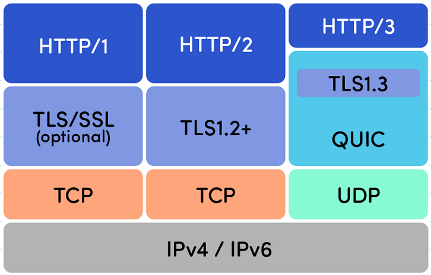
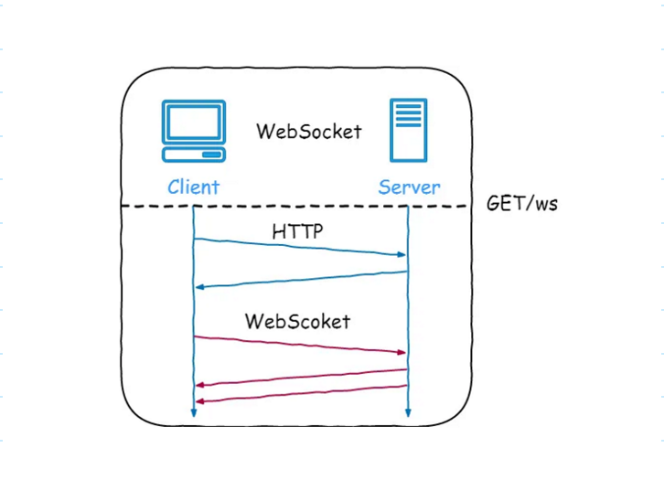

### 从输入 URL 到页面展示到底发生了什么

总体来说分为以下几个步骤:
1. 在浏览器中输入指定网页的 URL。
2.  浏览器通过 DNS 协议，获取域名对应的 IP 地址。
3.  浏览器根据 IP 地址和端口号(默认为80或者443)，向目标服务器发起一个 TCP 连接请求。
4.  浏览器在 TCP 连接上，向服务器发送一个 HTTP 请求报文，请求获取网页的内容。
5.  服务器收到 HTTP 请求报文后，处理请求，并返回 HTTP 响应报文给浏览器。
6. 浏览器收到 HTTP 响应报文后，解析响应体中的 HTML 代码，渲染网页的结构和样式，同时根据 HTML 中的其他资源的 URL（如图片、CSS、JS 等），再次发起 HTTP 请求，获取这些资源的内容，直到网页完全加载显示。
7. 浏览器在不需要和服务器通信时，可以主动关闭 TCP 连接，或者等待服务器的关闭请求。

详细介绍可以查看这篇文章：访问网页的全过程（知识串联）（强烈推荐）。

### HTTP 状态码有哪些？

HTTP 状态码用于描述 HTTP 请求的结果，比如 2xx 就代表请求被成功处理。

### HTTP 和 HTTPS 有什么区别？（重要）

- 端口号：HTTP 默认是 80，HTTPS 默认是 443。
- URL 前缀：HTTP 的 URL 前缀是 http://  HTTPS 的 URL 前缀是 https://。
- 安全性和资源消耗：HTTP 协议运行在 TCP 之上，所有传输的内容都是明文，客户端和服务器端都无法验证对方的身份。HTTPS 是运行在 SSL/TLS 之上的 HTTP 协议，SSL/TLS 运行在 TCP 之上。所有传输的内容都经过加密，加密采用对称加密，但对称加密的密钥用服务器方的证书进行了非对称加密。所以说，HTTP 安全性没有 HTTPS 高，但是 HTTPS 比 HTTP 耗费更多服务器资源。
- SEO（搜索引擎优化）：搜索引擎通常会更青睐使用 HTTPS 协议的网站，因为 HTTPS 能够提供更高的安全性和用户隐私保护。使用 HTTPS 协议的网站在搜索结果中可能会被优先显示，从而对 SEO 产生影响。

### HTTP 协议之间的差异

#### HTTP/1.0 和 HTTP/1.1 有什么区别？

- 连接方式 : HTTP/1.0 为短连接，HTTP/1.1 支持长连接。HTTP 协议的长连接和短连接，实质上是 TCP 协议的长连接和短连接。
- 状态响应码 : HTTP/1.1 中新加入了大量的状态码，光是错误响应状态码就新增了 24 种。比如说，100 (Continue)——在请求大资源前的预热请求，206 (Partial Content)——范围请求的标识码，409 (Conflict)——请求与当前资源的规定冲突，410 (Gone)——资源已被永久转移，而且没有任何已知的转发地址。
- 缓存机制 : 在 HTTP/1.0 中主要使用 Header 里的 If-Modified-Since,Expires 来做为缓存判断的标准，HTTP/1.1 则引入了更多的缓存控制策略例如 Entity tag，If-Unmodified-Since, If-Match, If-None-Match 等更多可供选择的缓存头来控制缓存策略。
- 带宽：HTTP/1.0 中，存在一些浪费带宽的现象，例如客户端只是需要某个对象的一部分，而服务器却将整个对象送过来了，并且不支持断点续传功能，HTTP/1.1 则在请求头引入了 range 头域，它允许只请求资源的某个部分，即返回码是 206（Partial Content），这样就方便了开发者自由的选择以便于充分利用带宽和连接。
- Host 头（Host Header）处理 :HTTP/1.1 引入了 Host 头字段，允许在同一 IP 地址上托管多个域名，从而支持虚拟主机的功能。而 HTTP/1.0 没有 Host 头字段，无法实现虚拟主机。

#### HTTP/1.1 和 HTTP/2.0 有什么区别？

• 多路复用（Multiplexing）：HTTP/2.0 在同一连接上可以同时传输多个请求和响应（可以看作是 HTTP/1.1 中长链接的升级版本），互不干扰。HTTP/1.1 则使用串行方式，每个请求和响应都需要独立的连接，而浏览器为了控制资源会有 6-8 个 TCP 连接都限制。。这使得 HTTP/2.0 在处理多个请求时更加高效，减少了网络延迟和提高了性能。
• 二进制帧（Binary Frames）：HTTP/2.0 使用二进制帧进行数据传输，而 HTTP/1.1 则使用文本格式的报文。二进制帧更加紧凑和高效，减少了传输的数据量和带宽消耗。
• 头部压缩（Header Compression）：HTTP/1.1 支持Body压缩，Header不支持压缩。HTTP/2.0 支持对Header压缩，使用了专门为Header压缩而设计的 HPACK 算法，减少了网络开销。
• 服务器推送（Server Push）：HTTP/2.0 支持服务器推送，可以在客户端请求一个资源时，将其他相关资源一并推送给客户端，从而减少了客户端的请求次数和延迟。而 HTTP/1.1 需要客户端自己发送请求来获取相关资源。

HTTP/2.0 多路复用效果图（图源： HTTP/2 For Web Developersopen in new window）：

可以看到，HTTP/2.0 的多路复用使得不同的请求可以共用一个 TCP 连接，避免建立多个连接带来不必要的额外开销，而 HTTP/1.1 中的每个请求都会建立一个单独的连接

#### HTTP/2.0 和 HTTP/3.0 有什么区别？

HTTP/2.0 和 HTTP/3.0 对比
​• 传输协议：HTTP/2.0 是基于 TCP 协议实现的，HTTP/3.0 新增了 QUIC（Quick UDP Internet Connections） 协议来实现可靠的传输，提供与 TLS/SSL 相当的安全性，具有较低的连接和传输延迟。你可以将 QUIC 看作是 UDP 的升级版本，在其基础上新增了很多功能比如加密、重传等等。HTTP/3.0 之前名为 HTTP-over-QUIC，从这个名字中我们也可以发现，HTTP/3 最大的改造就是使用了 QUIC。
​• 连接建立：HTTP/2.0 需要经过经典的 TCP 三次握手过程（由于安全的 HTTPS 连接建立还需要 TLS 握手，共需要大约 3 个 RTT）。由于 QUIC 协议的特性（TLS 1.3，TLS 1.3 除了支持 1 个 RTT 的握手，还支持 0 个 RTT 的握手）连接建立仅需 0-RTT 或者 1-RTT。这意味着 QUIC 在最佳情况下不需要任何的额外往返时间就可以建立新连接。
​• 队头阻塞：HTTP/2.0 多请求复用一个 TCP 连接，一旦发生丢包，就会阻塞住所有的 HTTP 请求。由于 QUIC 协议的特性，HTTP/3.0 在一定程度上解决了队头阻塞（Head-of-Line blocking, 简写：HOL blocking）问题，一个连接建立多个不同的数据流，这些数据流之间独立互不影响，某个数据流发生丢包了，其数据流不受影响（本质上是多路复用+轮询）。
​• 错误恢复：HTTP/3.0 具有更好的错误恢复机制，当出现丢包、延迟等网络问题时，可以更快地进行恢复和重传。而 HTTP/2.0 则需要依赖于 TCP 的错误恢复机制。
​• 安全性：HTTP/2.0 和 HTTP/3.0 在安全性上都有较高的要求，支持加密通信，但在实现上有所不同。HTTP/2.0 使用 TLS 协议进行加密，而 HTTP/3.0 基于 QUIC 协议，包含了内置的加密和身份验证机制，可以提供更强的安全性。

### HTTP 是不保存状态的协议, 如何保存用户状态?

HTTP 是一种不保存状态，即无状态（stateless）协议。也就是说 HTTP 协议自身不对请求和响应之间的通信状态进行保存。那么我们如何保存用户状态呢？Session 机制的存在就是为了解决这个问题，Session 的主要作用就是通过服务端记录用户的状态。典型的场景是购物车，当你要添加商品到购物车的时候，系统不知道是哪个用户操作的，因为 HTTP 协议是无状态的。服务端给特定的用户创建特定的 Session 之后就可以标识这个用户并且跟踪这个用户了（一般情况下，服务器会在一定时间内保存这个 Session，过了时间限制，就会销毁这个 Session）。

在服务端保存 Session 的方法很多，最常用的就是内存和数据库(比如是使用内存数据库 redis 保存)。既然 Session 存放在服务器端，那么我们如何实现 Session 跟踪呢？大部分情况下，我们都是通过在 Cookie 中附加一个 Session ID 来方式来跟踪。
Cookie 被禁用怎么办?

### URI 和 URL 的区别是什么?
• URI(Uniform Resource Identifier) 是统一资源标志符，可以唯一标识一个资源。
• URL(Uniform Resource Locator) 是统一资源定位符，可以提供该资源的路径。它是一种具体的 URI，即 URL 可以用来标识一个资源，而且还指明了如何 locate 这个资源。

URI 的作用像身份证号一样，URL 的作用更像家庭住址一样。URL 是一种具体的 URI，它不仅唯一标识资源，而且还提供了定位该资源的信息。

GET 和 POST 是 HTTP 协议中两种常用的请求方法，它们在不同的场景和目的下有不同的特点和用法。一般来说，可以从以下几个方面来区分二者（重点搞清两者在语义上的区别即可）：
• 语义（主要区别）：GET 通常用于获取或查询资源，而 POST 通常用于创建或修改资源。
• 幂等：GET 请求是幂等的，即多次重复执行不会改变资源的状态，而 POST 请求是不幂等的，即每次执行可能会产生不同的结果或影响资源的状态。
• 格式：GET 请求的参数通常放在 URL 中，形成查询字符串（querystring），而 POST 请求的参数通常放在请求体（body）中，可以有多种编码格式，如 application/x-www-form-urlencoded、multipart/form-data、application/json 等。GET 请求的 URL 长度受到浏览器和服务器的限制，而 POST 请求的 body 大小则没有明确的限制。不过，实际上 GET 请求也可以用 body 传输数据，只是并不推荐这样做，因为这样可能会导致一些兼容性或者语义上的问题。
• 缓存：由于 GET 请求是幂等的，它可以被浏览器或其他中间节点（如代理、网关）缓存起来，以提高性能和效率。而 POST 请求则不适合被缓存，因为它可能有副作用，每次执行可能需要实时的响应。
• 安全性：GET 请求和 POST 请求如果使用 HTTP 协议的话，那都不安全，因为 HTTP 协议本身是明文传输的，必须使用 HTTPS 协议来加密传输数据。另外，GET 请求相比 POST 请求更容易泄露敏感数据，因为 GET 请求的参数通常放在 URL 中。
再次提示，重点搞清两者在语义上的区别即可，实际使用过程中，也是通过语义来区分使用 GET 还是 POST。不过，也有一些项目所有的请求都用 POST，这个并不是固定的，项目组达成共识即可。

### WebSocket

WebSocket 是一种基于 TCP 连接的全双工通信协议，即客户端和服务器可以同时发送和接收数据。

WebSocket 协议在 2008 年诞生，2011 年成为国际标准，几乎所有主流较新版本的浏览器都支持该协议。不过，WebSocket 不只能在基于浏览器的应用程序中使用，很多编程语言、框架和服务器都提供了 WebSocket 支持。
WebSocket 协议本质上是应用层的协议，用于弥补 HTTP 协议在持久通信能力上的不足。客户端和服务器仅需一次握手，两者之间就直接可以创建持久性的连接，并进行双向数据传输。

Websocket 示意图

下面是 WebSocket 的常见应用场景：
• 视频弹幕
• 实时消息推送，详见Web 实时消息推送详解open in new window这篇文章
• 实时游戏对战
• 多用户协同编辑
• 社交聊天
• ……
#### WebSocket 和 HTTP 有什么区别？
WebSocket 和 HTTP 两者都是基于 TCP 的应用层协议，都可以在网络中传输数据。
下面是二者的主要区别：
• WebSocket 是一种双向实时通信协议，而 HTTP 是一种单向通信协议。并且，HTTP 协议下的通信只能由客户端发起，服务器无法主动通知客户端。
• WebSocket 使用 ws:// 或 wss://（使用 SSL/TLS 加密后的协议，类似于 HTTP 和 HTTPS 的关系） 作为协议前缀，HTTP 使用 http:// 或 https:// 作为协议前缀。
• WebSocket 可以支持扩展，用户可以扩展协议，实现部分自定义的子协议，如支持压缩、加密等。
• WebSocket 通信数据格式比较轻量，用于协议控制的数据包头部相对较小，网络开销小，而 HTTP 通信每次都要携带完整的头部，网络开销较大（HTTP/2.0 使用二进制帧进行数据传输，还支持头部压缩，减少了网络开销）。

#### WebSocket 的工作过程是什么样的？
WebSocket 的工作过程可以分为以下几个步骤：

1. 客户端向服务器发送一个 HTTP 请求，请求头中包含 Upgrade: websocket 和 Sec-WebSocket-Key 等字段，表示要求升级协议为 WebSocket；
2. 服务器收到这个请求后，会进行升级协议的操作，如果支持 WebSocket，它将回复一个 HTTP 101 状态码，响应头中包含 ，Connection: Upgrade和 Sec-WebSocket-Accept: xxx 等字段、表示成功升级到 WebSocket 协议。
3. 客户端和服务器之间建立了一个 WebSocket 连接，可以进行双向的数据传输。数据以帧（frames）的形式进行传送，WebSocket 的每条消息可能会被切分成多个数据帧（最小单位）。发送端会将消息切割成多个帧发送给接收端，接收端接收消息帧，并将关联的帧重新组装成完整的消息。
4. 客户端或服务器可以主动发送一个关闭帧，表示要断开连接。另一方收到后，也会回复一个关闭帧，然后双方关闭 TCP 连接。
另外，建立 WebSocket 连接之后，通过心跳机制来保持 WebSocket 连接的稳定性和活跃性。

####  SSE 与 WebSocket 有什么区别？
摘自Web 实时消息推送详解open in new window。

SSE 与 WebSocket 作用相似，都可以建立服务端与浏览器之间的通信，实现服务端向客户端推送消息，但还是有些许不同：
• SSE 是基于 HTTP 协议的，它们不需要特殊的协议或服务器实现即可工作；WebSocket 需单独服务器来处理协议。
• SSE 单向通信，只能由服务端向客户端单向通信；WebSocket 全双工通信，即通信的双方可以同时发送和接受信息。
• SSE 实现简单开发成本低，无需引入其他组件；WebSocket 传输数据需做二次解析，开发门槛高一些。
• SSE 默认支持断线重连；WebSocket 则需要自己实现。
• SSE 只能传送文本消息，二进制数据需要经过编码后传送；WebSocket 默认支持传送二进制数据。

### SSE 与 WebSocket 该如何选择？
SSE 好像一直不被大家所熟知，一部分原因是出现了 WebSocket，这个提供了更丰富的协议来执行双向、全双工通信。对于游戏、即时通信以及需要双向近乎实时更新的场景，拥有双向通道更具吸引力。
但是，在某些情况下，不需要从客户端发送数据。而你只需要一些服务器操作的更新。比如：站内信、未读消息数、状态更新、股票行情、监控数量等场景，SEE 不管是从实现的难易和成本上都更加有优势。此外，SSE 具有 WebSocket 在设计上缺乏的多种功能，例如：自动重新连接、事件 ID 和发送任意事件的能力。
