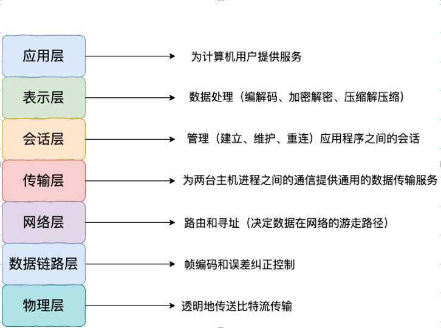
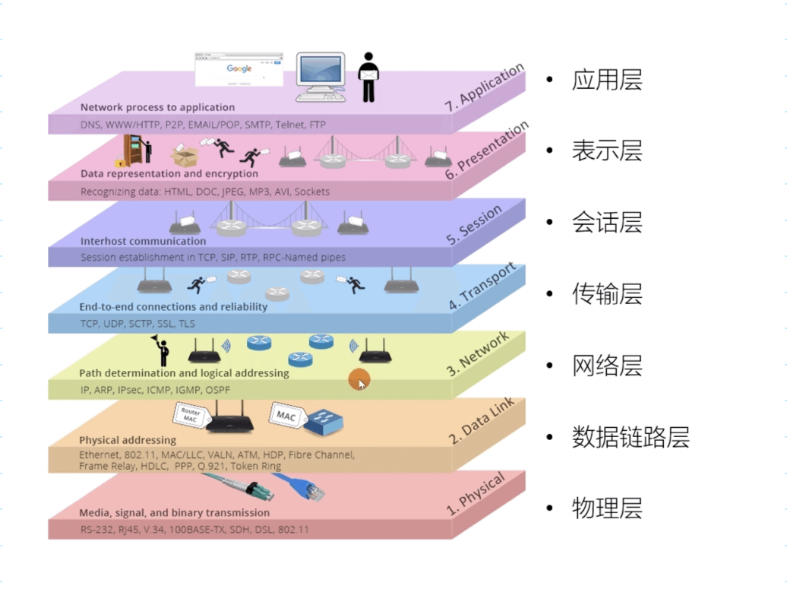
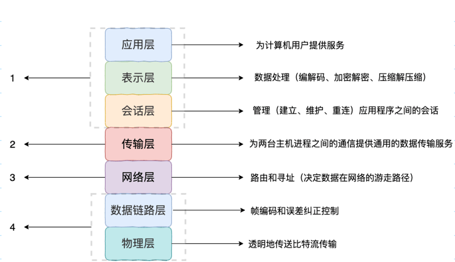
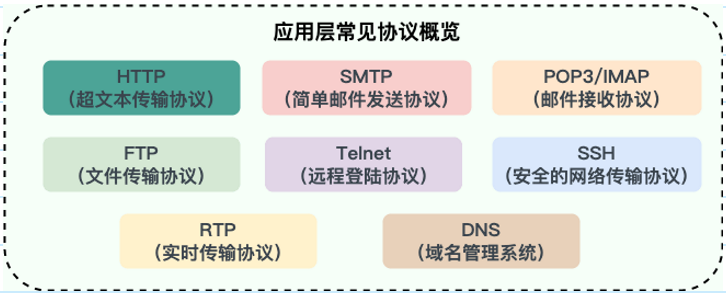
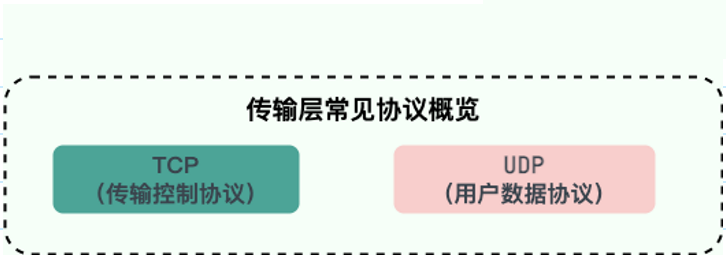
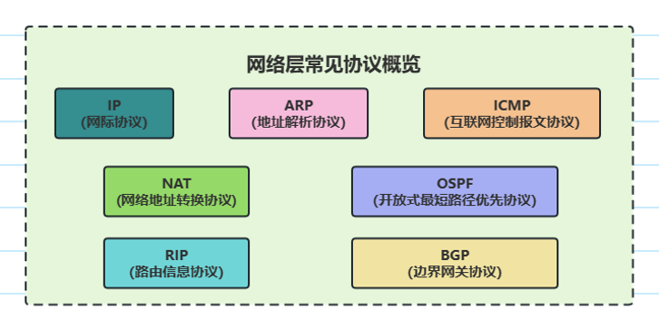
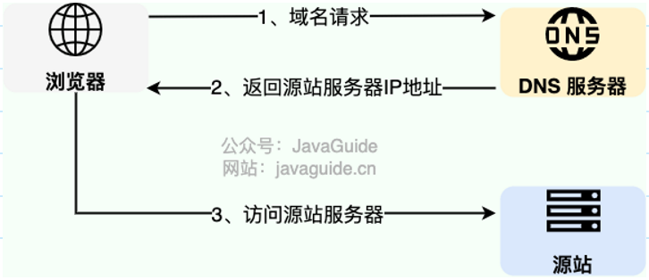

### OSI 计算机网络七层模型

OSI 七层模型 是国际标准化组织提出的一个网络分层模型，其大体结构以及每一层提供的功能如下图所示：

每一层都专注做一件事情，并且每一层都需要使用下一层提供的功能比如传输层需要使用网络层提供的路由和寻址功能，这样传输层才知道把数据传输到哪里去。

OSI 的七层体系结构概念清楚，理论也很完整，但是它比较复杂而且不实用，而且有些功能在多个层中重复出现。

上面这种图可能比较抽象，再来一个比较生动的图片。

### TCP/IP 四层模型

TCP/IP 四层模型 是目前被广泛采用的一种模型,我们可以将 TCP / IP 模型看作是 OSI 七层模型的精简版本，由以下 4 层组成：

- 应用层
- 传输层
- 网络层
- 网络接口层

 

需要注意的是，我们并不能将 TCP/IP 四层模型 和 OSI 七层模型完全精确地匹配起来，不过可以简单将两者对应起来，如下图所示：

### 为什么网络要分层？

说到分层，我们先从我们平时使用框架开发一个后台程序来说，我们往往会按照每一层做不同的事情的原则将系统分为三层（复杂的系统分层会更多）:

1. Repository（数据库操作）
2. Service（业务操作）
3. Controller（前后端数据交互）

 

复杂的系统需要分层，因为每一层都需要专注于一类事情。网络分层的原因也是一样，每一层只专注于做一类事情。

好了，再来说回：“为什么网络要分层？”。我觉得主要有 3 方面的原因：

 

- 各层之间相互独立：各层之间相互独立，各层之间不需要关心其他层是如何实现的，只需要知道自己如何调用下层提供好的功能就可以了（可以简单理解为接口调用）。这个和我们对开发时系统进行分层是一个道理。
- 提高了灵活性和可替换性：每一层都可以使用最适合的技术来实现，你只需要保证你提供的功能以及暴露的接口的规则没有改变就行了。并且，每一层都可以根据需要进行修改或替换，而不会影响到整个网络的结构。这个和我们平时开发系统的时候要求的高内聚、低耦合的原则也是可以对应上的。
- 大问题化小：分层可以将复杂的网络问题分解为许多比较小的、界线比较清晰简单的小问题来处理和解决。这样使得复杂的计算机网络系统变得易于设计，实现和标准化。 这个和我们平时开发的时候，一般会将系统功能分解，然后将复杂的问题分解为容易理解的更小的问题是相对应的，这些较小的问题具有更好的边界（目标和接口）定义。

 ### 常见的协议

#### 应用层有哪些常见的协议？

-  HTTP（Hypertext Transfer Protocol，超文本传输协议
   	基于 TCP 协议，是一种用于传输超文本和多媒体内容的协议，主要是为 Web 浏览器与 Web 服务器之间的通信而设计的。当我们使用浏览器浏览网页的时候，我们网页就是通过 HTTP 请求进行加载的。
-  SMTP（Simple Mail Transfer Protocol，简单邮件发送协议）
   	基于 TCP 协议，是一种用于发送电子邮件的协议。
       		注意 ⚠️：SMTP 协议只负责邮件的发送，而不是接收。要从邮件服务器接收邮件，需要使用 POP3 或 IMAP 协议。
-  POP3/IMAP（邮件接收协议）
   	基于 TCP 协议，两者都是负责邮件接收的协议。
    		IMAP 协议是比 POP3 更新的协议，它在功能和性能上都更加强大。IMAP 支持邮件搜索、标记、分类、归档等高级功能，而且可以在多个设备之间同步邮件状态。几乎所有现代电子邮件客户端和服务器都支持 IMAP。
-  FTP（File Transfer Protocol，文件传输协议）
   	基于 TCP 协议，是一种用于在计算机之间传输文件的协议，可以屏蔽操作系统和文件存储方式。
    		注意 ⚠️：FTP 是一种不安全的协议，因为它在传输过程中不会对数据进行加密。建议在传输敏感数据时使用更安全的协议，如 SFTP。
-  Telnet（远程登陆协议）：
   	基于 TCP 协议，用于通过一个终端登陆到其他服务器。
    		Telnet 协议的最大缺点之一是所有数据（包括用户名和密码）均以明文形式发送，这有潜在的安全风险。这就是为什么如今很少使用 Telnet，而是使用一种称为 SSH 的非常安全的网络传输协议的主要原因。
-  SSH（Secure Shell Protocol，安全的网络传输协议）：
   	基于 TCP 协议，通过加密和认证机制实现安全的访问和文件传输等业务
-  RTP（Real-time Transport Protocol，实时传输协议）
   	通常基于 UDP 协议，但也支持 TCP 协议。
       		它提供了端到端的实时传输数据的功能，但不包含资源预留存、不保证实时传输质量，这些功能由 WebRTC 实现。
-  DNS（Domain Name System，域名管理系统)
   	基于 UDP 协议，用于解决域名和 IP 地址的映射问题。

#### 传输层有哪些常见的协议？

- TCP（Transmission Control Protocol，传输控制协议 ）：提供 面向连接 的，可靠 的数据传输服务。
- UDP（User Datagram Protocol，用户数据协议）：提供 无连接 的，尽最大努力 的数据传输服务（不保证数据传输的可靠性），简单高效。

#### 网络层有哪些常见的协议？

- IP（Internet Protocol，网际协议）
  	TCP/IP 协议中最重要的协议之一，属于网络层的协议，主要作用是定义数据包的格式、对数据包进行路由和寻址，以便它们可以跨网络传播并到达正确的目的地。
  	目前 IP 协议主要分为两种，一种是过去的 IPv4，另一种是较新的 IPv6，目前这两种协议都在使用，但后者已经被提议来取代前者。

- ARP（Address Resolution Protocol，地址解析协议）
  	ARP 协议解决的是网络层地址和链路层地址之间的转换问题。因为一个 IP 数据报在物理上传输的过程中，总是需要知道下一跳（物理上的下一个目的地）该去往何处，但 IP 地址属于逻辑地址，而 MAC 地址才是物理地址，ARP 协议解决了 IP 地址转 MAC 地址的一些问题。

- ICMP（Internet Control Message Protocol，互联网控制报文协议）
  	一种用于传输网络状态和错误消息的协议，常用于网络诊断和故障排除。例如，Ping - NAT（Network Address Translation，网络地址转换协议）

- NAT 协议的应用场景如同它的名称——网络地址转换，应用于内部网到外部网的地址转换过程中。

  具体地说，在一个小的子网（局域网，LAN）内，各主机使用的是同一个 LAN 下的 IP 地址，但在该 LAN 以外，在广域网（WAN）中，需要一个统一的 IP 地址来标识该 LAN 在整个 Internet 上的位置。

- OSPF（Open Shortest Path First，开放式最短路径优先） ）
  	一种内部网关协议（Interior Gateway Protocol，IGP），也是广泛使用的一种动态路由协议，基于链路状态算法，考虑了链路的带宽、延迟等因素来选择最佳路径。

-  RIP(Routing Information Protocol，路由信息协议）
   	一种内部网关协议（Interior Gateway Protocol，IGP），也是一种动态路由协议，基于距离向量算法，使用固定的跳数作为度量标准，选择跳数最少的路径作为最佳路径。

-  BGP（Border Gateway Protocol，边界网关协议）
   	一种用来在路由选择域之间交换网络层可达性信息（Network Layer Reachability Information，NLRI）的路由选择协议，具有高度的灵活性和可扩展性。

### PING 命令的工作原理是什么？

PING 基于网络层的 ICMP（Internet Control Message Protocol，互联网控制报文协议），其主要原理就是通过在网络上发送和接收 ICMP 报文实现的。
ICMP 报文中包含了类型字段，用于标识 ICMP 报文类型。ICMP 报文的类型有很多种，但大致可以分为两类：
	• 查询报文类型：向目标主机发送请求并期望得到响应。
	• 差错报文类型：向源主机发送错误信息，用于报告网络中的错误情况。
PING 用到的 ICMP Echo Request（类型为 8 ） 和 ICMP Echo Reply（类型为 0） 属于查询报文类型 。
	• PING 命令会向目标主机发送 ICMP Echo Request。
	• 如果两个主机的连通性正常，目标主机会返回一个对应的 ICMP Echo Reply。

### DNS

DNS（Domain Name System）域名管理系统，是当用户使用浏览器访问网址之后，使用的第一个重要协议。DNS 要解决的是域名和 IP 地址的映射问题。

#### DNS:域名系统

在一台电脑上，可能存在浏览器 DNS 缓存，操作系统 DNS 缓存，路由器 DNS 缓存。如果以上缓存都查询不到，那么 DNS 就闪亮登场了。
目前 DNS 的设计采用的是分布式、层次数据库结构，DNS 是应用层协议，它可以在 UDP 或 TCP 协议之上运行，端口为 53 。

#### DNS 服务器有哪些？根服务器有多少个？

DNS 服务器自底向上可以依次分为以下几个层级(所有 DNS 服务器都属于以下四个类别之一):
	• 根 DNS 服务器。根 DNS 服务器提供 TLD 服务器的 IP 地址。目前世界上只有 13 组根服务器，我国境内目前仍没有根服务器。
	• 顶级域 DNS 服务器（TLD 服务器）。顶级域是指域名的后缀，如com、org、net和edu等。国家也有自己的顶级域，如uk、fr和ca。TLD 服务器提供了权威 DNS 服务器的 IP 地址。
	• 权威 DNS 服务器。在因特网上具有公共可访问主机的每个组织机构必须提供公共可访问的 DNS 记录，这些记录将这些主机的名字映射为 IP 地址。
	• 本地 DNS 服务器。每个 ISP（互联网服务提供商）都有一个自己的本地 DNS 服务器。当主机发出 DNS 请求时，该请求被发往本地 DNS 服务器，它起着代理的作用，并将该请求转发到 DNS 层次结构中。严格说来，不属于 DNS 层级结构
	
世界上并不是只有 13 台根服务器，这是很多人普遍的误解，网上很多文章也是这么写的。实际上，现在根服务器数量远远超过这个数量。最初确实是为 DNS 根服务器分配了 13 个 IP 地址，每个 IP 地址对应一个不同的根 DNS 服务器。然而，由于互联网的快速发展和增长，这个原始的架构变得不太适应当前的需求。为了提高 DNS 的可靠性、安全性和性能，目前这 13 个 IP 地址中的每一个都有多个服务器，截止到 2023 年底，所有根服务器之和达到了 600 多台，未来还会继续增加。

DNS 解析的过程是什么样的？
整个过程的步骤比较多，我单独写了一篇文章详细介绍：DNS 域名系统详解（应用层）